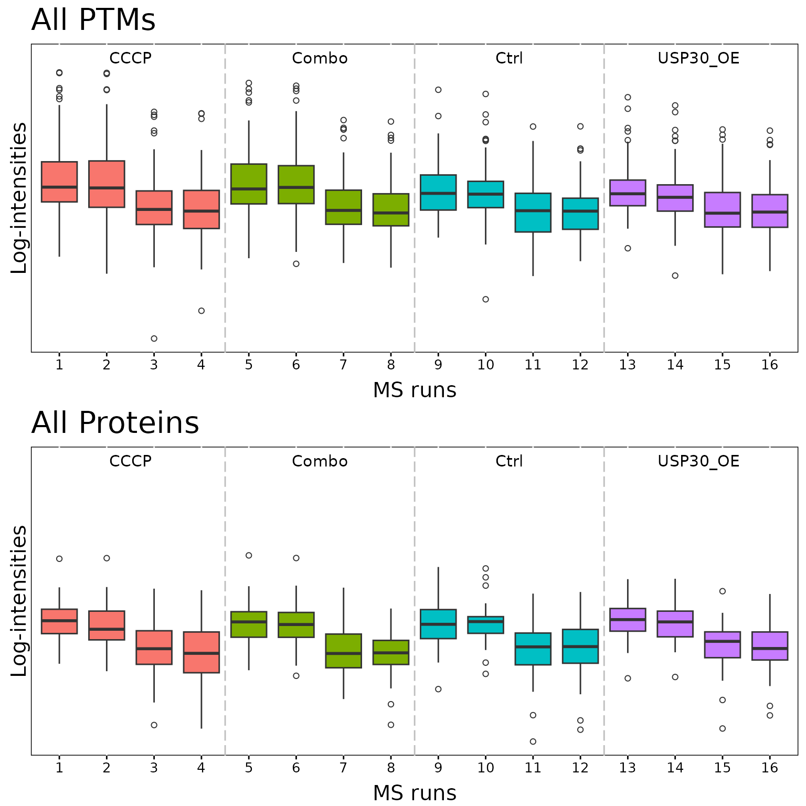
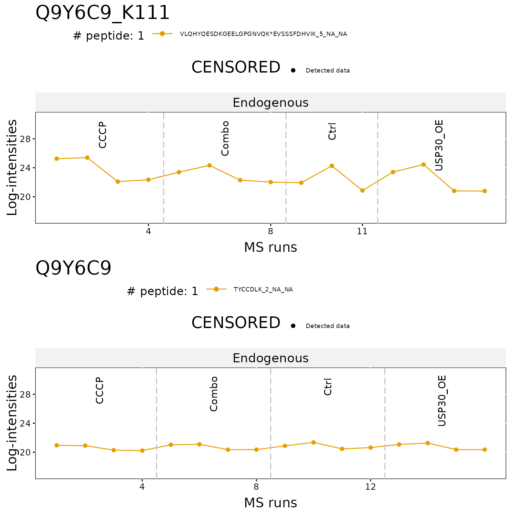
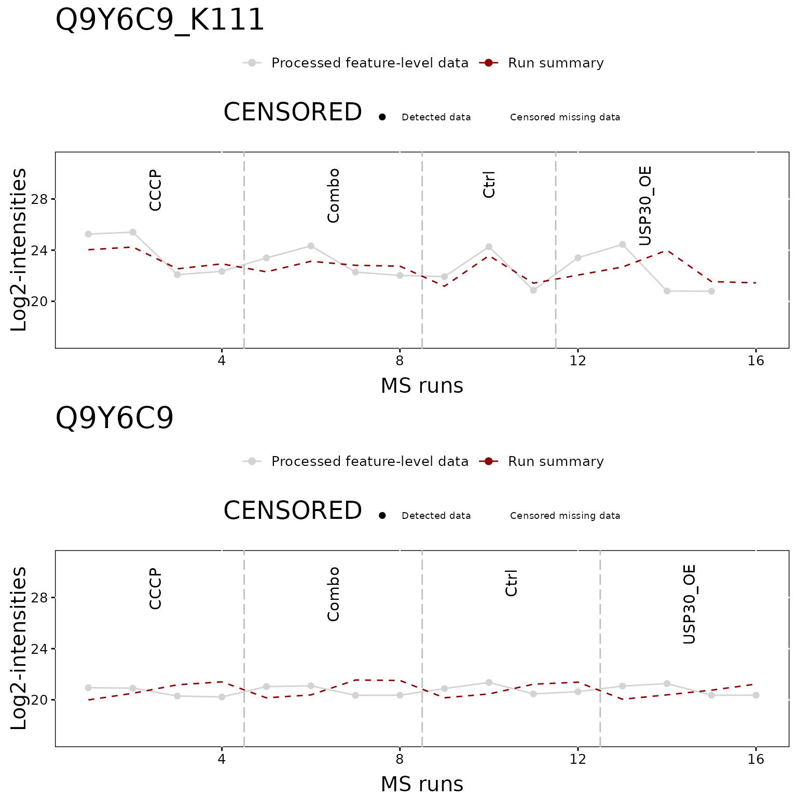
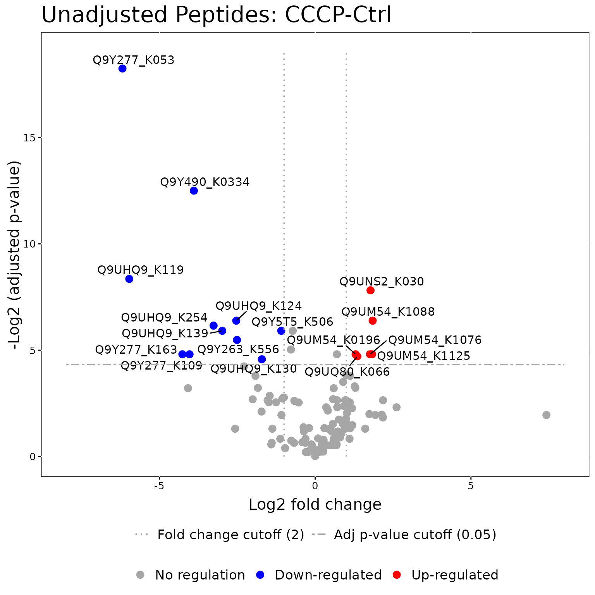
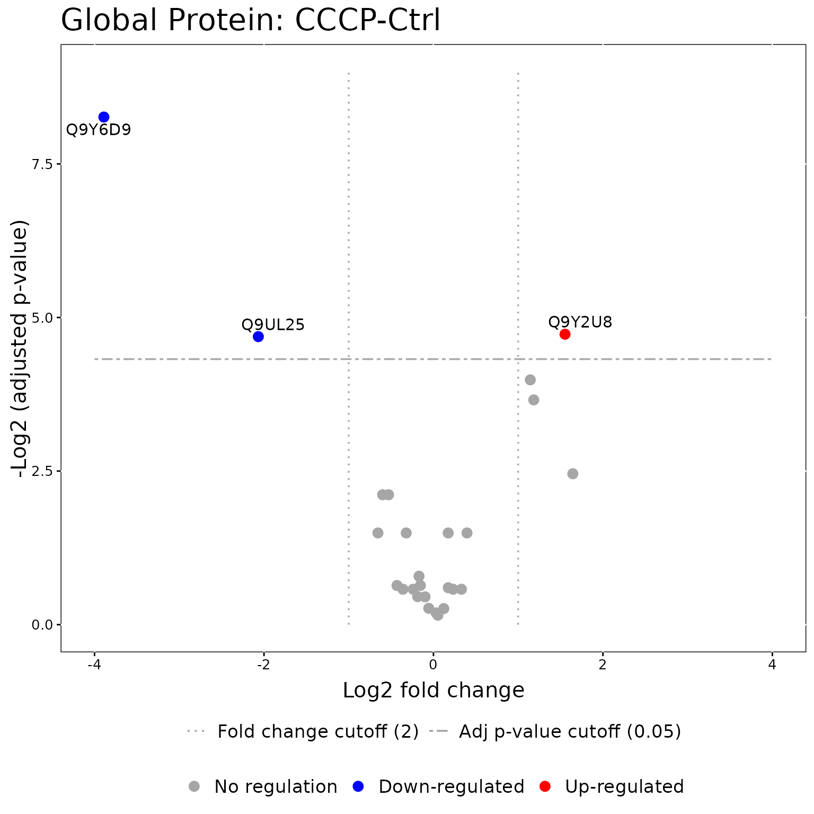
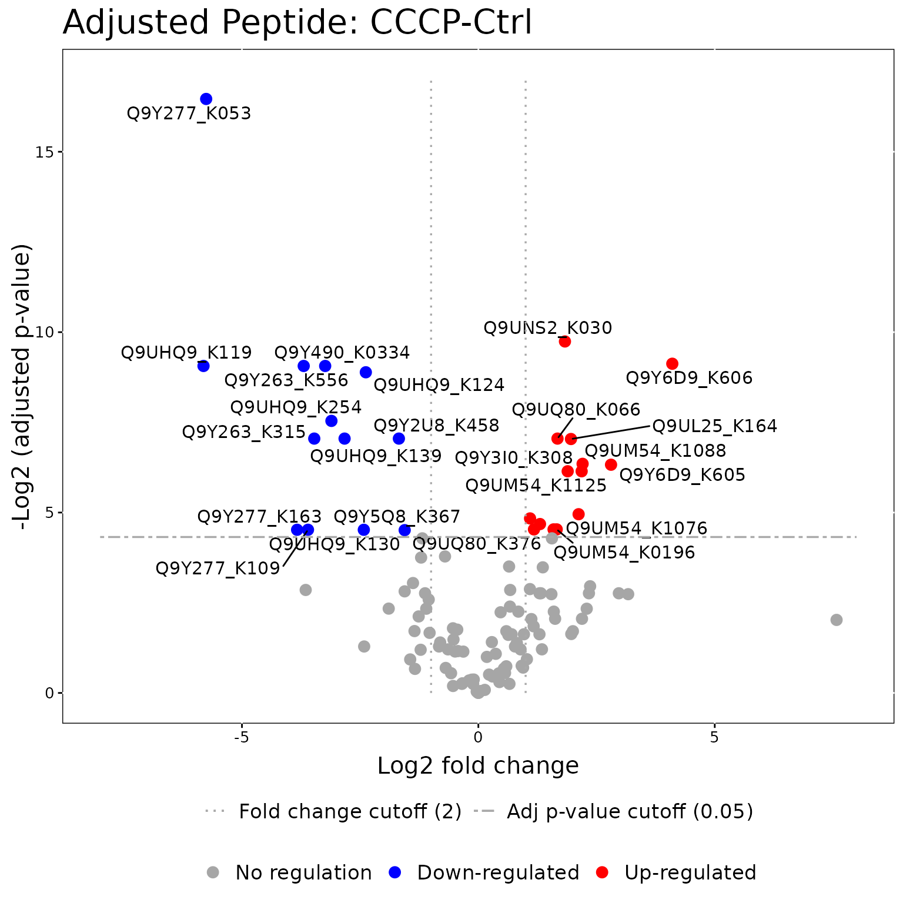
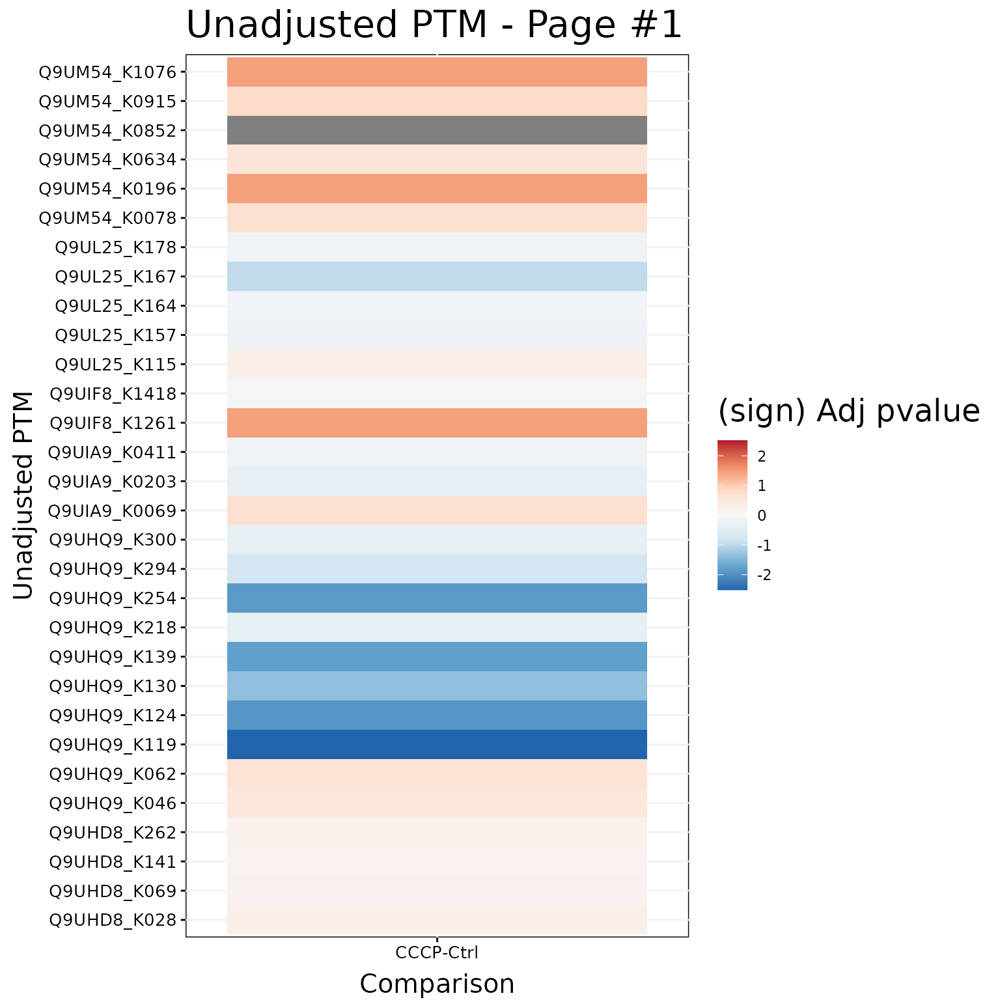
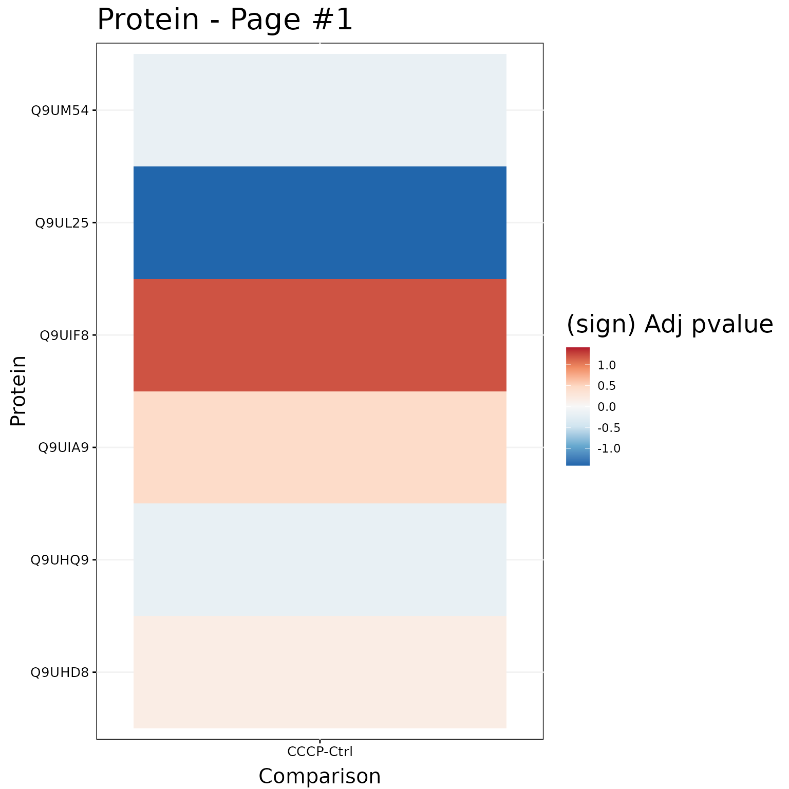
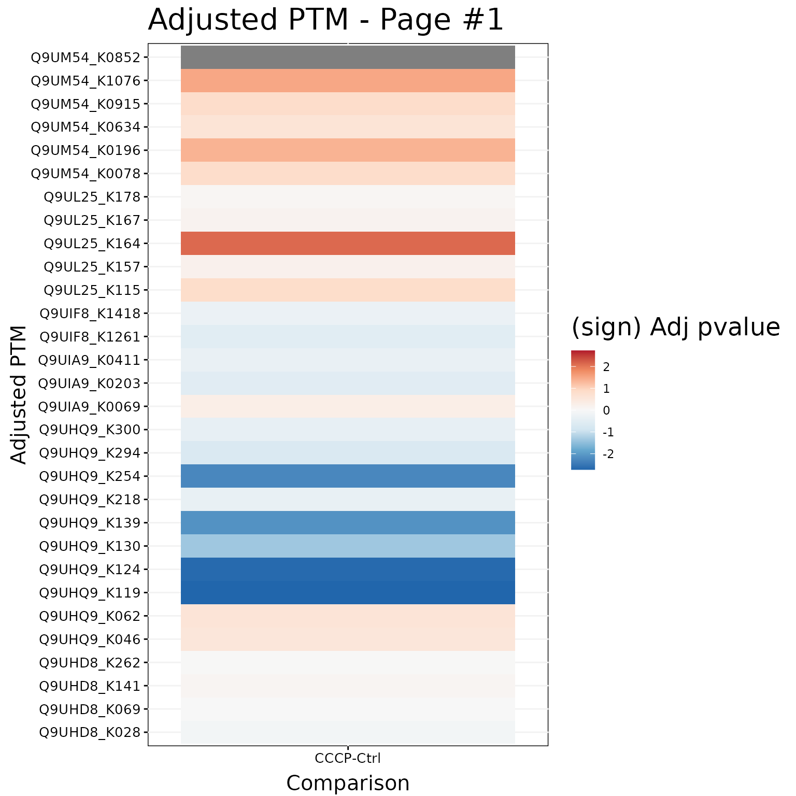

# MSstatsPTM LabelFree Workflow

This vignette provides an example workflow for how to use the package
`MSstatsPTM` for a mass spectrometry based proteomics experiment
acquired with a labelfree acquisition methods, such as DDA/DIA/SRM/PRM.
It also provides examples and an analysis of how adjusting for global
protein levels allows for better interpretations of PTM modeling
results.

## Installation

To install this package, start R (version “4.0”) and enter:

``` r
if (!requireNamespace("BiocManager", quietly = TRUE))
    install.packages("BiocManager")

BiocManager::install("MSstatsPTM")
```

``` r
library(MSstatsPTM)
library(MSstats)
```

## 1. Workflow

### 1.1 Raw Data Format

**Note: We are actively developing dedicated converters for
`MSstatsPTM`. If you have data from a processing tool that does not have
a dedicated converter in MSstatsPTM please add a github issue
`https://github.com/Vitek-Lab/MSstatsPTM/issues` and we will add the
converter.**

The first step is to load in the raw dataset for both the PTM and
Protein datasets. Each dataset can formatted using dedicated converters
in `MSstatsPTM`, such as `FragePipetoMSstatsPTMFormat`. If there is not
a dedicated converter for your tool in `MSstatsPTM`, you can
alternatively leverage converters from base `MSstats`. If using
converters from `MSstats` note they will need to be run both on the
global protein and PTM datasets.

Please note for the PTM dataset, both the protein and modification site
(or peptide), must be added into the `ProteinName` column. This allows
for the package to summarize to the peptide level, and avoid the off
chance there are matching peptides between proteins. For an example of
how this can be done please see the code below.

The output of the converter is a list with two formatted data.tables.
One each for the PTM and Protein datasets. If a global profiling run was
not performed, the Protein data.table will just be `NULL`

#### 1.1.1 MaxQuant - `MaxQtoMSstatsPTMFormat`

`MSstatsPTM` includes a dedicated converter for MaxQuant output.
Experiments can be acquired with label-free or TMT labeling methods. No
matter the experiment, we recommend using the `evidence.txt` file, and
not a PTM specific file such as the `Phospho (STY).txt` file. The
`MaxQtoMSstatsPTMFormat` converter includes a variety of parameters.
Examples for processing a TMT and LF dataset can be seen below.

``` r
# TMT experiment
head(maxq_tmt_evidence)
#>               Sequence Length Modifications
#> 1 AALLAQYADVTDEEDEADEK     20 Phospho (STY)
#> 2 AALLAQYADVTDEEDEADEK     20 Phospho (STY)
#> 3 AALLAQYADVTDEEDEADEK     20 Phospho (STY)
#> 4 AALLAQYADVTDEEDEADEK     20 Phospho (STY)
#> 5 AALLAQYADVTDEEDEADEK     20 Phospho (STY)
#> 6 AALLAQYADVTDEEDEADEK     20 Phospho (STY)
#>                       Modified.sequence Oxidation..M..Probabilities
#> 1 _AALLAQYADVT(Phospho (STY))DEEDEADEK_                            
#> 2 _AALLAQYADVT(Phospho (STY))DEEDEADEK_                            
#> 3 _AALLAQYADVT(Phospho (STY))DEEDEADEK_                            
#> 4 _AALLAQYADVT(Phospho (STY))DEEDEADEK_                            
#> 5 _AALLAQYADVT(Phospho (STY))DEEDEADEK_                            
#> 6 _AALLAQYADVT(Phospho (STY))DEEDEADEK_                            
#>          Phospho..STY..Probabilities Oxidation..M..Score.Diffs
#> 1            AALLAQYADVT(1)DEEDEADEK                          
#> 2 AALLAQY(0.316)ADVT(0.684)DEEDEADEK                          
#> 3            AALLAQYADVT(1)DEEDEADEK                          
#> 4 AALLAQY(0.001)ADVT(0.999)DEEDEADEK                          
#> 5 AALLAQY(0.001)ADVT(0.999)DEEDEADEK                          
#> 6            AALLAQYADVT(1)DEEDEADEK                          
#>         Phospho..STY..Score.Diffs Acetyl..N.term. Oxidation..M. Phospho..STY.
#> 1   AALLAQY(-74)ADVT(74)DEEDEADEK               0             0             1
#> 2 AALLAQY(-3.3)ADVT(3.3)DEEDEADEK               0             0             1
#> 3   AALLAQY(-75)ADVT(75)DEEDEADEK               0             0             1
#> 4   AALLAQY(-29)ADVT(29)DEEDEADEK               0             0             1
#> 5   AALLAQY(-29)ADVT(29)DEEDEADEK               0             0             1
#> 6   AALLAQY(-39)ADVT(39)DEEDEADEK               0             0             1
#>   Missed.cleavages Proteins Leading.proteins Leading.razor.protein Gene.names
#> 1                0   Q96MW1           Q96MW1                Q96MW1     CCDC43
#> 2                0   Q96MW1           Q96MW1                Q96MW1     CCDC43
#> 3                0   Q96MW1           Q96MW1                Q96MW1     CCDC43
#> 4                0   Q96MW1           Q96MW1                Q96MW1     CCDC43
#> 5                0   Q96MW1           Q96MW1                Q96MW1     CCDC43
#> 6                0   Q96MW1           Q96MW1                Q96MW1     CCDC43
#>                              Protein.names       Type
#> 1 Coiled-coil domain-containing protein 43 MULTI-MSMS
#> 2 Coiled-coil domain-containing protein 43       MSMS
#> 3 Coiled-coil domain-containing protein 43 MULTI-MSMS
#> 4 Coiled-coil domain-containing protein 43 MULTI-MSMS
#> 5 Coiled-coil domain-containing protein 43       MSMS
#> 6 Coiled-coil domain-containing protein 43       MSMS
#>                                        Raw.file Fraction Experiment MS.MS.m.z
#> 1 20171106_LUMOS1_nLC13_AH_TechBench2_TMTMS2L_1        1        MS2  912.0978
#> 2 20171106_LUMOS1_nLC13_AH_TechBench2_TMTMS2L_1        1        MS2  911.7875
#> 3 20171106_LUMOS1_nLC13_AH_TechBench2_TMTMS2L_2        2        MS2  912.4321
#> 4 20171106_LUMOS1_nLC13_AH_TechBench2_TMTMS2L_2        2        MS2  912.4330
#> 5 20171106_LUMOS1_nLC13_AH_TechBench2_TMTMS2L_2        2        MS2  912.0959
#> 6 20171106_LUMOS1_nLC13_AH_TechBench2_TMTMS2L_2        2        MS2  912.1791
#>   Charge      m.z     Mass Uncalibrated...Calibrated.m.z..ppm.
#> 1      3 759.3212 2274.942                              2.5755
#> 2      3 759.3212 2274.942                                 NaN
#> 3      3 759.3212 2274.942                              2.0210
#> 4      3 759.3212 2274.942                              2.2832
#> 5      3 759.3212 2274.942                                 NaN
#> 6      3 759.3212 2274.942                                 NaN
#>   Uncalibrated...Calibrated.m.z..Da. Mass.error..ppm. Mass.error..Da.
#> 1                          0.0019556           201200          152.78
#> 2                                NaN              NaN             NaN
#> 3                          0.0015346           201200          152.78
#> 4                          0.0017337           201200          152.78
#> 5                                NaN              NaN             NaN
#> 6                                NaN              NaN             NaN
#>   Uncalibrated.mass.error..ppm. Uncalibrated.mass.error..Da.
#> 1                        201200                       152.78
#> 2                           NaN                          NaN
#> 3                        201200                       152.78
#> 4                        201200                       152.78
#> 5                           NaN                          NaN
#> 6                           NaN                          NaN
#>   Max.intensity.m.z.0 Retention.time Retention.length Calibrated.retention.time
#> 1            912.4306         115.23          2.47460                    115.23
#> 2                 NaN         118.50          1.00000                    118.50
#> 3            912.4308         114.72          2.35110                    114.72
#> 4            912.4312         116.72          0.53974                    116.72
#> 5                 NaN         116.50          1.00000                    116.50
#> 6                 NaN         117.68          1.00000                    117.68
#>   Calibrated.retention.time.start Calibrated.retention.time.finish
#> 1                          114.78                           117.25
#> 2                          118.00                           119.00
#> 3                          114.22                           116.57
#> 4                          116.57                           117.11
#> 5                          116.00                           117.00
#> 6                          117.18                           118.18
#>   Retention.time.calibration Match.time.difference Match.m.z.difference
#> 1                          0                    NA                   NA
#> 2                          0                    NA                   NA
#> 3                          0                    NA                   NA
#> 4                          0                    NA                   NA
#> 5                          0                    NA                   NA
#> 6                          0                    NA                   NA
#>   Match.q.value Match.score Number.of.data.points Number.of.scans
#> 1            NA          NA                   382             108
#> 2            NA          NA                    NA              NA
#> 3            NA          NA                   356             106
#> 4            NA          NA                    42              23
#> 5            NA          NA                    NA              NA
#> 6            NA          NA                    NA              NA
#>   Number.of.isotopic.peaks       PIF Fraction.of.total.spectrum
#> 1                        6 0.9277212                0.004005980
#> 2                       NA       NaN                        NaN
#> 3                        6 0.9841691                0.006051585
#> 4                        3 0.7940387                0.001093331
#> 5                       NA       NaN                        NaN
#> 6                       NA       NaN                        NaN
#>   Base.peak.fraction        PEP MS.MS.count MS.MS.scan.number   Score
#> 1         0.09994941 1.8662e-46           2             38414 189.110
#> 2                NaN 1.6689e-02           1             39380  47.726
#> 3         0.08806564 5.8955e-39           2             38486 176.840
#> 4         0.02217602 5.4630e-08           1             38940 104.880
#> 5                NaN 8.6608e-27           1             38878 127.050
#> 6                NaN 4.8577e-26           1             39319 122.300
#>   Delta.score Combinatorics Intensity Reporter.intensity.corrected.1
#> 1     180.010             2 240530000                         125940
#> 2      30.847             2        NA                              0
#> 3     167.750             2 102250000                         155390
#> 4      89.116             2  11613000                          69254
#> 5     118.860             2        NA                              0
#> 6     114.110             2        NA                              0
#>   Reporter.intensity.corrected.2 Reporter.intensity.corrected.3
#> 1                         133100                         113620
#> 2                              0                              0
#> 3                         164220                         143320
#> 4                          80370                          60918
#> 5                              0                              0
#> 6                              0                              0
#>   Reporter.intensity.corrected.4 Reporter.intensity.corrected.5
#> 1                         119420                         108710
#> 2                              0                              0
#> 3                         160600                         163330
#> 4                          75915                          67276
#> 5                              0                              0
#> 6                              0                              0
#>   Reporter.intensity.corrected.6 Reporter.intensity.corrected.7
#> 1                         155830                         138320
#> 2                              0                              0
#> 3                         205080                         184670
#> 4                          86921                          80510
#> 5                              0                              0
#> 6                              0                              0
#>   Reporter.intensity.corrected.8 Reporter.intensity.corrected.9
#> 1                         158440                         174430
#> 2                              0                              0
#> 3                         178690                         203130
#> 4                          80892                          87856
#> 5                              0                              0
#> 6                              0                              0
#>   Reporter.intensity.corrected.10 Reporter.intensity.1 Reporter.intensity.2
#> 1                          130450               125940               133100
#> 2                               0                    0                    0
#> 3                          155170               155390               164220
#> 4                           82300                69254                80370
#> 5                               0                    0                    0
#> 6                               0                    0                    0
#>   Reporter.intensity.3 Reporter.intensity.4 Reporter.intensity.5
#> 1               113620               119420               108710
#> 2                    0                    0                    0
#> 3               143320               160600               163330
#> 4                60918                75915                67276
#> 5                    0                    0                    0
#> 6                    0                    0                    0
#>   Reporter.intensity.6 Reporter.intensity.7 Reporter.intensity.8
#> 1               155830               138320               158440
#> 2                    0                    0                    0
#> 3               205080               184670               178690
#> 4                86921                80510                80892
#> 5                    0                    0                    0
#> 6                    0                    0                    0
#>   Reporter.intensity.9 Reporter.intensity.10 Reporter.intensity.count.1
#> 1               174430                130450                          2
#> 2                    0                     0                          0
#> 3               203130                155170                          2
#> 4                87856                 82300                          1
#> 5                    0                     0                          0
#> 6                    0                     0                          0
#>   Reporter.intensity.count.2 Reporter.intensity.count.3
#> 1                          2                          2
#> 2                          0                          0
#> 3                          2                          2
#> 4                          1                          1
#> 5                          0                          0
#> 6                          0                          0
#>   Reporter.intensity.count.4 Reporter.intensity.count.5
#> 1                          2                          2
#> 2                          0                          0
#> 3                          2                          2
#> 4                          1                          1
#> 5                          0                          0
#> 6                          0                          0
#>   Reporter.intensity.count.6 Reporter.intensity.count.7
#> 1                          2                          2
#> 2                          0                          0
#> 3                          2                          2
#> 4                          1                          1
#> 5                          0                          0
#> 6                          0                          0
#>   Reporter.intensity.count.8 Reporter.intensity.count.9
#> 1                          2                          2
#> 2                          0                          0
#> 3                          2                          2
#> 4                          1                          1
#> 5                          0                          0
#> 6                          0                          0
#>   Reporter.intensity.count.10 Reverse Potential.contaminant  id
#> 1                           2                               125
#> 2                           0                               126
#> 3                           2                               127
#> 4                           1                               128
#> 5                           0                               129
#> 6                           0                               130
#>   Protein.group.IDs Peptide.ID Mod..peptide.ID MS.MS.IDs Best.MS.MS
#> 1              2449         42              50   153;154        154
#> 2              2449         42              50       155        155
#> 3              2449         42              50   156;157        157
#> 4              2449         42              50       158        158
#> 5              2449         42              50       159        159
#> 6              2449         42              50       160        160
#>   Oxidation..M..site.IDs Phospho..STY..site.IDs Taxonomy.IDs
#> 1                                          6884           NA
#> 2                                          6884           NA
#> 3                                          6884           NA
#> 4                                          6884           NA
#> 5                                          6884           NA
#> 6                                          6884           NA
head(maxq_tmt_annotation)
#>                                             Run Fraction TechRepMixture
#> 1 20171106_LUMOS1_nLC13_AH_TechBench2_TMTMS2L_1        1              1
#> 2 20171106_LUMOS1_nLC13_AH_TechBench2_TMTMS2L_1        1              1
#> 3 20171106_LUMOS1_nLC13_AH_TechBench2_TMTMS2L_1        1              1
#> 4 20171106_LUMOS1_nLC13_AH_TechBench2_TMTMS2L_1        1              1
#> 5 20171106_LUMOS1_nLC13_AH_TechBench2_TMTMS2L_1        1              1
#> 6 20171106_LUMOS1_nLC13_AH_TechBench2_TMTMS2L_1        1              1
#>      Channel Condition  Mixture BioReplicate
#> 1 channel.10 yeast_01x Mixture1  yeast_01x_1
#> 2  channel.1 yeast_04x Mixture1  yeast_04x_1
#> 3  channel.2 yeast_10x Mixture1  yeast_10x_1
#> 4  channel.3 yeast_01x Mixture1  yeast_01x_2
#> 5  channel.4 yeast_04x Mixture1  yeast_04x_2
#> 6  channel.5 yeast_10x Mixture1  yeast_10x_2
 
msstats_format_tmt = MaxQtoMSstatsPTMFormat(evidence=maxq_tmt_evidence,
                                    annotation=maxq_tmt_annotation,
                                    fasta=system.file("extdata", 
                                                      "maxq_tmt_fasta.fasta", 
                                                      package="MSstatsPTM"),
                                    fasta_protein_name="uniprot_ac",
                                    mod_id="\\(Phospho \\(STY\\)\\)",
                                    use_unmod_peptides=TRUE,
                                    labeling_type = "TMT",
                                    which_proteinid_ptm = "Proteins")
#> INFO  [2026-04-25 15:40:50] ** Raw data from MaxQuant imported successfully.
#> INFO  [2026-04-25 15:40:50] ** Rows with values of Potentialcontaminant equal to + are removed 
#> INFO  [2026-04-25 15:40:50] ** Rows with values of Reverse equal to + are removed 
#> INFO  [2026-04-25 15:40:50] ** Features with all missing measurements across channels within each run are removed.
#> INFO  [2026-04-25 15:40:50] ** Using provided annotation.
#> INFO  [2026-04-25 15:40:50] ** Run and Channel labels were standardized to remove symbols such as '.' or '%'.
#> INFO  [2026-04-25 15:40:50] ** The following options are used:
#>   - Features will be defined by the columns: PeptideSequence, PrecursorCharge
#>   - Shared peptides will be removed.
#>   - Proteins with single feature will not be removed.
#>   - Features with less than 3 measurements within each run will be kept.
#> INFO  [2026-04-25 15:40:50] ** Features with all missing measurements across channels within each run are removed.
#> INFO  [2026-04-25 15:40:50] ** Shared peptides are removed.
#> INFO  [2026-04-25 15:40:50] ** Features with all missing measurements across channels within each run are removed.
#> INFO  [2026-04-25 15:40:50] ** PSMs have been aggregated to peptide ions.
#> INFO  [2026-04-25 15:40:50] ** Run annotation merged with quantification data.
#> INFO  [2026-04-25 15:40:50] ** Features with one or two measurements across channels within each run are removed.
#> INFO  [2026-04-25 15:40:50] ** Fractionation handled.
#> INFO  [2026-04-25 15:40:51] ** Updated quantification data to make balanced design. Missing values are marked by NA
#> INFO  [2026-04-25 15:40:51] ** Finished preprocessing. The dataset is ready to be processed by the proteinSummarization function.

head(msstats_format_tmt$PTM)
#>   ProteinName                     PeptideSequence Charge
#> 1 Q96MW1_T139 AALLAQYADVT(Phospho (STY))DEEDEADEK      3
#> 2 Q96MW1_T139 AALLAQYADVT(Phospho (STY))DEEDEADEK      3
#> 3 Q96MW1_T139 AALLAQYADVT(Phospho (STY))DEEDEADEK      3
#> 4 Q96MW1_T139 AALLAQYADVT(Phospho (STY))DEEDEADEK      3
#> 5 Q96MW1_T139 AALLAQYADVT(Phospho (STY))DEEDEADEK      3
#> 6 Q96MW1_T139 AALLAQYADVT(Phospho (STY))DEEDEADEK      3
#>                                     PSM  Mixture TechRepMixture
#> 1 AALLAQYADVT(Phospho (STY))DEEDEADEK_3 Mixture1              1
#> 2 AALLAQYADVT(Phospho (STY))DEEDEADEK_3 Mixture1              1
#> 3 AALLAQYADVT(Phospho (STY))DEEDEADEK_3 Mixture1              1
#> 4 AALLAQYADVT(Phospho (STY))DEEDEADEK_3 Mixture1              1
#> 5 AALLAQYADVT(Phospho (STY))DEEDEADEK_3 Mixture1              1
#> 6 AALLAQYADVT(Phospho (STY))DEEDEADEK_3 Mixture1              1
#>                                             Run   Channel BioReplicate
#> 1 20171106_LUMOS1_nLC13_AH_TechBench2_TMTMS2L_1  channel1  yeast_04x_1
#> 2 20171106_LUMOS1_nLC13_AH_TechBench2_TMTMS2L_1 channel10  yeast_01x_1
#> 3 20171106_LUMOS1_nLC13_AH_TechBench2_TMTMS2L_1  channel2  yeast_10x_1
#> 4 20171106_LUMOS1_nLC13_AH_TechBench2_TMTMS2L_1  channel3  yeast_01x_2
#> 5 20171106_LUMOS1_nLC13_AH_TechBench2_TMTMS2L_1  channel4  yeast_04x_2
#> 6 20171106_LUMOS1_nLC13_AH_TechBench2_TMTMS2L_1  channel5  yeast_10x_2
#>   Condition Intensity
#> 1 yeast_04x    125940
#> 2 yeast_01x    130450
#> 3 yeast_10x    133100
#> 4 yeast_01x    113620
#> 5 yeast_04x    119420
#> 6 yeast_10x    108710
head(msstats_format_tmt$PROTEIN)
#>     ProteinName   PeptideSequence Charge                 PSM  Mixture
#> 351      P29966 EAGEGGEAEAPAAEGGK      2 EAGEGGEAEAPAAEGGK_2 Mixture1
#> 352      P29966 EAGEGGEAEAPAAEGGK      2 EAGEGGEAEAPAAEGGK_2 Mixture1
#> 353      P29966 EAGEGGEAEAPAAEGGK      2 EAGEGGEAEAPAAEGGK_2 Mixture1
#> 354      P29966 EAGEGGEAEAPAAEGGK      2 EAGEGGEAEAPAAEGGK_2 Mixture1
#> 355      P29966 EAGEGGEAEAPAAEGGK      2 EAGEGGEAEAPAAEGGK_2 Mixture1
#> 356      P29966 EAGEGGEAEAPAAEGGK      2 EAGEGGEAEAPAAEGGK_2 Mixture1
#>     TechRepMixture                                           Run   Channel
#> 351              1 20171106_LUMOS1_nLC13_AH_TechBench2_TMTMS2L_1  channel1
#> 352              1 20171106_LUMOS1_nLC13_AH_TechBench2_TMTMS2L_1 channel10
#> 353              1 20171106_LUMOS1_nLC13_AH_TechBench2_TMTMS2L_1  channel2
#> 354              1 20171106_LUMOS1_nLC13_AH_TechBench2_TMTMS2L_1  channel3
#> 355              1 20171106_LUMOS1_nLC13_AH_TechBench2_TMTMS2L_1  channel4
#> 356              1 20171106_LUMOS1_nLC13_AH_TechBench2_TMTMS2L_1  channel5
#>     BioReplicate Condition Intensity
#> 351  yeast_04x_1 yeast_04x     23384
#> 352  yeast_01x_1 yeast_01x     29612
#> 353  yeast_10x_1 yeast_10x     26450
#> 354  yeast_01x_2 yeast_01x     33341
#> 355  yeast_04x_2 yeast_04x     22335
#> 356  yeast_10x_2 yeast_10x     27212

# LF experiment
head(maxq_lf_evidence)
#>      Sequence Length Modifications Modified.sequence
#> 1 AAAAAAALQAK     11    Unmodified     _AAAAAAALQAK_
#> 2 AAAAAAALQAK     11    Unmodified     _AAAAAAALQAK_
#> 3 AAAAAAALQAK     11    Unmodified     _AAAAAAALQAK_
#> 4 AAAAAAALQAK     11    Unmodified     _AAAAAAALQAK_
#> 5 AAAAAAALQAK     11    Unmodified     _AAAAAAALQAK_
#> 6 AAAAAAALQAK     11    Unmodified     _AAAAAAALQAK_
#>   Oxidation..M..Probabilities Phospho..STY..Probabilities
#> 1                                                        
#> 2                                                        
#> 3                                                        
#> 4                                                        
#> 5                                                        
#> 6                                                        
#>   Oxidation..M..Score.Diffs Phospho..STY..Score.Diffs Acetyl..Protein.N.term.
#> 1                                                                           0
#> 2                                                                           0
#> 3                                                                           0
#> 4                                                                           0
#> 5                                                                           0
#> 6                                                                           0
#>   Oxidation..M. Phospho..STY. Missed.cleavages Proteins
#> 1             0             0                0   P36578
#> 2             0             0                0   P36578
#> 3             0             0                0   P36578
#> 4             0             0                0   P36578
#> 5             0             0                0   P36578
#> 6             0             0                0   P36578
#>                                                                      Leading.proteins
#> 1 sp|P36578|RL4_HUMAN60SribosomalproteinL4OS=Homosapiens(Human)OX=9606GN=RPL4PE=1SV=5
#> 2 sp|P36578|RL4_HUMAN60SribosomalproteinL4OS=Homosapiens(Human)OX=9606GN=RPL4PE=1SV=5
#> 3 sp|P36578|RL4_HUMAN60SribosomalproteinL4OS=Homosapiens(Human)OX=9606GN=RPL4PE=1SV=5
#> 4 sp|P36578|RL4_HUMAN60SribosomalproteinL4OS=Homosapiens(Human)OX=9606GN=RPL4PE=1SV=5
#> 5 sp|P36578|RL4_HUMAN60SribosomalproteinL4OS=Homosapiens(Human)OX=9606GN=RPL4PE=1SV=5
#> 6 sp|P36578|RL4_HUMAN60SribosomalproteinL4OS=Homosapiens(Human)OX=9606GN=RPL4PE=1SV=5
#>                                                                 Leading.razor.protein
#> 1 sp|P36578|RL4_HUMAN60SribosomalproteinL4OS=Homosapiens(Human)OX=9606GN=RPL4PE=1SV=5
#> 2 sp|P36578|RL4_HUMAN60SribosomalproteinL4OS=Homosapiens(Human)OX=9606GN=RPL4PE=1SV=5
#> 3 sp|P36578|RL4_HUMAN60SribosomalproteinL4OS=Homosapiens(Human)OX=9606GN=RPL4PE=1SV=5
#> 4 sp|P36578|RL4_HUMAN60SribosomalproteinL4OS=Homosapiens(Human)OX=9606GN=RPL4PE=1SV=5
#> 5 sp|P36578|RL4_HUMAN60SribosomalproteinL4OS=Homosapiens(Human)OX=9606GN=RPL4PE=1SV=5
#> 6 sp|P36578|RL4_HUMAN60SribosomalproteinL4OS=Homosapiens(Human)OX=9606GN=RPL4PE=1SV=5
#>         Type                             Raw.file  Experiment MS.MS.m.z Charge
#> 1 MULTI-MSMS 20180810_QE3_nLC3_AH_DDA_H100_Y25_01 H100_Y25_01  478.7820      2
#> 2 MULTI-MSMS 20180810_QE3_nLC3_AH_DDA_H100_Y25_03 H100_Y25_03  478.7810      2
#> 3 MULTI-MSMS 20180810_QE3_nLC3_AH_DDA_H100_Y25_04 H100_Y25_04  478.7803      2
#> 4 MULTI-MSMS 20180810_QE3_nLC3_AH_DDA_H100_Y25_05 H100_Y25_05  478.7815      2
#> 5 MULTI-MSMS 20180810_QE3_nLC3_AH_DDA_H100_Y25_06 H100_Y25_06  478.7802      2
#> 6 MULTI-MSMS 20180810_QE3_nLC3_AH_DDA_H100_Y50_01 H100_Y50_01  478.7803      2
#>        m.z     Mass Uncalibrated...Calibrated.m.z..ppm.
#> 1 478.7798 955.5451                              5.0066
#> 2 478.7798 955.5451                              2.4819
#> 3 478.7798 955.5451                              2.1796
#> 4 478.7798 955.5451                              2.2967
#> 5 478.7798 955.5451                              2.9534
#> 6 478.7798 955.5451                              1.6198
#>   Uncalibrated...Calibrated.m.z..Da. Mass.error..ppm. Mass.error..Da.
#> 1                         0.00239710         -0.46202     -0.00022120
#> 2                         0.00118830          0.76954      0.00036844
#> 3                         0.00104350         -0.27332     -0.00013086
#> 4                         0.00109960          0.50609      0.00024231
#> 5                         0.00141400         -0.77230     -0.00036976
#> 6                         0.00077553         -0.92114     -0.00044102
#>   Uncalibrated.mass.error..ppm. Uncalibrated.mass.error..Da.
#> 1                       4.54460                   0.00217590
#> 2                       3.25140                   0.00155670
#> 3                       1.90620                   0.00091267
#> 4                       2.80280                   0.00134190
#> 5                       2.18110                   0.00104430
#> 6                       0.69867                   0.00033451
#>   Max.intensity.m.z.0 Retention.time Retention.length Calibrated.retention.time
#> 1            478.7797         6.2039         0.079819                    6.2039
#> 2            478.7799         6.2822         0.090469                    6.2822
#> 3            478.7796         6.2327         0.110390                    6.2327
#> 4            478.7799         6.2924         0.090472                    6.2924
#> 5            478.7793         6.9938         0.089908                    6.9938
#> 6            478.7792         6.1802         0.110780                    6.1802
#>   Calibrated.retention.time.start Calibrated.retention.time.finish
#> 1                          6.1683                           6.2481
#> 2                          6.2257                           6.3162
#> 3                          6.1950                           6.3054
#> 4                          6.2470                           6.3375
#> 5                          6.9485                           7.0384
#> 6                          6.1278                           6.2385
#>   Retention.time.calibration Match.time.difference Match.m.z.difference
#> 1                          0                    NA                   NA
#> 2                          0                    NA                   NA
#> 3                          0                    NA                   NA
#> 4                          0                    NA                   NA
#> 5                          0                    NA                   NA
#> 6                          0                    NA                   NA
#>   Match.q.value Match.score Number.of.data.points Number.of.scans
#> 1            NA          NA                    15               7
#> 2            NA          NA                    14               8
#> 3            NA          NA                    19              10
#> 4            NA          NA                    18               8
#> 5            NA          NA                    17               8
#> 6            NA          NA                    17              10
#>   Number.of.isotopic.peaks PIF Fraction.of.total.spectrum Base.peak.fraction
#> 1                        3   0                          0                  0
#> 2                        3   0                          0                  0
#> 3                        2   0                          0                  0
#> 4                        3   0                          0                  0
#> 5                        3   0                          0                  0
#> 6                        2   0                          0                  0
#>          PEP MS.MS.count MS.MS.scan.number   Score Delta.score Combinatorics
#> 1 1.2617e-03           1              4016  78.149      67.201             1
#> 2 8.8997e-05           1              4158 111.170      95.303             1
#> 3 3.4144e-04           1              4087  99.442      84.065             1
#> 4 1.2494e-03           1              4148  76.679      61.302             1
#> 5 6.5027e-05           1              4774 114.890      96.560             1
#> 6 8.7846e-05           1              3994 111.950      96.570             1
#>   Intensity Reverse Potential.contaminant id Protein.group.IDs Peptide.ID
#> 1   7589900                                0              1276          0
#> 2  11810000                                1              1276          0
#> 3  10223000                                2              1276          0
#> 4  10733000                                3              1276          0
#> 5  17840000                                4              1276          0
#> 6   9679200                                5              1276          0
#>   Mod..peptide.ID MS.MS.IDs Best.MS.MS Oxidation..M..site.IDs
#> 1               0         0          0                       
#> 2               0         1          1                       
#> 3               0         2          2                       
#> 4               0         3          3                       
#> 5               0         4          4                       
#> 6               0         5          5                       
#>   Phospho..STY..site.IDs Taxonomy.IDs
#> 1                                  NA
#> 2                                  NA
#> 3                                  NA
#> 4                                  NA
#> 5                                  NA
#> 6                                  NA
head(maxq_lf_annotation)
#>                                     Run Condition BioReplicate
#> 1 20180810_QE3_nLC3_AH_DDA_Yonly_ind_01   H0_Y100   H0_Y100_01
#> 2 20180810_QE3_nLC3_AH_DDA_Yonly_ind_02   H0_Y100   H0_Y100_02
#> 3 20180810_QE3_nLC3_AH_DDA_Yonly_ind_03   H0_Y100   H0_Y100_03
#> 4  20180810_QE3_nLC3_AH_DDA_H100_Y25_01  H100_Y25  H100_Y25_07
#> 5  20180810_QE3_nLC3_AH_DDA_H100_Y25_02  H100_Y25  H100_Y25_08
#> 6  20180810_QE3_nLC3_AH_DDA_H100_Y25_03  H100_Y25  H100_Y25_09
#>                                Raw.file IsotopeLabelType
#> 1 20180810_QE3_nLC3_AH_DDA_Yonly_ind_01                L
#> 2 20180810_QE3_nLC3_AH_DDA_Yonly_ind_02                L
#> 3 20180810_QE3_nLC3_AH_DDA_Yonly_ind_03                L
#> 4  20180810_QE3_nLC3_AH_DDA_H100_Y25_01                L
#> 5  20180810_QE3_nLC3_AH_DDA_H100_Y25_02                L
#> 6  20180810_QE3_nLC3_AH_DDA_H100_Y25_03                L

msstats_format_lf = MaxQtoMSstatsPTMFormat(evidence=maxq_lf_evidence,
                                     annotation=maxq_lf_annotation,
                                     fasta=system.file("extdata", 
                                                       "maxq_lf_fasta.fasta", 
                                                       package="MSstatsPTM"),
                                     fasta_protein_name="uniprot_ac",
                                     mod_id="\\(Phospho \\(STY\\)\\)",
                                     use_unmod_peptides=TRUE,
                                     labeling_type = "LF",
                                     which_proteinid_ptm = "Proteins")
#> INFO  [2026-04-25 15:40:51] ** Raw data from MaxQuant imported successfully.
#> INFO  [2026-04-25 15:40:51] ** Rows with values of Potentialcontaminant equal to + are removed 
#> INFO  [2026-04-25 15:40:51] ** Rows with values of Reverse equal to + are removed 
#> INFO  [2026-04-25 15:40:51] ** Using provided annotation.
#> INFO  [2026-04-25 15:40:51] ** Run labels were standardized to remove symbols such as '.' or '%'.
#> INFO  [2026-04-25 15:40:51] ** The following options are used:
#>   - Features will be defined by the columns: PeptideSequence, PrecursorCharge
#>   - Shared peptides will be removed.
#>   - Proteins with single feature will not be removed.
#>   - Features with less than 3 measurements across runs will be removed.
#> INFO  [2026-04-25 15:40:51] ** Features with all missing measurements across runs are removed.
#> INFO  [2026-04-25 15:40:51] ** Shared peptides are removed.
#> INFO  [2026-04-25 15:40:51] ** Multiple measurements in a feature and a run are summarized by summaryforMultipleRows: max
#> INFO  [2026-04-25 15:40:51] ** Features with one or two measurements across runs are removed.
#> INFO  [2026-04-25 15:40:51] ** Run annotation merged with quantification data.
#> INFO  [2026-04-25 15:40:51] ** Features with one or two measurements across runs are removed.
#> INFO  [2026-04-25 15:40:51] ** Fractionation handled.
#> INFO  [2026-04-25 15:40:51] ** Updated quantification data to make balanced design. Missing values are marked by NA
#> INFO  [2026-04-25 15:40:51] ** Finished preprocessing. The dataset is ready to be processed by the dataProcess function.

head(msstats_format_lf$PTM)
#>       ProteinName                               PeptideSequence PrecursorCharge
#> 34 P09938_S15_S22 AAADALS(Phospho (STY))DLEIKDS(Phospho (STY))K               2
#> 35 P09938_S15_S22 AAADALS(Phospho (STY))DLEIKDS(Phospho (STY))K               2
#> 36 P09938_S15_S22 AAADALS(Phospho (STY))DLEIKDS(Phospho (STY))K               2
#> 37 P09938_S15_S22 AAADALS(Phospho (STY))DLEIKDS(Phospho (STY))K               2
#> 38 P09938_S15_S22 AAADALS(Phospho (STY))DLEIKDS(Phospho (STY))K               2
#> 39 P09938_S15_S22 AAADALS(Phospho (STY))DLEIKDS(Phospho (STY))K               2
#>    FragmentIon ProductCharge IsotopeLabelType Condition BioReplicate
#> 34          NA            NA                L H100_Y100 H100_Y100_19
#> 35          NA            NA                L H100_Y100 H100_Y100_20
#> 36          NA            NA                L H100_Y100 H100_Y100_21
#> 37          NA            NA                L H100_Y100 H100_Y100_22
#> 38          NA            NA                L H100_Y100 H100_Y100_23
#> 39          NA            NA                L H100_Y100 H100_Y100_24
#>                                      Run Fraction Intensity
#> 34 20180810_QE3_nLC3_AH_DDA_H100_Y100_01        1        NA
#> 35 20180810_QE3_nLC3_AH_DDA_H100_Y100_02        1        NA
#> 36 20180810_QE3_nLC3_AH_DDA_H100_Y100_03        1        NA
#> 37 20180810_QE3_nLC3_AH_DDA_H100_Y100_04        1        NA
#> 38 20180810_QE3_nLC3_AH_DDA_H100_Y100_05        1        NA
#> 39 20180810_QE3_nLC3_AH_DDA_H100_Y100_06        1        NA
head(msstats_format_lf$PROTEIN)
#>   ProteinName PeptideSequence PrecursorCharge FragmentIon ProductCharge
#> 1      P36578     AAAAAAALQAK               2          NA            NA
#> 2      P36578     AAAAAAALQAK               2          NA            NA
#> 3      P36578     AAAAAAALQAK               2          NA            NA
#> 4      P36578     AAAAAAALQAK               2          NA            NA
#> 5      P36578     AAAAAAALQAK               2          NA            NA
#> 6      P36578     AAAAAAALQAK               2          NA            NA
#>   IsotopeLabelType Condition BioReplicate                                   Run
#> 1                L H100_Y100 H100_Y100_19 20180810_QE3_nLC3_AH_DDA_H100_Y100_01
#> 2                L H100_Y100 H100_Y100_20 20180810_QE3_nLC3_AH_DDA_H100_Y100_02
#> 3                L H100_Y100 H100_Y100_21 20180810_QE3_nLC3_AH_DDA_H100_Y100_03
#> 4                L H100_Y100 H100_Y100_22 20180810_QE3_nLC3_AH_DDA_H100_Y100_04
#> 5                L H100_Y100 H100_Y100_23 20180810_QE3_nLC3_AH_DDA_H100_Y100_05
#> 6                L H100_Y100 H100_Y100_24 20180810_QE3_nLC3_AH_DDA_H100_Y100_06
#>   Fraction Intensity
#> 1        1  13697000
#> 2        1   8738100
#> 3        1  10827000
#> 4        1   9628900
#> 5        1   9485600
#> 6        1        NA
```

#### 1.1.2 FragPipe - `FragPipetoMSstatsPTMFormat`

`MSstatsPTM` includes a dedicated converter for FragPipe output. The
input is the `msstats.csv` and annotation files automatically generated
by FragPipe. FragPipe provides additional info on the localization of
modification sites, and the `FragPipetoMSstatsPTMFormat` converter
includes localization options that are not present in other converters.

``` r
# TMT example
head(fragpipe_input)
#>                                          Spectrum.Name
#> 1 16CPTAC_CCRCC_P_JHU_20180326_LUMOS_f01.02743.02743.4
#> 2 16CPTAC_CCRCC_P_JHU_20180326_LUMOS_f01.02755.02755.4
#> 3 16CPTAC_CCRCC_P_JHU_20180326_LUMOS_f01.02812.02812.3
#> 4 16CPTAC_CCRCC_P_JHU_20180326_LUMOS_f01.02913.02913.3
#> 5 16CPTAC_CCRCC_P_JHU_20180326_LUMOS_f01.02920.02920.5
#> 6 16CPTAC_CCRCC_P_JHU_20180326_LUMOS_f01.02975.02975.3
#>                                 Spectrum.File Peptide.Sequence
#> 1 16CPTAC_CCRCC_P_JHU_20180326_LUMOS_f01.mzML    RRHSHSHSPMSTR
#> 2 16CPTAC_CCRCC_P_JHU_20180326_LUMOS_f01.mzML     RHSHSHSPMSTR
#> 3 16CPTAC_CCRCC_P_JHU_20180326_LUMOS_f01.mzML      HSHSHSPMSTR
#> 4 16CPTAC_CCRCC_P_JHU_20180326_LUMOS_f01.mzML        HTRDSEAQR
#> 5 16CPTAC_CCRCC_P_JHU_20180326_LUMOS_f01.mzML     QHREPSEQEHRR
#> 6 16CPTAC_CCRCC_P_JHU_20180326_LUMOS_f01.mzML       RRSTSPDHTR
#>            Modified.Peptide.Sequence Probability Charge Protein.Start
#> 1 n[230]RRHSHS[167]HS[167]PM[147]STR      0.9953      4            92
#> 2  n[230]RHSHS[167]HS[167]PM[147]STR      0.9962      4            93
#> 3   n[230]HSHS[167]HS[167]PM[147]STR      0.9957      3            94
#> 4               n[230]HTRDS[167]EAQR      0.9778      3             6
#> 5            n[230]QHREPS[167]EQEHRR      0.9979      5           123
#> 6         n[230]RRS[167]T[181]SPDHTR      0.9976      3           636
#>   Protein.End    Gene Mapped.Genes               Protein Protein.ID
#> 1         104   TRA2B              sp|P62995|TRA2B_HUMAN     P62995
#> 2         104   TRA2B              sp|P62995|TRA2B_HUMAN     P62995
#> 3         104   TRA2B              sp|P62995|TRA2B_HUMAN     P62995
#> 4          14    STOM               sp|P27105|STOM_HUMAN     P27105
#> 5         134   SNIP1              sp|Q8TAD8|SNIP1_HUMAN     Q8TAD8
#> 6         645 AKAP17A              sp|Q02040|AK17A_HUMAN     Q02040
#>   Mapped.Proteins                Protein.Description Is.Unique Purity Intensity
#> 1                 Transformer-2 protein homolog beta      true   0.00         0
#> 2                 Transformer-2 protein homolog beta      true   1.00  93998240
#> 3                 Transformer-2 protein homolog beta      true   1.00  58713048
#> 4                                           Stomatin      true   0.53         0
#> 5                 Smad nuclear-interacting protein 1      true   0.84  32706532
#> 6                        A-kinase anchor protein 17A      true   1.00  28102432
#>               M.15.9949                                         STY.79.966331
#> 1 RRHSHSHSPM(1.0000)STR RRHS(0.1780)HS(0.8463)HS(0.8392)PMS(0.0709)T(0.0656)R
#> 2  RHSHSHSPM(1.0000)STR  RHS(0.1497)HS(0.8741)HS(0.8698)PMS(0.0523)T(0.0542)R
#> 3   HSHSHSPM(1.0000)STR   HS(0.0582)HS(0.9325)HS(0.9327)PMS(0.0387)T(0.0380)R
#> 4                                                   HT(0.3995)RDS(0.6005)EAQR
#> 5                                                        QHREPS(1.0000)EQEHRR
#> 6                                  RRS(0.7370)T(0.7512)S(0.4257)PDHT(0.0862)R
#>   Channel.126 Channel.127N Channel.127C Channel.128N Channel.128C Channel.129N
#> 1    5578.652     8280.212     7034.635    10747.431     14872.24     17204.29
#> 2   19045.867    25291.979    38326.629    34385.059     42117.77     72897.84
#> 3   18498.551    24321.078    33518.191    31881.815     36766.03     60230.07
#> 4   13825.080    15933.881     8398.121     8001.169     12493.29     22851.57
#> 5   13345.636    24715.256    11790.443    18234.275     34780.09     12546.47
#> 6   15176.378     8430.135    14684.991    19511.988     38792.40     58184.98
#>   Channel.129C Channel.130N Channel.130C Channel.131N
#> 1     15443.60    11442.942     12985.56     11235.75
#> 2     33277.25    50290.703     49428.89     26749.50
#> 3     31366.80    41944.098     47435.18     20533.39
#> 4     11001.78     8394.632     10014.59     14173.92
#> 5     29433.08    18376.287     14489.56     16896.90
#> 6     26905.22    26273.547     24920.71     15653.74
head(fragpipe_annotation)
#>                                      Run Fraction TechRepMixture Mixture
#> 1 16CPTAC_CCRCC_P_JHU_20180326_LUMOS_f01        1              1  plex16
#> 2 16CPTAC_CCRCC_P_JHU_20180326_LUMOS_f02        2              1  plex16
#> 3 16CPTAC_CCRCC_P_JHU_20180326_LUMOS_f03        3              1  plex16
#> 4 16CPTAC_CCRCC_P_JHU_20180326_LUMOS_f01        1              1  plex16
#> 5 16CPTAC_CCRCC_P_JHU_20180326_LUMOS_f02        2              1  plex16
#> 6 16CPTAC_CCRCC_P_JHU_20180326_LUMOS_f03        3              1  plex16
#>   Channel    BioReplicate Condition
#> 1     126 CPT0088900003_T         T
#> 2     126 CPT0088900003_T         T
#> 3     126 CPT0088900003_T         T
#> 4    127N CPT0079270003_T         T
#> 5    127N CPT0079270003_T         T
#> 6    127N CPT0079270003_T         T
head(fragpipe_input_protein)
#>                                          Spectrum.Name
#> 1 16CPTAC_CCRCC_W_JHU_20180322_LUMOS_f01.03785.03785.3
#> 2 16CPTAC_CCRCC_W_JHU_20180322_LUMOS_f01.04553.04553.3
#> 3 16CPTAC_CCRCC_W_JHU_20180322_LUMOS_f01.05163.05163.3
#> 4 16CPTAC_CCRCC_W_JHU_20180322_LUMOS_f01.05368.05368.2
#> 5 16CPTAC_CCRCC_W_JHU_20180322_LUMOS_f01.06388.06388.3
#> 6 16CPTAC_CCRCC_W_JHU_20180322_LUMOS_f01.09515.09515.2
#>                                 Spectrum.File Peptide.Sequence
#> 1 16CPTAC_CCRCC_W_JHU_20180322_LUMOS_f01.mzML       ANGMELDGRR
#> 2 16CPTAC_CCRCC_W_JHU_20180322_LUMOS_f01.mzML         EEMDDQDK
#> 3 16CPTAC_CCRCC_W_JHU_20180322_LUMOS_f01.mzML       ANGMELDGRR
#> 4 16CPTAC_CCRCC_W_JHU_20180322_LUMOS_f01.mzML       EYEQDQSSSR
#> 5 16CPTAC_CCRCC_W_JHU_20180322_LUMOS_f01.mzML   DRDTQNLQAQEEER
#> 6 16CPTAC_CCRCC_W_JHU_20180322_LUMOS_f01.mzML         EEMDDQDK
#>   Modified.Peptide.Sequence Probability Charge Protein.Start Protein.End   Gene
#> 1           ANGM[147]ELDGRR      0.8947      3           180         189  TRA2A
#> 2       n[230]EEM[147]DDQDK      0.8677      3           428         435 THRAP3
#> 3                                0.9888      3           180         189  TRA2A
#> 4          n[230]EYEQDQSSSR      1.0000      2           435         444 ZC3H13
#> 5      n[230]DRDTQNLQAQEEER      1.0000      3           166         179  SNIP1
#> 6            n[230]EEMDDQDK      1.0000      2           428         435 THRAP3
#>   Mapped.Genes               Protein Protein.ID       Mapped.Proteins
#> 1        TRA2B sp|Q13595|TRA2A_HUMAN     Q13595 sp|P62995|TRA2B_HUMAN
#> 2              sp|Q9Y2W1|TR150_HUMAN     Q9Y2W1                      
#> 3        TRA2B sp|Q13595|TRA2A_HUMAN     Q13595 sp|P62995|TRA2B_HUMAN
#> 4              sp|Q5T200|ZC3HD_HUMAN     Q5T200                      
#> 5              sp|Q8TAD8|SNIP1_HUMAN     Q8TAD8                      
#> 6              sp|Q9Y2W1|TR150_HUMAN     Q9Y2W1                      
#>                             Protein.Description Is.Unique Purity Intensity
#> 1           Transformer-2 protein homolog alpha     false   0.66  11404057
#> 2 Thyroid hormone receptor-associated protein 3      true   1.00 214722976
#> 3           Transformer-2 protein homolog alpha     false   1.00         0
#> 4 Zinc finger CCCH domain-containing protein 13      true   1.00         0
#> 5            Smad nuclear-interacting protein 1      true   1.00  23654240
#> 6 Thyroid hormone receptor-associated protein 3      true   1.00 137334144
#>   Channel.126 Channel.127N Channel.127C Channel.128N Channel.128C Channel.129N
#> 1        0.00         0.00         0.00         0.00         0.00         0.00
#> 2   169649.80    128647.68    211484.62    217940.97    285032.38    386665.06
#> 3        0.00         0.00         0.00         0.00         0.00         0.00
#> 4    27110.14     27206.84     18804.96     31722.93     46041.87     56579.66
#> 5    34456.11     45179.79     32160.84     45215.09     75652.51     31730.62
#> 6   540481.56    393964.88    647020.00    672371.25    932212.88   1208951.00
#>   Channel.129C Channel.130N Channel.130C Channel.131N
#> 1         0.00         0.00         0.00         0.00
#> 2    214397.91    235756.58    217907.38    128019.87
#> 3         0.00         0.00         0.00         0.00
#> 4     37022.87     38246.96     35628.89     29679.23
#> 5     46960.10     51399.19     38244.52     36727.02
#> 6    665127.81    719719.12    749849.31    429616.81
head(fragpipe_annotation_protein)
#>                                      Run Fraction TechRepMixture Mixture
#> 1 16CPTAC_CCRCC_W_JHU_20180322_LUMOS_f01        1              1  plex16
#> 2 16CPTAC_CCRCC_W_JHU_20180322_LUMOS_f02        2              1  plex16
#> 3 16CPTAC_CCRCC_W_JHU_20180322_LUMOS_f03        3              1  plex16
#> 4 16CPTAC_CCRCC_W_JHU_20180322_LUMOS_f01        1              1  plex16
#> 5 16CPTAC_CCRCC_W_JHU_20180322_LUMOS_f02        2              1  plex16
#> 6 16CPTAC_CCRCC_W_JHU_20180322_LUMOS_f03        3              1  plex16
#>   Channel    BioReplicate Condition
#> 1     126 CPT0088900003_T         T
#> 2     126 CPT0088900003_T         T
#> 3     126 CPT0088900003_T         T
#> 4    127N CPT0079270003_T         T
#> 5    127N CPT0079270003_T         T
#> 6    127N CPT0079270003_T         T

msstats_data = FragPipetoMSstatsPTMFormat(fragpipe_input,
                                          fragpipe_annotation,
                                          fragpipe_input_protein, 
                                          fragpipe_annotation_protein,
                                          mod_id_col = "STY",
                                          localization_cutoff=.75,
                                          remove_unlocalized_peptides=TRUE)
#> INFO  [2026-04-25 15:40:51] ** Raw data from Philosopher imported successfully.
#> INFO  [2026-04-25 15:40:51] ** Using provided annotation.
#> INFO  [2026-04-25 15:40:51] ** Run and Channel labels were standardized to remove symbols such as '.' or '%'.
#> INFO  [2026-04-25 15:40:51] ** The following options are used:
#>   - Features will be defined by the columns: PeptideSequence, PrecursorCharge
#>   - Shared peptides will be removed.
#>   - Proteins with single feature will not be removed.
#>   - Features with less than 3 measurements within each run will be kept.
#> INFO  [2026-04-25 15:40:51] ** Rows with values not greater than 0.6 in Purity are removed 
#> WARN  [2026-04-25 15:40:51] ** PeptideProphetProbability not found in input columns.
#> INFO  [2026-04-25 15:40:51] ** Sequences containing Oxidation are removed.
#> INFO  [2026-04-25 15:40:51] ** Features with all missing measurements across channels within each run are removed.
#> INFO  [2026-04-25 15:40:51] ** Shared peptides are removed.
#> INFO  [2026-04-25 15:40:51] ** Features with all missing measurements across channels within each run are removed.
#> INFO  [2026-04-25 15:40:51] ** PSMs have been aggregated to peptide ions.
#> INFO  [2026-04-25 15:40:51] ** Run annotation merged with quantification data.
#> INFO  [2026-04-25 15:40:51] ** Features with one or two measurements across channels within each run are removed.
#> INFO  [2026-04-25 15:40:51] ** Fractionation handled.
#> INFO  [2026-04-25 15:40:51] ** Updated quantification data to make balanced design. Missing values are marked by NA
#> INFO  [2026-04-25 15:40:51] ** Finished preprocessing. The dataset is ready to be processed by the proteinSummarization function.
#> INFO  [2026-04-25 15:40:51] ** Raw data from Philosopher imported successfully.
#> INFO  [2026-04-25 15:40:51] ** Using provided annotation.
#> INFO  [2026-04-25 15:40:51] ** Run and Channel labels were standardized to remove symbols such as '.' or '%'.
#> INFO  [2026-04-25 15:40:51] ** The following options are used:
#>   - Features will be defined by the columns: PeptideSequence, PrecursorCharge
#>   - Shared peptides will be removed.
#>   - Proteins with single feature will not be removed.
#>   - Features with less than 3 measurements within each run will be kept.
#> INFO  [2026-04-25 15:40:51] ** Rows with values not greater than 0.6 in Purity are removed 
#> WARN  [2026-04-25 15:40:51] ** PeptideProphetProbability not found in input columns.
#> INFO  [2026-04-25 15:40:51] ** Sequences containing Oxidation are removed.
#> INFO  [2026-04-25 15:40:51] ** Features with all missing measurements across channels within each run are removed.
#> INFO  [2026-04-25 15:40:51] ** Shared peptides are removed.
#> INFO  [2026-04-25 15:40:51] ** Features with all missing measurements across channels within each run are removed.
#> INFO  [2026-04-25 15:40:51] ** PSMs have been aggregated to peptide ions.
#> INFO  [2026-04-25 15:40:51] ** Run annotation merged with quantification data.
#> INFO  [2026-04-25 15:40:51] ** Features with one or two measurements across channels within each run are removed.
#> INFO  [2026-04-25 15:40:51] ** Fractionation handled.
#> INFO  [2026-04-25 15:40:51] ** Updated quantification data to make balanced design. Missing values are marked by NA
#> INFO  [2026-04-25 15:40:51] ** Finished preprocessing. The dataset is ready to be processed by the proteinSummarization function.
head(msstats_data$PTM)
#>                  ProteinName       PeptideSequence Charge
#> 1 sp|Q9Y2W1|TR150_HUMAN_S805 AEEYTEETEEREES*TTGFDK      3
#> 2 sp|Q9Y2W1|TR150_HUMAN_S805 AEEYTEETEEREES*TTGFDK      3
#> 3 sp|Q9Y2W1|TR150_HUMAN_S805 AEEYTEETEEREES*TTGFDK      3
#> 4 sp|Q9Y2W1|TR150_HUMAN_S805 AEEYTEETEEREES*TTGFDK      3
#> 5 sp|Q9Y2W1|TR150_HUMAN_S805 AEEYTEETEEREES*TTGFDK      3
#> 6 sp|Q9Y2W1|TR150_HUMAN_S805 AEEYTEETEEREES*TTGFDK      3
#>                       PSM Mixture TechRepMixture
#> 1 AEEYTEETEEREES*TTGFDK_3  plex16              1
#> 2 AEEYTEETEEREES*TTGFDK_3  plex16              1
#> 3 AEEYTEETEEREES*TTGFDK_3  plex16              1
#> 4 AEEYTEETEEREES*TTGFDK_3  plex16              1
#> 5 AEEYTEETEEREES*TTGFDK_3  plex16              1
#> 6 AEEYTEETEEREES*TTGFDK_3  plex16              1
#>                                      Run Channel    BioReplicate Condition
#> 1 16CPTAC_CCRCC_P_JHU_20180326_LUMOS_f01     126 CPT0088900003_T         T
#> 2 16CPTAC_CCRCC_P_JHU_20180326_LUMOS_f01    127C CPT0088920001_N         N
#> 3 16CPTAC_CCRCC_P_JHU_20180326_LUMOS_f01    127N CPT0079270003_T         T
#> 4 16CPTAC_CCRCC_P_JHU_20180326_LUMOS_f01    128C CPT0088550004_T         T
#> 5 16CPTAC_CCRCC_P_JHU_20180326_LUMOS_f01    128N CPT0079300001_N         N
#> 6 16CPTAC_CCRCC_P_JHU_20180326_LUMOS_f01    129C CPT0014450004_T         T
#>   Intensity
#> 1  47545.47
#> 2  45316.41
#> 3  80388.11
#> 4  66856.88
#> 5 118057.66
#> 6 192263.72
head(msstats_data$PROTEIN)
#>             ProteinName      PeptideSequence Charge                    PSM
#> 1 sp|Q9Y2W1|TR150_HUMAN AEEYTEETEEREESTTGFDK      3 AEEYTEETEEREESTTGFDK_3
#> 2 sp|Q9Y2W1|TR150_HUMAN AEEYTEETEEREESTTGFDK      3 AEEYTEETEEREESTTGFDK_3
#> 3 sp|Q9Y2W1|TR150_HUMAN AEEYTEETEEREESTTGFDK      3 AEEYTEETEEREESTTGFDK_3
#> 4 sp|Q9Y2W1|TR150_HUMAN AEEYTEETEEREESTTGFDK      3 AEEYTEETEEREESTTGFDK_3
#> 5 sp|Q9Y2W1|TR150_HUMAN AEEYTEETEEREESTTGFDK      3 AEEYTEETEEREESTTGFDK_3
#> 6 sp|Q9Y2W1|TR150_HUMAN AEEYTEETEEREESTTGFDK      3 AEEYTEETEEREESTTGFDK_3
#>   Mixture TechRepMixture                                    Run Channel
#> 1  plex16              1 16CPTAC_CCRCC_W_JHU_20180322_LUMOS_f01     126
#> 2  plex16              1 16CPTAC_CCRCC_W_JHU_20180322_LUMOS_f01    127C
#> 3  plex16              1 16CPTAC_CCRCC_W_JHU_20180322_LUMOS_f01    127N
#> 4  plex16              1 16CPTAC_CCRCC_W_JHU_20180322_LUMOS_f01    128C
#> 5  plex16              1 16CPTAC_CCRCC_W_JHU_20180322_LUMOS_f01    128N
#> 6  plex16              1 16CPTAC_CCRCC_W_JHU_20180322_LUMOS_f01    129C
#>      BioReplicate Condition Intensity
#> 1 CPT0088900003_T         T  97711.92
#> 2 CPT0088920001_N         N 104208.69
#> 3 CPT0079270003_T         T 107628.15
#> 4 CPT0088550004_T         T 194282.36
#> 5 CPT0079300001_N         N 152762.88
#> 6 CPT0014450004_T         T 143260.84

# LFQ Example
input = system.file("tinytest/raw_data/Fragpipe/MSstats.csv", 
                                        package = "MSstatsPTM")
input = data.table::fread(input)
annot = system.file("tinytest/raw_data/Fragpipe/experiment_annotation.tsv", 
                                        package = "MSstatsPTM")
annot = data.table::fread(annot)    
input_protein = system.file("tinytest/raw_data/Fragpipe/msstats_proteome_lf.csv",
                                        package = "MSstatsPTM")

input_protein = data.table::fread(input_protein) # Global profiling run

msstats_data = FragPipetoMSstatsPTMFormat(input,
                                          annot,
                                          input_protein = input_protein,
                                          label_type="LF",
                                          mod_id_col = "STY",
                                          localization_cutoff=.75,
                                          protein_id_col = "ProteinName",
                                          peptide_id_col = "PeptideSequence")
#> INFO  [2026-04-25 15:40:51] ** Raw data from FragPipe imported successfully.
#> INFO  [2026-04-25 15:40:51] ** Using annotation extracted from quantification data.
#> INFO  [2026-04-25 15:40:51] ** Run labels were standardized to remove symbols such as '.' or '%'.
#> INFO  [2026-04-25 15:40:51] ** The following options are used:
#>   - Features will be defined by the columns: PeptideSequence, PrecursorCharge, FragmentIon, ProductCharge
#>   - Shared peptides will be removed.
#>   - Proteins with single feature will not be removed.
#>   - Features with less than 3 measurements across runs will be kept.
#> INFO  [2026-04-25 15:40:51] ** Features with all missing measurements across runs are removed.
#> INFO  [2026-04-25 15:40:51] ** Shared peptides are removed.
#> INFO  [2026-04-25 15:40:51] ** Multiple measurements in a feature and a run are summarized by summaryforMultipleRows: sum
#> INFO  [2026-04-25 15:40:51] ** Features with all missing measurements across runs are removed.
#> INFO  [2026-04-25 15:40:51] ** Run annotation merged with quantification data.
#> INFO  [2026-04-25 15:40:51] ** Features with all missing measurements across runs are removed.
#> INFO  [2026-04-25 15:40:51] ** Fractionation handled.
#> INFO  [2026-04-25 15:40:51] ** Updated quantification data to make balanced design. Missing values are marked by NA
#> INFO  [2026-04-25 15:40:51] ** Finished preprocessing. The dataset is ready to be processed by the dataProcess function.
#> INFO  [2026-04-25 15:40:51] ** Raw data from FragPipe imported successfully.
#> INFO  [2026-04-25 15:40:51] ** Using annotation extracted from quantification data.
#> INFO  [2026-04-25 15:40:51] ** Run labels were standardized to remove symbols such as '.' or '%'.
#> INFO  [2026-04-25 15:40:51] ** The following options are used:
#>   - Features will be defined by the columns: PeptideSequence, PrecursorCharge, FragmentIon, ProductCharge
#>   - Shared peptides will be removed.
#>   - Proteins with single feature will not be removed.
#>   - Features with less than 3 measurements across runs will be kept.
#> INFO  [2026-04-25 15:40:51] ** Features with all missing measurements across runs are removed.
#> INFO  [2026-04-25 15:40:51] ** Shared peptides are removed.
#> INFO  [2026-04-25 15:40:51] ** Multiple measurements in a feature and a run are summarized by summaryforMultipleRows: sum
#> INFO  [2026-04-25 15:40:51] ** Features with all missing measurements across runs are removed.
#> INFO  [2026-04-25 15:40:51] ** Run annotation merged with quantification data.
#> INFO  [2026-04-25 15:40:51] ** Features with all missing measurements across runs are removed.
#> INFO  [2026-04-25 15:40:51] ** Fractionation handled.
#> INFO  [2026-04-25 15:40:51] ** Updated quantification data to make balanced design. Missing values are marked by NA
#> INFO  [2026-04-25 15:40:51] ** Finished preprocessing. The dataset is ready to be processed by the dataProcess function.
head(msstats_data$PTM)
#>                 ProteinName                                   PeptideSequence
#> 1 sp|P02400|RLA4_YEAST_S100 FATVPTGGASSAAAGAAGAAAGGDAAEEEKEEEAKEES*DDDMGFGLFD
#> 2 sp|P02400|RLA4_YEAST_S100 FATVPTGGASSAAAGAAGAAAGGDAAEEEKEEEAKEES*DDDMGFGLFD
#> 3 sp|P02400|RLA4_YEAST_S100 FATVPTGGASSAAAGAAGAAAGGDAAEEEKEEEAKEES*DDDMGFGLFD
#> 4 sp|P02400|RLA4_YEAST_S100 FATVPTGGASSAAAGAAGAAAGGDAAEEEKEEEAKEES*DDDMGFGLFD
#> 5 sp|P02400|RLA4_YEAST_S100 FATVPTGGASSAAAGAAGAAAGGDAAEEEKEEEAKEES*DDDMGFGLFD
#> 6 sp|P02400|RLA4_YEAST_S100 FATVPTGGASSAAAGAAGAAAGGDAAEEEKEEEAKEES*DDDMGFGLFD
#>   PrecursorCharge FragmentIon ProductCharge IsotopeLabelType Condition
#> 1               3        <NA>            NA                L        WT
#> 2               3        <NA>            NA                L       MUT
#> 3               3        <NA>            NA                L        WT
#> 4               3        <NA>            NA                L       MUT
#> 5               4        <NA>            NA                L        WT
#> 6               4        <NA>            NA                L       MUT
#>   BioReplicate                             Run Fraction Intensity
#> 1            3  JCI-TiO2-DDAphosMethod-WT_1338        1 143712.34
#> 2            2 JCI-TiO2-DDAphosMethod-rho_1339        1        NA
#> 3            4         JCI-TiO2-DDAstd-WT_1335        1 128482.80
#> 4            3        JCI-TiO2-DDAstd-rho_1336        1        NA
#> 5            3  JCI-TiO2-DDAphosMethod-WT_1338        1  64697.76
#> 6            2 JCI-TiO2-DDAphosMethod-rho_1339        1  27288.38
head(msstats_data$PROTEIN)
#>            ProteinName                                  PeptideSequence
#> 1 sp|P02400|RLA4_YEAST FATVPTGGASSAAAGAAGAAAGGDAAEEEKEEEAKEESDDDMGFGLFD
#> 2 sp|P02400|RLA4_YEAST FATVPTGGASSAAAGAAGAAAGGDAAEEEKEEEAKEESDDDMGFGLFD
#> 3 sp|P02400|RLA4_YEAST FATVPTGGASSAAAGAAGAAAGGDAAEEEKEEEAKEESDDDMGFGLFD
#> 4 sp|P02400|RLA4_YEAST FATVPTGGASSAAAGAAGAAAGGDAAEEEKEEEAKEESDDDMGFGLFD
#> 5 sp|P02400|RLA4_YEAST FATVPTGGASSAAAGAAGAAAGGDAAEEEKEEEAKEESDDDMGFGLFD
#> 6 sp|P02400|RLA4_YEAST FATVPTGGASSAAAGAAGAAAGGDAAEEEKEEEAKEESDDDMGFGLFD
#>   PrecursorCharge FragmentIon ProductCharge IsotopeLabelType Condition
#> 1               3        <NA>            NA                L        WT
#> 2               3        <NA>            NA                L        WT
#> 3               3        <NA>            NA                L       MUT
#> 4               3        <NA>            NA                L        WT
#> 5               3        <NA>            NA                L       MUT
#> 6               3        <NA>            NA                L        WT
#>   BioReplicate                                        Run Fraction Intensity
#> 1            1 3-9-2023_JCI_230308_DDA_TiO2-10L_S1-A5_199        1       0.0
#> 2            2                            CR_Tio2-WT_1715        1       0.0
#> 3            1                       CR_Tio2-phos85D_1716        1       0.0
#> 4            3             JCI-TiO2-DDAphosMethod-WT_1338        1  213712.3
#> 5            2            JCI-TiO2-DDAphosMethod-rho_1339        1  141983.5
#> 6            4                    JCI-TiO2-DDAstd-WT_1335        1  235076.7
```

#### 1.1.3 Proteome Discoverer - `PDtoMSstatsPTMFormat`

`MSstatsPTM` includes a dedicated converter for Proteome Discoverer
output. Experiments can be acquired with label-free or TMT labeling
methods. The input is the `psm` file and a custom built annotation file.
Proteome Discoverer provides additional info on the localization of
modification sites, and the `PDtoMSstatsPTMFormat` converter includes
localization options that are not present in other converters.

``` r
head(pd_psm_input)
#>   Checked Tags Confidence Identifying.Node.Type Identifying.Node Search.ID
#> 1   False   NA       High            Sequest HT  Sequest HT (B4)         B
#> 2   False   NA       High            Sequest HT  Sequest HT (B4)         B
#> 3   False   NA       High            Sequest HT  Sequest HT (B4)         B
#> 4   False   NA       High            Sequest HT  Sequest HT (B4)         B
#> 5   False   NA       High            Sequest HT  Sequest HT (B4)         B
#> 6   False   NA       High            Sequest HT  Sequest HT (B4)         B
#>   Identifying.Node.No PSM.Ambiguity                     Sequence
#> 1                   4   Unambiguous AAEAGETGAATSATEGDNNNNTAAGDKK
#> 2                   4   Unambiguous                    LEAGLSDSK
#> 3                   4   Unambiguous                  LQETNPEEVPK
#> 4                   4   Unambiguous            LREENFSSNTSELGNKK
#> 5                   4   Unambiguous                   LLDNTNTDVK
#> 6                   4      Selected   HSDSYSENETNHTNVPISSTGGTNNK
#>                     Annotated.Sequence Modifications X..Proteins
#> 1 [K].AAEAGETGAATSATEGDNNNNTAAGDKK.[G]                         1
#> 2                    [K].LEAGLsDSK.[Q]   S6(Phospho)           1
#> 3                  [K].LQETNPEEVPK.[F]                         1
#> 4            [K].LREENFSSNtSELGNKK.[H]  T10(Phospho)           1
#> 5                   [K].LLDNTNTDVK.[I]                         1
#> 6   [R].HSDSYsENETNHTNVPISSTGGTNNK.[T]   S6(Phospho)          20
#>   Master.Protein.Accessions
#> 1                    Q07478
#> 2                    P17536
#> 3                    P35691
#> 4                    P33419
#> 5                    Q08421
#> 6                    Q99231
#>                                                                                                              Master.Protein.Descriptions
#> 1                   ATP-dependent RNA helicase SUB2 OS=Saccharomyces cerevisiae (strain ATCC 204508 / S288c) OX=559292 GN=SUB2 PE=1 SV=1
#> 2                                     Tropomyosin-1 OS=Saccharomyces cerevisiae (strain ATCC 204508 / S288c) OX=559292 GN=TPM1 PE=1 SV=1
#> 3 Translationally-controlled tumor protein homolog OS=Saccharomyces cerevisiae (strain ATCC 204508 / S288c) OX=559292 GN=TMA19 PE=1 SV=1
#> 4                        Spindle pole component 29 OS=Saccharomyces cerevisiae (strain ATCC 204508 / S288c) OX=559292 GN=SPC29 PE=1 SV=1
#> 5             Enhancer of translation termination 1 OS=Saccharomyces cerevisiae (strain ATCC 204508 / S288c) OX=559292 GN=ETT1 PE=1 SV=1
#> 6        Transposon Ty1-DR3 Gag-Pol polyprotein OS=Saccharomyces cerevisiae (strain ATCC 204508 / S288c) OX=559292 GN=TY1B-DR3 PE=1 SV=2
#>                                                                                                                                               Protein.Accessions
#> 1                                                                                                                                                         Q07478
#> 2                                                                                                                                                         P17536
#> 3                                                                                                                                                         P35691
#> 4                                                                                                                                                         P33419
#> 5                                                                                                                                                         Q08421
#> 6 P0C2I9; P47100; Q12141; P47098; P0C2J0; P0C2I3; Q12269; Q03855; P0C2I2; Q99231; Q12414; Q07793; Q04711; Q04670; Q12273; Q03612; Q92393; P0C2I5; Q03434; O13527
#>                                                                                                                                                                                                                                                                                                                                                                                                                                                                                                                                                                                                                                                                                                                                                                                                                                                                                                                                                                                                                                                                                                                                                                                                                                                                                                                                                                                                                                                                                                                                                                                                                                                                                                                                                                                                                                                                                                                                                                                                                                                                                                                                                                                                                                                                                                                                                                                                                                                                                                                                                                                                                                                                 Protein.Descriptions
#> 1                                                                                                                                                                                                                                                                                                                                                                                                                                                                                                                                                                                                                                                                                                                                                                                                                                                                                                                                                                                                                                                                                                                                                                                                                                                                                                                                                                                                                                                                                                                                                                                                                                                                                                                                                                                                                                                                                                                                                                                                                                                                                                                                                                                                                                                                                                                                                                                                                                                                                                                                                               ATP-dependent RNA helicase SUB2 OS=Saccharomyces cerevisiae (strain ATCC 204508 / S288c) OX=559292 GN=SUB2 PE=1 SV=1
#> 2                                                                                                                                                                                                                                                                                                                                                                                                                                                                                                                                                                                                                                                                                                                                                                                                                                                                                                                                                                                                                                                                                                                                                                                                                                                                                                                                                                                                                                                                                                                                                                                                                                                                                                                                                                                                                                                                                                                                                                                                                                                                                                                                                                                                                                                                                                                                                                                                                                                                                                                                                                                 Tropomyosin-1 OS=Saccharomyces cerevisiae (strain ATCC 204508 / S288c) OX=559292 GN=TPM1 PE=1 SV=1
#> 3                                                                                                                                                                                                                                                                                                                                                                                                                                                                                                                                                                                                                                                                                                                                                                                                                                                                                                                                                                                                                                                                                                                                                                                                                                                                                                                                                                                                                                                                                                                                                                                                                                                                                                                                                                                                                                                                                                                                                                                                                                                                                                                                                                                                                                                                                                                                                                                                                                                                                                                                             Translationally-controlled tumor protein homolog OS=Saccharomyces cerevisiae (strain ATCC 204508 / S288c) OX=559292 GN=TMA19 PE=1 SV=1
#> 4                                                                                                                                                                                                                                                                                                                                                                                                                                                                                                                                                                                                                                                                                                                                                                                                                                                                                                                                                                                                                                                                                                                                                                                                                                                                                                                                                                                                                                                                                                                                                                                                                                                                                                                                                                                                                                                                                                                                                                                                                                                                                                                                                                                                                                                                                                                                                                                                                                                                                                                                                                    Spindle pole component 29 OS=Saccharomyces cerevisiae (strain ATCC 204508 / S288c) OX=559292 GN=SPC29 PE=1 SV=1
#> 5                                                                                                                                                                                                                                                                                                                                                                                                                                                                                                                                                                                                                                                                                                                                                                                                                                                                                                                                                                                                                                                                                                                                                                                                                                                                                                                                                                                                                                                                                                                                                                                                                                                                                                                                                                                                                                                                                                                                                                                                                                                                                                                                                                                                                                                                                                                                                                                                                                                                                                                                                         Enhancer of translation termination 1 OS=Saccharomyces cerevisiae (strain ATCC 204508 / S288c) OX=559292 GN=ETT1 PE=1 SV=1
#> 6 Transposon Ty1-PR1 Gag-Pol polyprotein OS=Saccharomyces cerevisiae (strain ATCC 204508 / S288c) OX=559292 GN=TY1B-PR1 PE=3 SV=1; Transposon Ty1-JR2 Gag-Pol polyprotein OS=Saccharomyces cerevisiae (strain ATCC 204508 / S288c) OX=559292 GN=TY1B-JR2 PE=3 SV=3; Transposon Ty1-GR1 Gag-Pol polyprotein OS=Saccharomyces cerevisiae (strain ATCC 204508 / S288c) OX=559292 GN=TY1B-GR1 PE=3 SV=1; Transposon Ty1-JR1 Gag-Pol polyprotein OS=Saccharomyces cerevisiae (strain ATCC 204508 / S288c) OX=559292 GN=TY1B-JR1 PE=3 SV=3; Transposon Ty1-PR2 Gag-Pol polyprotein OS=Saccharomyces cerevisiae (strain ATCC 204508 / S288c) OX=559292 GN=TY1B-PR2 PE=3 SV=1; Transposon Ty1-DR6 Gag-Pol polyprotein OS=Saccharomyces cerevisiae (strain ATCC 204508 / S288c) OX=559292 GN=TY1B-DR6 PE=3 SV=1; Transposon Ty1-GR2 Gag-Pol polyprotein OS=Saccharomyces cerevisiae (strain ATCC 204508 / S288c) OX=559292 GN=TY1B-GR2 PE=3 SV=3; Transposon Ty1-DR1 Gag-Pol polyprotein OS=Saccharomyces cerevisiae (strain ATCC 204508 / S288c) OX=559292 GN=TY1B-DR1 PE=3 SV=2; Transposon Ty1-DR5 Gag-Pol polyprotein OS=Saccharomyces cerevisiae (strain ATCC 204508 / S288c) OX=559292 GN=TY1B-DR5 PE=3 SV=1; Transposon Ty1-DR3 Gag-Pol polyprotein OS=Saccharomyces cerevisiae (strain ATCC 204508 / S288c) OX=559292 GN=TY1B-DR3 PE=1 SV=2; Transposon Ty1-PL Gag-Pol polyprotein OS=Saccharomyces cerevisiae (strain ATCC 204508 / S288c) OX=559292 GN=TY1B-PL PE=3 SV=1; Transposon Ty1-DR4 Gag-Pol polyprotein OS=Saccharomyces cerevisiae (strain ATCC 204508 / S288c) OX=559292 GN=TY1B-DR4 PE=3 SV=2; Transposon Ty1-ML1 Gag-Pol polyprotein OS=Saccharomyces cerevisiae (strain ATCC 204508 / S288c) OX=559292 GN=TY1B-ML1 PE=3 SV=2; Transposon Ty1-MR2 Gag-Pol polyprotein OS=Saccharomyces cerevisiae (strain ATCC 204508 / S288c) OX=559292 GN=TY1B-MR2 PE=3 SV=2; Transposon Ty1-OL Gag-Pol polyprotein OS=Saccharomyces cerevisiae (strain ATCC 204508 / S288c) OX=559292 GN=TY1B-OL PE=3 SV=1; Transposon Ty1-ER1 Gag-Pol polyprotein OS=Saccharomyces cerevisiae (strain ATCC 204508 / S288c) OX=559292 GN=TY1B-ER1 PE=3 SV=1; Transposon Ty1-OR Gag-Pol polyprotein OS=Saccharomyces cerevisiae (strain ATCC 204508 / S288c) OX=559292 GN=TY1B-OR PE=3 SV=1; Transposon Ty1-LR2 Gag-Pol polyprotein OS=Saccharomyces cerevisiae (strain ATCC 204508 / S288c) OX=559292 GN=TY1B-LR2 PE=3 SV=1; Transposon Ty1-ML2 Gag-Pol polyprotein OS=Saccharomyces cerevisiae (strain ATCC 204508 / S288c) OX=559292 GN=TY1B-ML2 PE=3 SV=2; Truncated transposon Ty1-A Gag-Pol polyprotein OS=Saccharomyces cerevisiae (strain ATCC 204508 / S288c) OX=559292 GN=TY1B-A PE=3 SV=3
#>   X..Missed.Cleavages Charge Original.Precursor.Charge DeltaScore DeltaCn Rank
#> 1                   1      3                         3     0.7340       0    1
#> 2                   0      2                         2     0.1038       0    1
#> 3                   0      2                         2     0.4962       0    1
#> 4                   2      3                         3     0.1122       0    1
#> 5                   0      2                         2     0.5480       0    1
#> 6                   0      3                         3     0.0091       0    1
#>   Search.Engine.Rank Concatenated.Rank m.z..Da. Contaminant Aligned.m.z..Da.
#> 1                  1                 1 879.3940       False         879.3940
#> 2                  1                 1 500.2237       False         500.2237
#> 3                  1                 1 642.3285       False         642.3285
#> 4                  1                 1 678.3174       False         678.3174
#> 5                  1                 1 566.7962       False         566.7962
#> 6                  1                 1 957.4013       False         957.4013
#>    MH...Da. Theo..MH...Da. DeltaM..ppm. Deltam.z..Da. Ions.Matched Matched.Ions
#> 1 2636.1673      2636.1667         0.25       0.00022          0/0            0
#> 2  999.4401       999.4394         0.64       0.00032          0/0            0
#> 3 1283.6497      1283.6478         1.47       0.00094          0/0            0
#> 4 2032.9376      2032.9335         2.00       0.00135          0/0            0
#> 5 1132.5851      1132.5844         0.57       0.00032          0/0            0
#> 6 2870.1893      2870.1861         1.14       0.00109          0/0            0
#>   Total.Ions Intensity Activation.Type NCE.... MS.Order
#> 1          0   7769382             HCD      28      MS2
#> 2          0   2978492             HCD      28      MS2
#> 3          0   2776155             HCD      28      MS2
#> 4          0   2369740             HCD      28      MS2
#> 5          0   2483459             HCD      28      MS2
#> 6          0   4993433             HCD      28      MS2
#>   Isolation.Interference.... Ion.Inject.Time..ms. RT..min. First.Scan Last.Scan
#> 1                   1.321094                   22   4.9337       1851      1851
#> 2                  25.545490                   22   7.5681       5317      5317
#> 3                  10.363530                   22   7.5687       5318      5318
#> 4                   6.098627                   22   7.5720       5320      5320
#> 5                  24.051600                   22   7.5726       5321      5321
#> 6                   0.000000                   22   7.5738       5323      5323
#>   Master.Scan.s.                             Spectrum.File File.ID Quan.Info
#> 1           1848 20180810_QE3_nLC3_AH_DDA_Yonly_ind_02.raw     F35          
#> 2           5306 20180810_QE3_nLC3_AH_DDA_Yonly_ind_02.raw     F35          
#> 3           5306 20180810_QE3_nLC3_AH_DDA_Yonly_ind_02.raw     F35          
#> 4           5319 20180810_QE3_nLC3_AH_DDA_Yonly_ind_02.raw     F35          
#> 5           5319 20180810_QE3_nLC3_AH_DDA_Yonly_ind_02.raw     F35          
#> 6           5319 20180810_QE3_nLC3_AH_DDA_Yonly_ind_02.raw     F35          
#>   Peptides.Matched XCorr X..Protein.Groups Percolator.q.Value Percolator.PEP
#> 1             3606  8.57                 1       0.0001142857   6.305117e-16
#> 2              679  2.60                 1       0.0001143000   3.711000e-04
#> 3              511  2.62                 1       0.0001143000   1.498000e-05
#> 4             1894  5.26                 1       0.0001143000   3.015000e-07
#> 5              505  2.50                 1       0.0001143000   7.418000e-05
#> 6             2549  7.66                 1       0.0001143000   6.116000e-14
#>   Percolator.SVMScore Precursor.Area Apex.RT..min.
#> 1            9.869511        5859362          4.94
#> 2            1.135000        5397380          7.58
#> 3            1.719000       66213752          7.61
#> 4            2.428000             NA            NA
#> 5            1.428000        1715639          7.56
#> 6            5.227000       22296560          7.59
#>   ptmRS..Binomial.Peptide.Score ptmRS..Isoform.Confidence.Probability
#> 1                            NA                                    NA
#> 2                        308.92                                 1.000
#> 3                            NA                                    NA
#> 4                        439.90                                 1.000
#> 5                            NA                                    NA
#> 6                        611.48                                 0.006
#>                                                                                                                                                                                                                                                                                                                                                                                                                                                                                       ptmRS..Isoform.Group.Report
#> 1                                                                                                                                                                                                                                                                                                                                                                                                                                                                                                                
#> 2                                                                                                                                                                                                                                                                                                          y1+-H(3) O(4) P(8): 788.38; y1+-H(3) O(4) P(7): 659.34; y1+-H(3) O(4) P(6): 588.30; y1+-H(3) O(4) P(5): 531.28; y1+-H(3) O(4) P(4): 418.19; y2+-H(3) O(4) P(6): 294.65; y1+(3): 349.17; y1+(2): 234.14
#> 3                                                                                                                                                                                                                                                                                                                                                                                                                                                                                                                
#> 4                                                                                                                                                                                                                                           b1+-H(3) O(4) P(10): 1160.53; b1+-H(3) O(4) P(12): 1376.61; y1+-H(3) O(4) P(10): 1059.54; y1+-H(3) O(4) P(9): 972.51; y1+-H(3) O(4) P(8): 858.47; y2+-H(3) O(4) P(10): 530.28; y2+-H(3) O(4) P(9): 486.76; y2+-H(3) O(4) P(8): 429.74; y1+(7): 775.43; y2+(7): 388.22
#> 5                                                                                                                                                                                                                                                                                                                                                                                                                                                                                                                
#> 6 b1+-H(3) O(4) P(4): 409.15; b1+-H(3) O(4) P(5): 572.21; b1+-H(3) O(4) P(6): 659.24; b1+-H(3) O(4) P(9): 1031.37; b1+-H(3) O(4) P(10): 1132.42; b1+-H(3) O(4) P(11): 1246.46; b1+-H(3) O(4) P(12): 1383.52; b1+-H(3) O(4) P(14): 1598.61; b1+-H(3) O(4) P(15): 1697.68; b2+-H(3) O(4) P(9): 516.19; b2+-H(3) O(4) P(12): 692.26; b2+-H(3) O(4) P(13): 742.79; b2+-H(3) O(4) P(14): 799.81; b2+-H(3) O(4) P(15): 849.34; y2+-H(3) O(4) P(25): 1318.08; y2+-H(3) O(4) P(24): 1274.56; y2+-H(3) O(4) P(23): 1217.05
#>   ptmRS..Best.Site.Probabilities
#> 1                               
#> 2               S6(Phospho): 100
#> 3                               
#> 4              T10(Phospho): 100
#> 5                               
#> 6              S4(Phospho): 99.4
#>                                                                                     ptmRS..Phospho.Site.Probabilities
#> 1                                                                                                                    
#> 2                                                                                              S(6): 100.0; S(8): 0.0
#> 3                                                                                                                    
#> 4                                                                      S(7): 0.0; S(8): 0.0; T(10): 100.0; S(11): 0.0
#> 5                                                                                                                    
#> 6 S(2): 0.0; S(4): 99.4; Y(5): 0.0; S(6): 0.6; T(10): 0.0; T(13): 0.0; S(18): 0.0; S(19): 0.0; T(20): 0.0; T(23): 0.0
head(pd_annotation)
#>                                         Run Condition BioReplicate
#> 1 20180810_QE3_nLC3_AH_DDA_Yonly_ind_01.raw   H0_Y100   H0_Y100_01
#> 2 20180810_QE3_nLC3_AH_DDA_Yonly_ind_02.raw   H0_Y100   H0_Y100_02
#> 3 20180810_QE3_nLC3_AH_DDA_Yonly_ind_03.raw   H0_Y100   H0_Y100_03
#> 4 20180810_QE3_nLC3_AH_DDA_Honly_ind_01.raw   H100_Y0   H100_Y0_04
#> 5 20180810_QE3_nLC3_AH_DDA_Honly_ind_02.raw   H100_Y0   H100_Y0_05
#> 6 20180810_QE3_nLC3_AH_DDA_Honly_ind_03.raw   H100_Y0   H100_Y0_06

msstats_format = PDtoMSstatsPTMFormat(pd_psm_input, 
                                 pd_annotation, 
                                 system.file("extdata", "pd_fasta.fasta", 
                                             package="MSstatsPTM"),
                                 use_unmod_peptides=TRUE, 
                                 which_proteinid = "Master.Protein.Accessions")
#> INFO: Extracting modifications
#> INFO  [2026-04-25 15:40:52] ** Raw data from ProteomeDiscoverer imported successfully.
#> INFO  [2026-04-25 15:40:52] ** Raw data from ProteomeDiscoverer cleaned successfully.
#> INFO  [2026-04-25 15:40:52] ** Using provided annotation.
#> INFO  [2026-04-25 15:40:52] ** Run labels were standardized to remove symbols such as '.' or '%'.
#> INFO  [2026-04-25 15:40:52] ** The following options are used:
#>   - Features will be defined by the columns: PeptideSequence, PrecursorCharge
#>   - Shared peptides will be removed.
#>   - Proteins with single feature will not be removed.
#>   - Features with less than 3 measurements across runs will be removed.
#> INFO  [2026-04-25 15:40:52] ** Features with all missing measurements across runs are removed.
#> INFO  [2026-04-25 15:40:52] ** Shared peptides are removed.
#> Warning in aggregator(Intensity, na.rm = TRUE): no non-missing arguments to
#> max; returning -Inf
#> Warning in aggregator(Intensity, na.rm = TRUE): no non-missing arguments to
#> max; returning -Inf
#> Warning in aggregator(Intensity, na.rm = TRUE): no non-missing arguments to
#> max; returning -Inf
#> Warning in aggregator(Intensity, na.rm = TRUE): no non-missing arguments to
#> max; returning -Inf
#> Warning in aggregator(Intensity, na.rm = TRUE): no non-missing arguments to
#> max; returning -Inf
#> Warning in aggregator(Intensity, na.rm = TRUE): no non-missing arguments to
#> max; returning -Inf
#> Warning in aggregator(Intensity, na.rm = TRUE): no non-missing arguments to
#> max; returning -Inf
#> Warning in aggregator(Intensity, na.rm = TRUE): no non-missing arguments to
#> max; returning -Inf
#> Warning in aggregator(Intensity, na.rm = TRUE): no non-missing arguments to
#> max; returning -Inf
#> Warning in aggregator(Intensity, na.rm = TRUE): no non-missing arguments to
#> max; returning -Inf
#> Warning in aggregator(Intensity, na.rm = TRUE): no non-missing arguments to
#> max; returning -Inf
#> Warning in aggregator(Intensity, na.rm = TRUE): no non-missing arguments to
#> max; returning -Inf
#> Warning in aggregator(Intensity, na.rm = TRUE): no non-missing arguments to
#> max; returning -Inf
#> Warning in aggregator(Intensity, na.rm = TRUE): no non-missing arguments to
#> max; returning -Inf
#> Warning in aggregator(Intensity, na.rm = TRUE): no non-missing arguments to
#> max; returning -Inf
#> Warning in aggregator(Intensity, na.rm = TRUE): no non-missing arguments to
#> max; returning -Inf
#> Warning in aggregator(Intensity, na.rm = TRUE): no non-missing arguments to
#> max; returning -Inf
#> Warning in aggregator(Intensity, na.rm = TRUE): no non-missing arguments to
#> max; returning -Inf
#> Warning in aggregator(Intensity, na.rm = TRUE): no non-missing arguments to
#> max; returning -Inf
#> Warning in aggregator(Intensity, na.rm = TRUE): no non-missing arguments to
#> max; returning -Inf
#> Warning in aggregator(Intensity, na.rm = TRUE): no non-missing arguments to
#> max; returning -Inf
#> Warning in aggregator(Intensity, na.rm = TRUE): no non-missing arguments to
#> max; returning -Inf
#> Warning in aggregator(Intensity, na.rm = TRUE): no non-missing arguments to
#> max; returning -Inf
#> Warning in aggregator(Intensity, na.rm = TRUE): no non-missing arguments to
#> max; returning -Inf
#> Warning in aggregator(Intensity, na.rm = TRUE): no non-missing arguments to
#> max; returning -Inf
#> Warning in aggregator(Intensity, na.rm = TRUE): no non-missing arguments to
#> max; returning -Inf
#> Warning in aggregator(Intensity, na.rm = TRUE): no non-missing arguments to
#> max; returning -Inf
#> Warning in aggregator(Intensity, na.rm = TRUE): no non-missing arguments to
#> max; returning -Inf
#> Warning in aggregator(Intensity, na.rm = TRUE): no non-missing arguments to
#> max; returning -Inf
#> Warning in aggregator(Intensity, na.rm = TRUE): no non-missing arguments to
#> max; returning -Inf
#> Warning in aggregator(Intensity, na.rm = TRUE): no non-missing arguments to
#> max; returning -Inf
#> Warning in aggregator(Intensity, na.rm = TRUE): no non-missing arguments to
#> max; returning -Inf
#> Warning in aggregator(Intensity, na.rm = TRUE): no non-missing arguments to
#> max; returning -Inf
#> Warning in aggregator(Intensity, na.rm = TRUE): no non-missing arguments to
#> max; returning -Inf
#> Warning in aggregator(Intensity, na.rm = TRUE): no non-missing arguments to
#> max; returning -Inf
#> Warning in aggregator(Intensity, na.rm = TRUE): no non-missing arguments to
#> max; returning -Inf
#> Warning in aggregator(Intensity, na.rm = TRUE): no non-missing arguments to
#> max; returning -Inf
#> Warning in aggregator(Intensity, na.rm = TRUE): no non-missing arguments to
#> max; returning -Inf
#> Warning in aggregator(Intensity, na.rm = TRUE): no non-missing arguments to
#> max; returning -Inf
#> Warning in aggregator(Intensity, na.rm = TRUE): no non-missing arguments to
#> max; returning -Inf
#> Warning in aggregator(Intensity, na.rm = TRUE): no non-missing arguments to
#> max; returning -Inf
#> Warning in aggregator(Intensity, na.rm = TRUE): no non-missing arguments to
#> max; returning -Inf
#> Warning in aggregator(Intensity, na.rm = TRUE): no non-missing arguments to
#> max; returning -Inf
#> Warning in aggregator(Intensity, na.rm = TRUE): no non-missing arguments to
#> max; returning -Inf
#> Warning in aggregator(Intensity, na.rm = TRUE): no non-missing arguments to
#> max; returning -Inf
#> Warning in aggregator(Intensity, na.rm = TRUE): no non-missing arguments to
#> max; returning -Inf
#> Warning in aggregator(Intensity, na.rm = TRUE): no non-missing arguments to
#> max; returning -Inf
#> Warning in aggregator(Intensity, na.rm = TRUE): no non-missing arguments to
#> max; returning -Inf
#> Warning in aggregator(Intensity, na.rm = TRUE): no non-missing arguments to
#> max; returning -Inf
#> Warning in aggregator(Intensity, na.rm = TRUE): no non-missing arguments to
#> max; returning -Inf
#> Warning in aggregator(Intensity, na.rm = TRUE): no non-missing arguments to
#> max; returning -Inf
#> Warning in aggregator(Intensity, na.rm = TRUE): no non-missing arguments to
#> max; returning -Inf
#> Warning in aggregator(Intensity, na.rm = TRUE): no non-missing arguments to
#> max; returning -Inf
#> Warning in aggregator(Intensity, na.rm = TRUE): no non-missing arguments to
#> max; returning -Inf
#> Warning in aggregator(Intensity, na.rm = TRUE): no non-missing arguments to
#> max; returning -Inf
#> Warning in aggregator(Intensity, na.rm = TRUE): no non-missing arguments to
#> max; returning -Inf
#> Warning in aggregator(Intensity, na.rm = TRUE): no non-missing arguments to
#> max; returning -Inf
#> Warning in aggregator(Intensity, na.rm = TRUE): no non-missing arguments to
#> max; returning -Inf
#> Warning in aggregator(Intensity, na.rm = TRUE): no non-missing arguments to
#> max; returning -Inf
#> Warning in aggregator(Intensity, na.rm = TRUE): no non-missing arguments to
#> max; returning -Inf
#> Warning in aggregator(Intensity, na.rm = TRUE): no non-missing arguments to
#> max; returning -Inf
#> Warning in aggregator(Intensity, na.rm = TRUE): no non-missing arguments to
#> max; returning -Inf
#> Warning in aggregator(Intensity, na.rm = TRUE): no non-missing arguments to
#> max; returning -Inf
#> Warning in aggregator(Intensity, na.rm = TRUE): no non-missing arguments to
#> max; returning -Inf
#> Warning in aggregator(Intensity, na.rm = TRUE): no non-missing arguments to
#> max; returning -Inf
#> Warning in aggregator(Intensity, na.rm = TRUE): no non-missing arguments to
#> max; returning -Inf
#> Warning in aggregator(Intensity, na.rm = TRUE): no non-missing arguments to
#> max; returning -Inf
#> Warning in aggregator(Intensity, na.rm = TRUE): no non-missing arguments to
#> max; returning -Inf
#> Warning in aggregator(Intensity, na.rm = TRUE): no non-missing arguments to
#> max; returning -Inf
#> Warning in aggregator(Intensity, na.rm = TRUE): no non-missing arguments to
#> max; returning -Inf
#> Warning in aggregator(Intensity, na.rm = TRUE): no non-missing arguments to
#> max; returning -Inf
#> Warning in aggregator(Intensity, na.rm = TRUE): no non-missing arguments to
#> max; returning -Inf
#> Warning in aggregator(Intensity, na.rm = TRUE): no non-missing arguments to
#> max; returning -Inf
#> Warning in aggregator(Intensity, na.rm = TRUE): no non-missing arguments to
#> max; returning -Inf
#> Warning in aggregator(Intensity, na.rm = TRUE): no non-missing arguments to
#> max; returning -Inf
#> Warning in aggregator(Intensity, na.rm = TRUE): no non-missing arguments to
#> max; returning -Inf
#> Warning in aggregator(Intensity, na.rm = TRUE): no non-missing arguments to
#> max; returning -Inf
#> Warning in aggregator(Intensity, na.rm = TRUE): no non-missing arguments to
#> max; returning -Inf
#> Warning in aggregator(Intensity, na.rm = TRUE): no non-missing arguments to
#> max; returning -Inf
#> Warning in aggregator(Intensity, na.rm = TRUE): no non-missing arguments to
#> max; returning -Inf
#> Warning in aggregator(Intensity, na.rm = TRUE): no non-missing arguments to
#> max; returning -Inf
#> Warning in aggregator(Intensity, na.rm = TRUE): no non-missing arguments to
#> max; returning -Inf
#> Warning in aggregator(Intensity, na.rm = TRUE): no non-missing arguments to
#> max; returning -Inf
#> Warning in aggregator(Intensity, na.rm = TRUE): no non-missing arguments to
#> max; returning -Inf
#> Warning in aggregator(Intensity, na.rm = TRUE): no non-missing arguments to
#> max; returning -Inf
#> Warning in aggregator(Intensity, na.rm = TRUE): no non-missing arguments to
#> max; returning -Inf
#> Warning in aggregator(Intensity, na.rm = TRUE): no non-missing arguments to
#> max; returning -Inf
#> Warning in aggregator(Intensity, na.rm = TRUE): no non-missing arguments to
#> max; returning -Inf
#> Warning in aggregator(Intensity, na.rm = TRUE): no non-missing arguments to
#> max; returning -Inf
#> Warning in aggregator(Intensity, na.rm = TRUE): no non-missing arguments to
#> max; returning -Inf
#> Warning in aggregator(Intensity, na.rm = TRUE): no non-missing arguments to
#> max; returning -Inf
#> Warning in aggregator(Intensity, na.rm = TRUE): no non-missing arguments to
#> max; returning -Inf
#> Warning in aggregator(Intensity, na.rm = TRUE): no non-missing arguments to
#> max; returning -Inf
#> Warning in aggregator(Intensity, na.rm = TRUE): no non-missing arguments to
#> max; returning -Inf
#> Warning in aggregator(Intensity, na.rm = TRUE): no non-missing arguments to
#> max; returning -Inf
#> Warning in aggregator(Intensity, na.rm = TRUE): no non-missing arguments to
#> max; returning -Inf
#> Warning in aggregator(Intensity, na.rm = TRUE): no non-missing arguments to
#> max; returning -Inf
#> Warning in aggregator(Intensity, na.rm = TRUE): no non-missing arguments to
#> max; returning -Inf
#> Warning in aggregator(Intensity, na.rm = TRUE): no non-missing arguments to
#> max; returning -Inf
#> Warning in aggregator(Intensity, na.rm = TRUE): no non-missing arguments to
#> max; returning -Inf
#> Warning in aggregator(Intensity, na.rm = TRUE): no non-missing arguments to
#> max; returning -Inf
#> Warning in aggregator(Intensity, na.rm = TRUE): no non-missing arguments to
#> max; returning -Inf
#> Warning in aggregator(Intensity, na.rm = TRUE): no non-missing arguments to
#> max; returning -Inf
#> Warning in aggregator(Intensity, na.rm = TRUE): no non-missing arguments to
#> max; returning -Inf
#> Warning in aggregator(Intensity, na.rm = TRUE): no non-missing arguments to
#> max; returning -Inf
#> Warning in aggregator(Intensity, na.rm = TRUE): no non-missing arguments to
#> max; returning -Inf
#> Warning in aggregator(Intensity, na.rm = TRUE): no non-missing arguments to
#> max; returning -Inf
#> Warning in aggregator(Intensity, na.rm = TRUE): no non-missing arguments to
#> max; returning -Inf
#> Warning in aggregator(Intensity, na.rm = TRUE): no non-missing arguments to
#> max; returning -Inf
#> Warning in aggregator(Intensity, na.rm = TRUE): no non-missing arguments to
#> max; returning -Inf
#> Warning in aggregator(Intensity, na.rm = TRUE): no non-missing arguments to
#> max; returning -Inf
#> Warning in aggregator(Intensity, na.rm = TRUE): no non-missing arguments to
#> max; returning -Inf
#> Warning in aggregator(Intensity, na.rm = TRUE): no non-missing arguments to
#> max; returning -Inf
#> Warning in aggregator(Intensity, na.rm = TRUE): no non-missing arguments to
#> max; returning -Inf
#> Warning in aggregator(Intensity, na.rm = TRUE): no non-missing arguments to
#> max; returning -Inf
#> Warning in aggregator(Intensity, na.rm = TRUE): no non-missing arguments to
#> max; returning -Inf
#> Warning in aggregator(Intensity, na.rm = TRUE): no non-missing arguments to
#> max; returning -Inf
#> Warning in aggregator(Intensity, na.rm = TRUE): no non-missing arguments to
#> max; returning -Inf
#> Warning in aggregator(Intensity, na.rm = TRUE): no non-missing arguments to
#> max; returning -Inf
#> Warning in aggregator(Intensity, na.rm = TRUE): no non-missing arguments to
#> max; returning -Inf
#> Warning in aggregator(Intensity, na.rm = TRUE): no non-missing arguments to
#> max; returning -Inf
#> Warning in aggregator(Intensity, na.rm = TRUE): no non-missing arguments to
#> max; returning -Inf
#> Warning in aggregator(Intensity, na.rm = TRUE): no non-missing arguments to
#> max; returning -Inf
#> Warning in aggregator(Intensity, na.rm = TRUE): no non-missing arguments to
#> max; returning -Inf
#> Warning in aggregator(Intensity, na.rm = TRUE): no non-missing arguments to
#> max; returning -Inf
#> Warning in aggregator(Intensity, na.rm = TRUE): no non-missing arguments to
#> max; returning -Inf
#> Warning in aggregator(Intensity, na.rm = TRUE): no non-missing arguments to
#> max; returning -Inf
#> Warning in aggregator(Intensity, na.rm = TRUE): no non-missing arguments to
#> max; returning -Inf
#> Warning in aggregator(Intensity, na.rm = TRUE): no non-missing arguments to
#> max; returning -Inf
#> Warning in aggregator(Intensity, na.rm = TRUE): no non-missing arguments to
#> max; returning -Inf
#> Warning in aggregator(Intensity, na.rm = TRUE): no non-missing arguments to
#> max; returning -Inf
#> Warning in aggregator(Intensity, na.rm = TRUE): no non-missing arguments to
#> max; returning -Inf
#> Warning in aggregator(Intensity, na.rm = TRUE): no non-missing arguments to
#> max; returning -Inf
#> Warning in aggregator(Intensity, na.rm = TRUE): no non-missing arguments to
#> max; returning -Inf
#> Warning in aggregator(Intensity, na.rm = TRUE): no non-missing arguments to
#> max; returning -Inf
#> Warning in aggregator(Intensity, na.rm = TRUE): no non-missing arguments to
#> max; returning -Inf
#> Warning in aggregator(Intensity, na.rm = TRUE): no non-missing arguments to
#> max; returning -Inf
#> Warning in aggregator(Intensity, na.rm = TRUE): no non-missing arguments to
#> max; returning -Inf
#> Warning in aggregator(Intensity, na.rm = TRUE): no non-missing arguments to
#> max; returning -Inf
#> Warning in aggregator(Intensity, na.rm = TRUE): no non-missing arguments to
#> max; returning -Inf
#> Warning in aggregator(Intensity, na.rm = TRUE): no non-missing arguments to
#> max; returning -Inf
#> Warning in aggregator(Intensity, na.rm = TRUE): no non-missing arguments to
#> max; returning -Inf
#> Warning in aggregator(Intensity, na.rm = TRUE): no non-missing arguments to
#> max; returning -Inf
#> Warning in aggregator(Intensity, na.rm = TRUE): no non-missing arguments to
#> max; returning -Inf
#> Warning in aggregator(Intensity, na.rm = TRUE): no non-missing arguments to
#> max; returning -Inf
#> Warning in aggregator(Intensity, na.rm = TRUE): no non-missing arguments to
#> max; returning -Inf
#> Warning in aggregator(Intensity, na.rm = TRUE): no non-missing arguments to
#> max; returning -Inf
#> Warning in aggregator(Intensity, na.rm = TRUE): no non-missing arguments to
#> max; returning -Inf
#> Warning in aggregator(Intensity, na.rm = TRUE): no non-missing arguments to
#> max; returning -Inf
#> Warning in aggregator(Intensity, na.rm = TRUE): no non-missing arguments to
#> max; returning -Inf
#> Warning in aggregator(Intensity, na.rm = TRUE): no non-missing arguments to
#> max; returning -Inf
#> Warning in aggregator(Intensity, na.rm = TRUE): no non-missing arguments to
#> max; returning -Inf
#> Warning in aggregator(Intensity, na.rm = TRUE): no non-missing arguments to
#> max; returning -Inf
#> Warning in aggregator(Intensity, na.rm = TRUE): no non-missing arguments to
#> max; returning -Inf
#> Warning in aggregator(Intensity, na.rm = TRUE): no non-missing arguments to
#> max; returning -Inf
#> Warning in aggregator(Intensity, na.rm = TRUE): no non-missing arguments to
#> max; returning -Inf
#> Warning in aggregator(Intensity, na.rm = TRUE): no non-missing arguments to
#> max; returning -Inf
#> Warning in aggregator(Intensity, na.rm = TRUE): no non-missing arguments to
#> max; returning -Inf
#> Warning in aggregator(Intensity, na.rm = TRUE): no non-missing arguments to
#> max; returning -Inf
#> Warning in aggregator(Intensity, na.rm = TRUE): no non-missing arguments to
#> max; returning -Inf
#> Warning in aggregator(Intensity, na.rm = TRUE): no non-missing arguments to
#> max; returning -Inf
#> Warning in aggregator(Intensity, na.rm = TRUE): no non-missing arguments to
#> max; returning -Inf
#> Warning in aggregator(Intensity, na.rm = TRUE): no non-missing arguments to
#> max; returning -Inf
#> Warning in aggregator(Intensity, na.rm = TRUE): no non-missing arguments to
#> max; returning -Inf
#> Warning in aggregator(Intensity, na.rm = TRUE): no non-missing arguments to
#> max; returning -Inf
#> Warning in aggregator(Intensity, na.rm = TRUE): no non-missing arguments to
#> max; returning -Inf
#> Warning in aggregator(Intensity, na.rm = TRUE): no non-missing arguments to
#> max; returning -Inf
#> Warning in aggregator(Intensity, na.rm = TRUE): no non-missing arguments to
#> max; returning -Inf
#> Warning in aggregator(Intensity, na.rm = TRUE): no non-missing arguments to
#> max; returning -Inf
#> Warning in aggregator(Intensity, na.rm = TRUE): no non-missing arguments to
#> max; returning -Inf
#> Warning in aggregator(Intensity, na.rm = TRUE): no non-missing arguments to
#> max; returning -Inf
#> Warning in aggregator(Intensity, na.rm = TRUE): no non-missing arguments to
#> max; returning -Inf
#> Warning in aggregator(Intensity, na.rm = TRUE): no non-missing arguments to
#> max; returning -Inf
#> Warning in aggregator(Intensity, na.rm = TRUE): no non-missing arguments to
#> max; returning -Inf
#> Warning in aggregator(Intensity, na.rm = TRUE): no non-missing arguments to
#> max; returning -Inf
#> Warning in aggregator(Intensity, na.rm = TRUE): no non-missing arguments to
#> max; returning -Inf
#> Warning in aggregator(Intensity, na.rm = TRUE): no non-missing arguments to
#> max; returning -Inf
#> Warning in aggregator(Intensity, na.rm = TRUE): no non-missing arguments to
#> max; returning -Inf
#> Warning in aggregator(Intensity, na.rm = TRUE): no non-missing arguments to
#> max; returning -Inf
#> Warning in aggregator(Intensity, na.rm = TRUE): no non-missing arguments to
#> max; returning -Inf
#> Warning in aggregator(Intensity, na.rm = TRUE): no non-missing arguments to
#> max; returning -Inf
#> Warning in aggregator(Intensity, na.rm = TRUE): no non-missing arguments to
#> max; returning -Inf
#> Warning in aggregator(Intensity, na.rm = TRUE): no non-missing arguments to
#> max; returning -Inf
#> Warning in aggregator(Intensity, na.rm = TRUE): no non-missing arguments to
#> max; returning -Inf
#> Warning in aggregator(Intensity, na.rm = TRUE): no non-missing arguments to
#> max; returning -Inf
#> Warning in aggregator(Intensity, na.rm = TRUE): no non-missing arguments to
#> max; returning -Inf
#> Warning in aggregator(Intensity, na.rm = TRUE): no non-missing arguments to
#> max; returning -Inf
#> Warning in aggregator(Intensity, na.rm = TRUE): no non-missing arguments to
#> max; returning -Inf
#> Warning in aggregator(Intensity, na.rm = TRUE): no non-missing arguments to
#> max; returning -Inf
#> Warning in aggregator(Intensity, na.rm = TRUE): no non-missing arguments to
#> max; returning -Inf
#> Warning in aggregator(Intensity, na.rm = TRUE): no non-missing arguments to
#> max; returning -Inf
#> Warning in aggregator(Intensity, na.rm = TRUE): no non-missing arguments to
#> max; returning -Inf
#> Warning in aggregator(Intensity, na.rm = TRUE): no non-missing arguments to
#> max; returning -Inf
#> Warning in aggregator(Intensity, na.rm = TRUE): no non-missing arguments to
#> max; returning -Inf
#> Warning in aggregator(Intensity, na.rm = TRUE): no non-missing arguments to
#> max; returning -Inf
#> Warning in aggregator(Intensity, na.rm = TRUE): no non-missing arguments to
#> max; returning -Inf
#> Warning in aggregator(Intensity, na.rm = TRUE): no non-missing arguments to
#> max; returning -Inf
#> Warning in aggregator(Intensity, na.rm = TRUE): no non-missing arguments to
#> max; returning -Inf
#> Warning in aggregator(Intensity, na.rm = TRUE): no non-missing arguments to
#> max; returning -Inf
#> Warning in aggregator(Intensity, na.rm = TRUE): no non-missing arguments to
#> max; returning -Inf
#> Warning in aggregator(Intensity, na.rm = TRUE): no non-missing arguments to
#> max; returning -Inf
#> Warning in aggregator(Intensity, na.rm = TRUE): no non-missing arguments to
#> max; returning -Inf
#> Warning in aggregator(Intensity, na.rm = TRUE): no non-missing arguments to
#> max; returning -Inf
#> Warning in aggregator(Intensity, na.rm = TRUE): no non-missing arguments to
#> max; returning -Inf
#> Warning in aggregator(Intensity, na.rm = TRUE): no non-missing arguments to
#> max; returning -Inf
#> Warning in aggregator(Intensity, na.rm = TRUE): no non-missing arguments to
#> max; returning -Inf
#> Warning in aggregator(Intensity, na.rm = TRUE): no non-missing arguments to
#> max; returning -Inf
#> Warning in aggregator(Intensity, na.rm = TRUE): no non-missing arguments to
#> max; returning -Inf
#> Warning in aggregator(Intensity, na.rm = TRUE): no non-missing arguments to
#> max; returning -Inf
#> Warning in aggregator(Intensity, na.rm = TRUE): no non-missing arguments to
#> max; returning -Inf
#> Warning in aggregator(Intensity, na.rm = TRUE): no non-missing arguments to
#> max; returning -Inf
#> Warning in aggregator(Intensity, na.rm = TRUE): no non-missing arguments to
#> max; returning -Inf
#> Warning in aggregator(Intensity, na.rm = TRUE): no non-missing arguments to
#> max; returning -Inf
#> Warning in aggregator(Intensity, na.rm = TRUE): no non-missing arguments to
#> max; returning -Inf
#> Warning in aggregator(Intensity, na.rm = TRUE): no non-missing arguments to
#> max; returning -Inf
#> Warning in aggregator(Intensity, na.rm = TRUE): no non-missing arguments to
#> max; returning -Inf
#> Warning in aggregator(Intensity, na.rm = TRUE): no non-missing arguments to
#> max; returning -Inf
#> Warning in aggregator(Intensity, na.rm = TRUE): no non-missing arguments to
#> max; returning -Inf
#> Warning in aggregator(Intensity, na.rm = TRUE): no non-missing arguments to
#> max; returning -Inf
#> Warning in aggregator(Intensity, na.rm = TRUE): no non-missing arguments to
#> max; returning -Inf
#> Warning in aggregator(Intensity, na.rm = TRUE): no non-missing arguments to
#> max; returning -Inf
#> Warning in aggregator(Intensity, na.rm = TRUE): no non-missing arguments to
#> max; returning -Inf
#> Warning in aggregator(Intensity, na.rm = TRUE): no non-missing arguments to
#> max; returning -Inf
#> Warning in aggregator(Intensity, na.rm = TRUE): no non-missing arguments to
#> max; returning -Inf
#> Warning in aggregator(Intensity, na.rm = TRUE): no non-missing arguments to
#> max; returning -Inf
#> Warning in aggregator(Intensity, na.rm = TRUE): no non-missing arguments to
#> max; returning -Inf
#> Warning in aggregator(Intensity, na.rm = TRUE): no non-missing arguments to
#> max; returning -Inf
#> Warning in aggregator(Intensity, na.rm = TRUE): no non-missing arguments to
#> max; returning -Inf
#> Warning in aggregator(Intensity, na.rm = TRUE): no non-missing arguments to
#> max; returning -Inf
#> Warning in aggregator(Intensity, na.rm = TRUE): no non-missing arguments to
#> max; returning -Inf
#> Warning in aggregator(Intensity, na.rm = TRUE): no non-missing arguments to
#> max; returning -Inf
#> Warning in aggregator(Intensity, na.rm = TRUE): no non-missing arguments to
#> max; returning -Inf
#> Warning in aggregator(Intensity, na.rm = TRUE): no non-missing arguments to
#> max; returning -Inf
#> INFO  [2026-04-25 15:40:52] ** Multiple measurements in a feature and a run are summarized by summaryforMultipleRows: max
#> INFO  [2026-04-25 15:40:52] ** Features with one or two measurements across runs are removed.
#> INFO  [2026-04-25 15:40:52] ** Run annotation merged with quantification data.
#> INFO  [2026-04-25 15:40:52] ** Features with one or two measurements across runs are removed.
#> INFO  [2026-04-25 15:40:52] ** Fractionation handled.
#> INFO  [2026-04-25 15:40:52] ** Updated quantification data to make balanced design. Missing values are marked by NA
#> INFO  [2026-04-25 15:40:52] ** Finished preprocessing. The dataset is ready to be processed by the dataProcess function.

head(msstats_format$PTM)
#>   ProteinName                           PeptideSequence PrecursorCharge
#> 1  Q07478_S37 AAEAGETGAATS*ATEGDNNNNTAAGDKKS12(Phospho)               3
#> 2  Q07478_S37 AAEAGETGAATS*ATEGDNNNNTAAGDKKS12(Phospho)               3
#> 3  Q07478_S37 AAEAGETGAATS*ATEGDNNNNTAAGDKKS12(Phospho)               3
#> 4  Q07478_S37 AAEAGETGAATS*ATEGDNNNNTAAGDKKS12(Phospho)               3
#> 5  Q07478_S37 AAEAGETGAATS*ATEGDNNNNTAAGDKKS12(Phospho)               3
#> 6  Q07478_S37 AAEAGETGAATS*ATEGDNNNNTAAGDKKS12(Phospho)               3
#>   FragmentIon ProductCharge IsotopeLabelType Condition BioReplicate
#> 1          NA            NA                L H100_Y100 H100_Y100_19
#> 2          NA            NA                L H100_Y100 H100_Y100_20
#> 3          NA            NA                L H100_Y100 H100_Y100_21
#> 4          NA            NA                L H100_Y100 H100_Y100_22
#> 5          NA            NA                L H100_Y100 H100_Y100_23
#> 6          NA            NA                L H100_Y100 H100_Y100_24
#>                                        Run Fraction Intensity
#> 1 20180810_QE3_nLC3_AH_DDA_H100_Y100_01raw        1        NA
#> 2 20180810_QE3_nLC3_AH_DDA_H100_Y100_02raw        1        NA
#> 3 20180810_QE3_nLC3_AH_DDA_H100_Y100_03raw        1        NA
#> 4 20180810_QE3_nLC3_AH_DDA_H100_Y100_04raw        1        NA
#> 5 20180810_QE3_nLC3_AH_DDA_H100_Y100_05raw        1        NA
#> 6 20180810_QE3_nLC3_AH_DDA_H100_Y100_06raw        1        NA
head(msstats_format$PROTEIN)
#>    ProteinName              PeptideSequence PrecursorCharge FragmentIon
#> 67      Q07478 AAEAGETGAATSATEGDNNNNTAAGDKK               3          NA
#> 68      Q07478 AAEAGETGAATSATEGDNNNNTAAGDKK               3          NA
#> 69      Q07478 AAEAGETGAATSATEGDNNNNTAAGDKK               3          NA
#> 70      Q07478 AAEAGETGAATSATEGDNNNNTAAGDKK               3          NA
#> 71      Q07478 AAEAGETGAATSATEGDNNNNTAAGDKK               3          NA
#> 72      Q07478 AAEAGETGAATSATEGDNNNNTAAGDKK               3          NA
#>    ProductCharge IsotopeLabelType Condition BioReplicate
#> 67            NA                L H100_Y100 H100_Y100_19
#> 68            NA                L H100_Y100 H100_Y100_20
#> 69            NA                L H100_Y100 H100_Y100_21
#> 70            NA                L H100_Y100 H100_Y100_22
#> 71            NA                L H100_Y100 H100_Y100_23
#> 72            NA                L H100_Y100 H100_Y100_24
#>                                         Run Fraction Intensity
#> 67 20180810_QE3_nLC3_AH_DDA_H100_Y100_01raw        1        NA
#> 68 20180810_QE3_nLC3_AH_DDA_H100_Y100_02raw        1        NA
#> 69 20180810_QE3_nLC3_AH_DDA_H100_Y100_03raw        1        NA
#> 70 20180810_QE3_nLC3_AH_DDA_H100_Y100_04raw        1        NA
#> 71 20180810_QE3_nLC3_AH_DDA_H100_Y100_05raw        1        NA
#> 72 20180810_QE3_nLC3_AH_DDA_H100_Y100_06raw        1        NA
```

#### 1.1.4 Spectronaut - `SpectronauttoMSstatsPTMFormat`

`MSstatsPTM` includes a dedicated converter for Spectronaut output.
Experiments can be acquired with label-free labeling methods.

``` r
head(spectronaut_input)
#>   R.Condition                            R.FileName R.Replicate PG.Genes
#> 1       Honly 20180815_QE3_nLC3_AH_DIA_Honly_ind_01           1    DNM1L
#> 2       Honly 20180815_QE3_nLC3_AH_DIA_Honly_ind_01           1     BIN1
#> 3       Honly 20180815_QE3_nLC3_AH_DIA_Honly_ind_01           1     BIN1
#> 4       Honly 20180815_QE3_nLC3_AH_DIA_Honly_ind_01           1    KMT2D
#> 5       Honly 20180815_QE3_nLC3_AH_DIA_Honly_ind_01           1 PPP1R12A
#> 6       Honly 20180815_QE3_nLC3_AH_DIA_Honly_ind_01           1   SEC16A
#>                         PG.ProteinDescriptions PG.ProteinGroups PG.ProteinNames
#> 1                       Dynamin-1-like protein           O00429     DNM1L_HUMAN
#> 2      Myc box-dependent-interacting protein 1           O00499      BIN1_HUMAN
#> 3      Myc box-dependent-interacting protein 1           O00499      BIN1_HUMAN
#> 4        Histone-lysine N-methyltransferase 2D           O14686     KMT2D_HUMAN
#> 5 Protein phosphatase 1 regulatory subunit 12A           O14974     MYPT1_HUMAN
#> 6             Protein transport protein Sec16A           O15027     SC16A_HUMAN
#>   PEP.PeptidePosition EG.IsDecoy
#> 1                 607      FALSE
#> 2                 293      FALSE
#> 3                 293      FALSE
#> 4                4736      FALSE
#> 5                 443      FALSE
#> 6                 879      FALSE
#>                                             EG.PrecursorId
#> 1          _SKPIPIM[Oxidation (M)]PAS[Phospho (STY)]PQK_.2
#> 2                   _GNKSPS[Phospho (STY)]PPDGSPAATPEIR_.3
#> 3                   _GNKS[Phospho (STY)]PSPPDGSPAATPEIR_.3
#> 4                           _ALS[Phospho (STY)]PVIPLIPR_.2
#> 5                        _TGS[Phospho (STY)]YGALAEITASK_.2
#> 6 _AQQELVPPQQQ[Deamidation (NQ)]AS[Phospho (STY)]PPQLPK_.3
#>   EG.PTMAssayCandidateScore EG.PTMAssayProbability EG.PTMLocalizationConfidence
#> 1                 29.064455              0.9999999                    0.9999999
#> 2                  6.009665              0.4966855                    0.4966855
#> 3                  6.009665              0.4966855                    0.4966855
#> 4                       NaN                    NaN                    1.0000000
#> 5                 24.307762              0.5848936                    0.5848936
#> 6                 15.286304              0.3310838                    0.6655419
#>                                                                                                                                                             EG.PTMLocalizationProbabilities
#> 1                                                                                                              _S[Phospho (STY): 0%]KPIPIM[Oxidation (M): 100%]PAS[Phospho (STY): 100%]PQK_
#> 2                                                                               _GNKS[Phospho (STY): 49.7%]PS[Phospho (STY): 49.7%]PPDGS[Phospho (STY): 0.3%]PAAT[Phospho (STY): 0.3%]PEIR_
#> 3                                                                               _GNKS[Phospho (STY): 49.7%]PS[Phospho (STY): 49.7%]PPDGS[Phospho (STY): 0.3%]PAAT[Phospho (STY): 0.3%]PEIR_
#> 4                                                                                                                                                        _ALS[Phospho (STY): 100%]PVIPLIPR_
#> 5                                                                     _T[Phospho (STY): 41.5%]GS[Phospho (STY): 58.5%]Y[Phospho (STY): 0%]GALAEIT[Phospho (STY): 0%]AS[Phospho (STY): 0%]K_
#> 6 _AQ[Deamidation (NQ): 0%]Q[Deamidation (NQ): 0%]ELVPPQ[Deamidation (NQ): 33.1%]Q[Deamidation (NQ): 33.1%]Q[Deamidation (NQ): 33.1%]AS[Phospho (STY): 100%]PPQ[Deamidation (NQ): 0.7%]LPK_
#>   EG.NormalizationFactor EG.TotalQuantity..Settings. FG.Charge F.Charge
#> 1              1558039.8                 24796966912         2        2
#> 2              1766846.4                  9006234624         3        3
#> 3              1766846.4                  9006234624         3        3
#> 4               887979.7                 26086424576         2        2
#> 5              1128734.0                 98855960576         2        2
#> 6              1189332.0                356193000000         3        3
#>                                      EG.ModifiedSequence F.FrgIon F.FrgLossType
#> 1          _SKPIPIM[Oxidation (M)]PAS[Phospho (STY)]PQK_       NA        noloss
#> 2                   _GNKSPS[Phospho (STY)]PPDGSPAATPEIR_       NA        noloss
#> 3                   _GNKS[Phospho (STY)]PSPPDGSPAATPEIR_       NA        noloss
#> 4                           _ALS[Phospho (STY)]PVIPLIPR_       NA        noloss
#> 5                        _TGS[Phospho (STY)]YGALAEITASK_       NA        noloss
#> 6 _AQQELVPPQQQ[Deamidation (NQ)]AS[Phospho (STY)]PPQLPK_       NA        noloss
#>   F.ExcludedFromQuantification   F.PeakArea
#> 1                        FALSE  24796966912
#> 2                        FALSE   9006234624
#> 3                        FALSE   9006234624
#> 4                        FALSE  26086424576
#> 5                        FALSE  98855960576
#> 6                        FALSE 356193000000
head(spectronaut_annotation)
#>                                     Run Fraction TechRepMixture Condition
#> 1 20180815_QE3_nLC3_AH_DIA_Honly_ind_01        1              1   H100_Y0
#> 2 20180815_QE3_nLC3_AH_DIA_Honly_ind_02        1              1   H100_Y0
#> 3 20180815_QE3_nLC3_AH_DIA_Honly_ind_03        1              1   H100_Y0
#> 4 20180815_QE3_nLC3_AH_DIA_Yonly_ind_01        1              1   H0_Y100
#> 5 20180815_QE3_nLC3_AH_DIA_Yonly_ind_02        1              1   H0_Y100
#> 6 20180815_QE3_nLC3_AH_DIA_Yonly_ind_03        1              1   H0_Y100
#>   BioReplicate
#> 1   H100_Y0_04
#> 2   H100_Y0_05
#> 3   H100_Y0_06
#> 4   H0_Y100_01
#> 5   H0_Y100_02
#> 6   H0_Y100_03

msstats_input = SpectronauttoMSstatsPTMFormat(spectronaut_input, 
                  annotation=spectronaut_annotation, 
                  fasta_path=system.file("extdata", "spectronaut_fasta.fasta", 
                                         package="MSstatsPTM"),
                  use_unmod_peptides=TRUE,
                  mod_id = "\\[Phospho \\(STY\\)\\]",
                  fasta_protein_name = "uniprot_iso"
                  )
#> INFO  [2026-04-25 15:40:53] ** Raw data from Spectronaut imported successfully.
#> INFO  [2026-04-25 15:40:53] ** Raw data from Spectronaut cleaned successfully.
#> INFO  [2026-04-25 15:40:53] ** Using provided annotation.
#> INFO  [2026-04-25 15:40:53] ** Run labels were standardized to remove symbols such as '.' or '%'.
#> INFO  [2026-04-25 15:40:53] ** The following options are used:
#>   - Features will be defined by the columns: PeptideSequence, PrecursorCharge, FragmentIon, ProductCharge
#>   - Shared peptides will be removed.
#>   - Proteins with single feature will not be removed.
#>   - Features with less than 3 measurements across runs will be removed.
#> INFO  [2026-04-25 15:40:53] ** Intensities with values of FExcludedFromQuantification equal to TRUE are replaced with NA
#> WARN  [2026-04-25 15:40:53] ** PGQvalue not found in input columns.
#> WARN  [2026-04-25 15:40:53] ** EGQvalue not found in input columns.
#> INFO  [2026-04-25 15:40:53] ** Features with all missing measurements across runs are removed.
#> INFO  [2026-04-25 15:40:53] ** Shared peptides are removed.
#> INFO  [2026-04-25 15:40:53] ** Multiple measurements in a feature and a run are summarized by summaryforMultipleRows: max
#> INFO  [2026-04-25 15:40:53] ** Features with one or two measurements across runs are removed.
#> INFO  [2026-04-25 15:40:53] ** Run annotation merged with quantification data.
#> INFO  [2026-04-25 15:40:53] ** Features with one or two measurements across runs are removed.
#> INFO  [2026-04-25 15:40:53] ** Fractionation handled.
#> INFO  [2026-04-25 15:40:53] ** Updated quantification data to make balanced design. Missing values are marked by NA
#> INFO  [2026-04-25 15:40:53] ** Finished preprocessing. The dataset is ready to be processed by the dataProcess function.
 
head(msstats_input$PTM)
#>    ProteinName                PeptideSequence PrecursorCharge FragmentIon
#> 37  P09938_S22 AAADALSDLEIKDS[Phospho (STY)]K               2        <NA>
#> 38  P09938_S22 AAADALSDLEIKDS[Phospho (STY)]K               2        <NA>
#> 39  P09938_S22 AAADALSDLEIKDS[Phospho (STY)]K               2        <NA>
#> 40  P09938_S22 AAADALSDLEIKDS[Phospho (STY)]K               2        <NA>
#> 41  P09938_S22 AAADALSDLEIKDS[Phospho (STY)]K               2        <NA>
#> 42  P09938_S22 AAADALSDLEIKDS[Phospho (STY)]K               2        <NA>
#>    ProductCharge IsotopeLabelType Condition BioReplicate
#> 37             2                L   H100_Y0   H100_Y0_04
#> 38             2                L   H100_Y0   H100_Y0_05
#> 39             2                L   H100_Y0   H100_Y0_06
#> 40             2                L   H0_Y100   H0_Y100_01
#> 41             2                L   H0_Y100   H0_Y100_02
#> 42             2                L   H0_Y100   H0_Y100_03
#>                                      Run Fraction Intensity
#> 37 20180815_QE3_nLC3_AH_DIA_Honly_ind_01        1        NA
#> 38 20180815_QE3_nLC3_AH_DIA_Honly_ind_02        1        NA
#> 39 20180815_QE3_nLC3_AH_DIA_Honly_ind_03        1        NA
#> 40 20180815_QE3_nLC3_AH_DIA_Yonly_ind_01        1 201390.72
#> 41 20180815_QE3_nLC3_AH_DIA_Yonly_ind_02        1  75962.33
#> 42 20180815_QE3_nLC3_AH_DIA_Yonly_ind_03        1 281808.72
head(msstats_input$PROTEIN)
#>   ProteinName PeptideSequence PrecursorCharge FragmentIon ProductCharge
#> 1      P36578     AAAAAAALQAK               2        <NA>             2
#> 2      P36578     AAAAAAALQAK               2        <NA>             2
#> 3      P36578     AAAAAAALQAK               2        <NA>             2
#> 4      P36578     AAAAAAALQAK               2        <NA>             2
#> 5      P36578     AAAAAAALQAK               2        <NA>             2
#> 6      P36578     AAAAAAALQAK               2        <NA>             2
#>   IsotopeLabelType Condition BioReplicate                                   Run
#> 1                L   H100_Y0   H100_Y0_04 20180815_QE3_nLC3_AH_DIA_Honly_ind_01
#> 2                L   H100_Y0   H100_Y0_05 20180815_QE3_nLC3_AH_DIA_Honly_ind_02
#> 3                L   H100_Y0   H100_Y0_06 20180815_QE3_nLC3_AH_DIA_Honly_ind_03
#> 4                L   H0_Y100   H0_Y100_01 20180815_QE3_nLC3_AH_DIA_Yonly_ind_01
#> 5                L   H0_Y100   H0_Y100_02 20180815_QE3_nLC3_AH_DIA_Yonly_ind_02
#> 6                L   H0_Y100   H0_Y100_03 20180815_QE3_nLC3_AH_DIA_Yonly_ind_03
#>   Fraction Intensity
#> 1        1        NA
#> 2        1        NA
#> 3        1        NA
#> 4        1        NA
#> 5        1        NA
#> 6        1        NA
```

#### 1.1.5 Skyline - `SkylinetoMSstatsPTMFormat`

`MSstatsPTM` includes a dedicated converter for Skyline output.
Experiments can be acquired with label-free labeling methods.

#### 1.1.6 Peak Studio - `PStoMSstatsPTMFormat`

`MSstatsPTM` includes a dedicated converter for Peak Studio output.
Experiments can be acquired with label-free labeling methods.

#### 1.1.6 Progenesis - `ProgenesistoMSstatsPTMFormat`

`MSstatsPTM` includes a dedicated converter for Progenesis output.
Experiments can be acquired with label-free labeling methods.

#### 1.1.7 FASTA File

You might notice a FASTA file is also needed for some converters. This
FASTA file can be obtained by querying
[Uniprot](https://www.uniprot.org/id-mapping) with all of the protein
IDs present in your PTM dataset.

Follow these steps to download a FASTA file from UniProt:

1.  **Prepare your protein IDs** Make a list of your protein IDs (e.g.,
    UniProt accessions like P31749, Q9Y243, etc.). You can copy-paste
    them into the UniProt tool.
2.  **Go to the UniProt ID mapping tool** Open the UniProt ID mapping
    page: <https://www.uniprot.org/id-mapping>
3.  **Select input database** In the “From” dropdown, choose: UniProtKB
    AC/ID
4.  **Select output database** In the “To” dropdown:
    - If isoform-specific data is needed, select: UniProtKB/Swiss-Prot
    - Otherwise, select: UniProtKB
5.  **Submit your IDs** Paste your protein IDs into the text box and
    click “Submit”.
6.  **Download the FASTA file** Once the mapping is complete, you’ll see
    a results page.
    - Click the “Download” button on the top of the table.
    - Select “FASTA (canonical)” and click download

The FASTA file is a necessary input because some tools (e.g. MaxQuant)
do not report the specific amino acid that is modified relative to the
whole *protein* sequence. Rather, they report the specific amino acid
relative to the reported *peptide*. This distinction is important
because modifications like phosphorylation, methylation, or acetylation
often have specific roles depending on where they occur within the
full-length protein. With the help of a FASTA file, MSstatsPTM can
determine the specific amino acid that is modified in the context of the
whole protein sequence.

#### 1.1.8 Additional tools

If there is not a dedicated `MSstatsPTM` converter for a processing
tool, the existing converters in `MSstats` and `MSstatsTMT` converters
can be used as described below.

Note, in order to do this, it is critical that the ProteinName column be
a combination of the Protein Name and modification site.

As an example, if you would like to analyze an experiment processed with
DIANN, you can leverage the `DIANNtoMSstatsFormat` in `MSstats`. Given
two datasets, named `raw_ptm_df` and `raw_protein_df`, and an annotation
file, we can process the data as follows.

``` r
# Add site into ProteinName column
raw_ptm_df$ProteinName = paste(raw_ptm_df$ProteinName,
                                raw_ptm_df$Site, sep = "_")

# Run MSstats Converters
PTM_data = MSstats::DIANNtoMSstatsFormat(raw_ptm_df, annotation)
PROTEIN_data = MSstats::DIANNtoMSstatsFormat(raw_protein_df, annotation)

# Combine into one list
msstatsptm_input_data = list(PTM = PTM_data, PROTEIN = PROTEIN_data)
```

The variable `msstatsptm_input_data` can now be used as the input to the
remainder of the `MSstatsPTM` processing pipeline.

### 1.2 Summarization - `dataSummarizationPTM`

After loading in the input data, the next step is to use the
`dataSummarizationPTM` function. This provides the summarized dataset
needed to model the protein/PTM abundance. The function will summarize
the Protein dataset up to the protein level and will summarize the PTM
dataset up to the peptide level. There are multiple options for
normalization and missing value imputation. These options should be
reviewed in the package documentation.

``` r

MSstatsPTM.summary = dataSummarizationPTM(raw.input, verbose = FALSE, 
                                          use_log_file = FALSE, append = FALSE)
#>   |                                                                              |                                                                      |   0%  |                                                                              |=                                                                     |   1%  |                                                                              |=                                                                     |   2%  |                                                                              |==                                                                    |   2%  |                                                                              |==                                                                    |   3%  |                                                                              |===                                                                   |   4%  |                                                                              |===                                                                   |   5%  |                                                                              |====                                                                  |   6%  |                                                                              |=====                                                                 |   7%  |                                                                              |======                                                                |   8%  |                                                                              |======                                                                |   9%  |                                                                              |=======                                                               |  10%  |                                                                              |========                                                              |  11%  |                                                                              |========                                                              |  12%  |                                                                              |=========                                                             |  12%  |                                                                              |=========                                                             |  13%  |                                                                              |==========                                                            |  14%  |                                                                              |==========                                                            |  15%  |                                                                              |===========                                                           |  16%  |                                                                              |============                                                          |  17%  |                                                                              |=============                                                         |  18%  |                                                                              |=============                                                         |  19%  |                                                                              |==============                                                        |  20%  |                                                                              |==============                                                        |  21%  |                                                                              |===============                                                       |  21%  |                                                                              |================                                                      |  22%  |                                                                              |================                                                      |  23%  |                                                                              |=================                                                     |  24%  |                                                                              |=================                                                     |  25%  |                                                                              |==================                                                    |  26%  |                                                                              |===================                                                   |  26%  |                                                                              |===================                                                   |  27%  |                                                                              |====================                                                  |  28%  |                                                                              |====================                                                  |  29%  |                                                                              |=====================                                                 |  30%
#>   |                                                                              |=====================                                                 |  31%  |                                                                              |======================                                                |  31%  |                                                                              |=======================                                               |  32%  |                                                                              |=======================                                               |  33%  |                                                                              |========================                                              |  34%  |                                                                              |========================                                              |  35%  |                                                                              |=========================                                             |  36%  |                                                                              |==========================                                            |  37%  |                                                                              |===========================                                           |  38%  |                                                                              |===========================                                           |  39%  |                                                                              |============================                                          |  40%  |                                                                              |=============================                                         |  41%  |                                                                              |==============================                                        |  42%  |                                                                              |==============================                                        |  43%  |                                                                              |===============================                                       |  44%  |                                                                              |===============================                                       |  45%  |                                                                              |================================                                      |  45%  |                                                                              |================================                                      |  46%  |                                                                              |=================================                                     |  47%  |                                                                              |==================================                                    |  48%  |                                                                              |==================================                                    |  49%  |                                                                              |===================================                                   |  50%  |                                                                              |====================================                                  |  51%  |                                                                              |====================================                                  |  52%  |                                                                              |=====================================                                 |  53%  |                                                                              |======================================                                |  54%  |                                                                              |======================================                                |  55%  |                                                                              |=======================================                               |  55%  |                                                                              |=======================================                               |  56%  |                                                                              |========================================                              |  57%  |                                                                              |========================================                              |  58%  |                                                                              |=========================================                             |  59%  |                                                                              |==========================================                            |  60%  |                                                                              |===========================================                           |  61%  |                                                                              |===========================================                           |  62%  |                                                                              |============================================                          |  63%  |                                                                              |=============================================                         |  64%  |                                                                              |==============================================                        |  65%  |                                                                              |==============================================                        |  66%  |                                                                              |===============================================                       |  67%  |                                                                              |===============================================                       |  68%  |                                                                              |================================================                      |  69%  |                                                                              |=================================================                     |  69%  |                                                                              |=================================================                     |  70%  |                                                                              |==================================================                    |  71%  |                                                                              |==================================================                    |  72%  |                                                                              |===================================================                   |  73%  |                                                                              |===================================================                   |  74%  |                                                                              |====================================================                  |  74%  |                                                                              |=====================================================                 |  75%  |                                                                              |=====================================================                 |  76%  |                                                                              |======================================================                |  77%  |                                                                              |======================================================                |  78%  |                                                                              |=======================================================               |  79%  |                                                                              |========================================================              |  79%  |                                                                              |========================================================              |  80%  |                                                                              |=========================================================             |  81%  |                                                                              |=========================================================             |  82%  |                                                                              |==========================================================            |  83%  |                                                                              |===========================================================           |  84%  |                                                                              |============================================================          |  85%  |                                                                              |============================================================          |  86%  |                                                                              |=============================================================         |  87%  |                                                                              |=============================================================         |  88%  |                                                                              |==============================================================        |  88%  |                                                                              |==============================================================        |  89%  |                                                                              |===============================================================       |  90%  |                                                                              |================================================================      |  91%  |                                                                              |================================================================      |  92%  |                                                                              |=================================================================     |  93%  |                                                                              |==================================================================    |  94%  |                                                                              |===================================================================   |  95%  |                                                                              |===================================================================   |  96%  |                                                                              |====================================================================  |  97%  |                                                                              |====================================================================  |  98%  |                                                                              |===================================================================== |  98%  |                                                                              |===================================================================== |  99%  |                                                                              |======================================================================| 100%
#>   |                                                                              |                                                                      |   0%  |                                                                              |===                                                                   |   4%  |                                                                              |=====                                                                 |   8%  |                                                                              |========                                                              |  12%  |                                                                              |===========                                                           |  15%  |                                                                              |=============                                                         |  19%  |                                                                              |================                                                      |  23%  |                                                                              |===================                                                   |  27%  |                                                                              |======================                                                |  31%  |                                                                              |========================                                              |  35%  |                                                                              |===========================                                           |  38%  |                                                                              |==============================                                        |  42%  |                                                                              |================================                                      |  46%  |                                                                              |===================================                                   |  50%  |                                                                              |======================================                                |  54%  |                                                                              |========================================                              |  58%  |                                                                              |===========================================                           |  62%  |                                                                              |==============================================                        |  65%  |                                                                              |================================================                      |  69%  |                                                                              |===================================================                   |  73%  |                                                                              |======================================================                |  77%  |                                                                              |=========================================================             |  81%  |                                                                              |===========================================================           |  85%  |                                                                              |==============================================================        |  88%  |                                                                              |=================================================================     |  92%  |                                                                              |===================================================================   |  96%  |                                                                              |======================================================================| 100%

head(MSstatsPTM.summary$PTM$ProteinLevelData)
#>   RUN     Protein LABEL LogIntensities originalRUN GROUP SUBJECT
#> 1   3 Q9UHD8_K028     L       20.40124   CCCP-B2T1  CCCP    BCH2
#> 2   4 Q9UHD8_K028     L       20.48536   CCCP-B2T2  CCCP    BCH2
#> 3   7 Q9UHD8_K028     L       20.64447  Combo-B2T1 Combo    BCH2
#> 4   8 Q9UHD8_K028     L       20.73128  Combo-B2T2 Combo    BCH2
#> 5  11 Q9UHD8_K028     L       20.41225   Ctrl-B2T1  Ctrl    BCH2
#> 6  12 Q9UHD8_K028     L       20.65940   Ctrl-B2T2  Ctrl    BCH2
#>   TotalGroupMeasurements NumMeasuredFeature MissingPercentage more50missing
#> 1                      4                  1                 0         FALSE
#> 2                      4                  1                 0         FALSE
#> 3                      4                  1                 0         FALSE
#> 4                      4                  1                 0         FALSE
#> 5                      4                  1                 0         FALSE
#> 6                      4                  1                 0         FALSE
#>   NumImputedFeature
#> 1                 0
#> 2                 0
#> 3                 0
#> 4                 0
#> 5                 0
#> 6                 0
head(MSstatsPTM.summary$PROTEIN$ProteinLevelData)
#>   RUN Protein LABEL LogIntensities   originalRUN    GROUP SUBJECT
#> 1   3  Q9UHD8     L       19.36883     CCCP-B2T1     CCCP    BCH2
#> 2   4  Q9UHD8     L       19.56289     CCCP-B2T2     CCCP    BCH2
#> 3   7  Q9UHD8     L       18.69612    Combo-B2T1    Combo    BCH2
#> 4  11  Q9UHD8     L       19.77119     Ctrl-B2T1     Ctrl    BCH2
#> 5  12  Q9UHD8     L       19.62490     Ctrl-B2T2     Ctrl    BCH2
#> 6  15  Q9UHD8     L       19.16970 USP30_OE-B2T1 USP30_OE    BCH2
#>   TotalGroupMeasurements NumMeasuredFeature MissingPercentage more50missing
#> 1                      4                  1                 0         FALSE
#> 2                      4                  1                 0         FALSE
#> 3                      4                  1                 0         FALSE
#> 4                      4                  1                 0         FALSE
#> 5                      4                  1                 0         FALSE
#> 6                      4                  1                 0         FALSE
#>   NumImputedFeature
#> 1                 0
#> 2                 0
#> 3                 0
#> 4                 0
#> 5                 0
#> 6                 0
```

The summarize function returns a list with PTM and Protein summarization
information. Each PTM and Protein include a list of data.tables:
`FeatureLevelData` is a data.table of reformatted input of
dataSummarizationPTM, `ProteinLevelData` is the run level summarization
data.

### 1.2.1 QCPlot

Once summarized, MSstatsPTM provides multiple plots to analyze the
experiment. Here we show the quality control boxplot. The first plot
shows the modified data and the second plot shows the global protein
dataset.

``` r
dataProcessPlotsPTM(MSstatsPTM.summary,
                    type = 'QCPLOT',
                    which.PTM = "allonly",
                    address = FALSE)
```



### 1.2.2 Profile Plot

Here we show a profile plot. Again the top plot shows the modified
peptide, and the bottom shows the overall protein.

``` r

dataProcessPlotsPTM(MSstatsPTM.summary,
                    type = 'ProfilePlot',
                    which.Protein = "Q9Y6C9",
                    address = FALSE)
```



### 1.3 Modeling - `groupComparisonPTM`

After summarization, the summarized datasets can be modeled using the
`groupComparisonPTM` function. This function will model the PTM and
Protein summarized datasets, and then adjust the PTM model for changes
in overall protein abundance. The output of the function is a list
containing these three models named: `PTM.Model`, `PROTEIN.Model`,
`ADJUSTED.Model`.

``` r

# Specify contrast matrix
comparison = matrix(c(-1,0,1,0),nrow=1)
row.names(comparison) = "CCCP-Ctrl"
colnames(comparison) = c("CCCP", "Combo", "Ctrl", "USP30_OE")

MSstatsPTM.model = groupComparisonPTM(MSstatsPTM.summary, 
                                      ptm_label_type = "LF",
                                      protein_label_type = "LF",
                                      contrast.matrix = comparison,
                                      use_log_file = FALSE, append = FALSE,
                                      verbose = FALSE)
#> INFO  [2026-04-25 15:40:58]  == Start to test and get inference in whole plot ...
#>   |                                                                              |                                                                      |   0%  |                                                                              |=                                                                     |   1%  |                                                                              |=                                                                     |   2%  |                                                                              |==                                                                    |   2%  |                                                                              |==                                                                    |   3%  |                                                                              |===                                                                   |   4%  |                                                                              |===                                                                   |   5%  |                                                                              |====                                                                  |   6%  |                                                                              |=====                                                                 |   7%  |                                                                              |======                                                                |   8%  |                                                                              |======                                                                |   9%  |                                                                              |=======                                                               |  10%  |                                                                              |========                                                              |  11%  |                                                                              |========                                                              |  12%  |                                                                              |=========                                                             |  12%  |                                                                              |=========                                                             |  13%  |                                                                              |==========                                                            |  14%  |                                                                              |==========                                                            |  15%  |                                                                              |===========                                                           |  16%  |                                                                              |============                                                          |  17%  |                                                                              |=============                                                         |  18%  |                                                                              |=============                                                         |  19%  |                                                                              |==============                                                        |  20%  |                                                                              |==============                                                        |  21%  |                                                                              |===============                                                       |  21%  |                                                                              |================                                                      |  22%  |                                                                              |================                                                      |  23%  |                                                                              |=================                                                     |  24%  |                                                                              |=================                                                     |  25%  |                                                                              |==================                                                    |  26%  |                                                                              |===================                                                   |  26%  |                                                                              |===================                                                   |  27%  |                                                                              |====================                                                  |  28%  |                                                                              |====================                                                  |  29%  |                                                                              |=====================                                                 |  30%  |                                                                              |=====================                                                 |  31%  |                                                                              |======================                                                |  31%  |                                                                              |=======================                                               |  32%  |                                                                              |=======================                                               |  33%  |                                                                              |========================                                              |  34%  |                                                                              |========================                                              |  35%  |                                                                              |=========================                                             |  36%  |                                                                              |==========================                                            |  37%  |                                                                              |===========================                                           |  38%  |                                                                              |===========================                                           |  39%  |                                                                              |============================                                          |  40%  |                                                                              |=============================                                         |  41%  |                                                                              |==============================                                        |  42%  |                                                                              |==============================                                        |  43%  |                                                                              |===============================                                       |  44%  |                                                                              |===============================                                       |  45%  |                                                                              |================================                                      |  45%  |                                                                              |================================                                      |  46%  |                                                                              |=================================                                     |  47%  |                                                                              |==================================                                    |  48%  |                                                                              |==================================                                    |  49%  |                                                                              |===================================                                   |  50%  |                                                                              |====================================                                  |  51%  |                                                                              |====================================                                  |  52%  |                                                                              |=====================================                                 |  53%  |                                                                              |======================================                                |  54%  |                                                                              |======================================                                |  55%  |                                                                              |=======================================                               |  55%  |                                                                              |=======================================                               |  56%  |                                                                              |========================================                              |  57%  |                                                                              |========================================                              |  58%  |                                                                              |=========================================                             |  59%  |                                                                              |==========================================                            |  60%  |                                                                              |===========================================                           |  61%  |                                                                              |===========================================                           |  62%  |                                                                              |============================================                          |  63%  |                                                                              |=============================================                         |  64%  |                                                                              |==============================================                        |  65%  |                                                                              |==============================================                        |  66%  |                                                                              |===============================================                       |  67%  |                                                                              |===============================================                       |  68%  |                                                                              |================================================                      |  69%  |                                                                              |=================================================                     |  69%  |                                                                              |=================================================                     |  70%  |                                                                              |==================================================                    |  71%  |                                                                              |==================================================                    |  72%  |                                                                              |===================================================                   |  73%  |                                                                              |===================================================                   |  74%  |                                                                              |====================================================                  |  74%  |                                                                              |=====================================================                 |  75%  |                                                                              |=====================================================                 |  76%  |                                                                              |======================================================                |  77%  |                                                                              |======================================================                |  78%  |                                                                              |=======================================================               |  79%  |                                                                              |========================================================              |  79%  |                                                                              |========================================================              |  80%  |                                                                              |=========================================================             |  81%  |                                                                              |=========================================================             |  82%  |                                                                              |==========================================================            |  83%  |                                                                              |===========================================================           |  84%  |                                                                              |============================================================          |  85%  |                                                                              |============================================================          |  86%  |                                                                              |=============================================================         |  87%  |                                                                              |=============================================================         |  88%  |                                                                              |==============================================================        |  88%  |                                                                              |==============================================================        |  89%  |                                                                              |===============================================================       |  90%  |                                                                              |================================================================      |  91%  |                                                                              |================================================================      |  92%  |                                                                              |=================================================================     |  93%  |                                                                              |==================================================================    |  94%  |                                                                              |===================================================================   |  95%  |                                                                              |===================================================================   |  96%  |                                                                              |====================================================================  |  97%  |                                                                              |====================================================================  |  98%  |                                                                              |===================================================================== |  98%  |                                                                              |===================================================================== |  99%  |                                                                              |======================================================================| 100%
#> INFO  [2026-04-25 15:41:01]  == Comparisons for all proteins are done.
#> INFO  [2026-04-25 15:41:01]  == Start to test and get inference in whole plot ...
#>   |                                                                              |                                                                      |   0%  |                                                                              |===                                                                   |   4%  |                                                                              |=====                                                                 |   8%  |                                                                              |========                                                              |  12%  |                                                                              |===========                                                           |  15%  |                                                                              |=============                                                         |  19%  |                                                                              |================                                                      |  23%  |                                                                              |===================                                                   |  27%  |                                                                              |======================                                                |  31%  |                                                                              |========================                                              |  35%  |                                                                              |===========================                                           |  38%  |                                                                              |==============================                                        |  42%  |                                                                              |================================                                      |  46%  |                                                                              |===================================                                   |  50%  |                                                                              |======================================                                |  54%  |                                                                              |========================================                              |  58%  |                                                                              |===========================================                           |  62%  |                                                                              |==============================================                        |  65%  |                                                                              |================================================                      |  69%  |                                                                              |===================================================                   |  73%  |                                                                              |======================================================                |  77%  |                                                                              |=========================================================             |  81%  |                                                                              |===========================================================           |  85%  |                                                                              |==============================================================        |  88%  |                                                                              |=================================================================     |  92%  |                                                                              |===================================================================   |  96%  |                                                                              |======================================================================| 100%
#> INFO  [2026-04-25 15:41:01]  == Comparisons for all proteins are done.
head(MSstatsPTM.model$PTM.Model)
#>        Protein     Label     log2FC         SE    Tvalue    DF    pvalue
#>         <fctr>    <char>      <num>      <num>     <num> <int>     <num>
#> 1: Q9UHD8_K028 CCCP-Ctrl 0.09252946 0.09730265 0.9509449     4 0.3954813
#> 2: Q9UHD8_K069 CCCP-Ctrl 0.23951169 0.41676772 0.5746887     8 0.5812984
#> 3: Q9UHD8_K141 CCCP-Ctrl 0.67768414 1.16924218 0.5795926     3 0.6028472
#> 4: Q9UHD8_K262 CCCP-Ctrl 0.27833912 0.42000163 0.6627096     8 0.5261452
#> 5: Q9UHQ9_K046 CCCP-Ctrl 1.01518685 0.64212263 1.5809860     4 0.1890377
#> 6: Q9UHQ9_K062 CCCP-Ctrl 7.42220640 3.91482091 1.8959249     4 0.1308526
#>    adj.pvalue  issue MissingPercentage ImputationPercentage
#>         <num> <char>             <num>                <num>
#> 1:  0.5527209   <NA>               0.5                    0
#> 2:  0.6743062   <NA>               0.0                    0
#> 3:  0.6921977   <NA>               0.5                    0
#> 4:  0.6492856   <NA>               0.0                    0
#> 5:  0.3426309   <NA>               0.5                    0
#> 6:  0.2577609   <NA>               0.5                    0
head(MSstatsPTM.model$PROTEIN.Model)
#>    Protein     Label     log2FC        SE     Tvalue    DF      pvalue
#>     <fctr>    <char>      <num>     <num>      <num> <int>       <num>
#> 1:  Q9UHD8 CCCP-Ctrl  0.2321867 0.3054474  0.7601529     3 0.502444586
#> 2:  Q9UHQ9 CCCP-Ctrl -0.1543455 0.1532654 -1.0070472     4 0.370886065
#> 3:  Q9UIA9 CCCP-Ctrl  0.1738736 0.1096856  1.5852003     6 0.164014050
#> 4:  Q9UIF8 CCCP-Ctrl  1.1429060 0.2462052  4.6420872     4 0.009718807
#> 5:  Q9UL25 CCCP-Ctrl -2.0671120 0.2668733 -7.7456678     3 0.004475377
#> 6:  Q9UM54 CCCP-Ctrl -0.3602191 0.4761387 -0.7565424     8 0.471013931
#>    adj.pvalue  issue MissingPercentage ImputationPercentage
#>         <num> <lgcl>             <num>                <num>
#> 1: 0.67065761     NA         0.5000000            0.0000000
#> 2: 0.64286918     NA         0.5000000            0.0000000
#> 3: 0.35536378     NA         0.2500000            0.2500000
#> 4: 0.06317225     NA         0.5000000            0.0000000
#> 5: 0.03878660     NA         0.5000000            0.0000000
#> 6: 0.67065761     NA         0.3333333            0.3333333
head(MSstatsPTM.model$ADJUSTED.Model)
#>        Protein     Label      log2FC        SE      Tvalue        DF    pvalue
#>         <fctr>    <char>       <num>     <num>       <num>     <num>     <num>
#> 1: Q9UHD8_K028 CCCP-Ctrl -0.13965728 0.3205713 -0.43565127  3.611872 0.6878442
#> 2: Q9UHD8_K069 CCCP-Ctrl  0.00732495 0.5167141  0.01417602 10.683042 0.9889508
#> 3: Q9UHD8_K141 CCCP-Ctrl  0.44549740 1.2084806  0.36864257  3.407565 0.7341288
#> 4: Q9UHD8_K262 CCCP-Ctrl  0.04615237 0.5193260  0.08886975 10.710608 0.9308253
#> 5: Q9UHQ9_K046 CCCP-Ctrl  1.16953233 0.6601604  1.77158815  4.454292 0.1438076
#> 6: Q9UHQ9_K062 CCCP-Ctrl  7.57655188 3.9178199  1.93386934  4.012262 0.1250396
#>    adj.pvalue GlobalProtein Adjusted
#>         <num>        <char>   <lgcl>
#> 1:  0.7746595        Q9UHD8     TRUE
#> 2:  0.9968452        Q9UHD8     TRUE
#> 3:  0.8110375        Q9UHD8     TRUE
#> 4:  0.9640691        Q9UHD8     TRUE
#> 5:  0.2780280        Q9UHQ9     TRUE
#> 6:  0.2458406        Q9UHQ9     TRUE
```

### 1.3.1 Volcano Plot

The models from the `groupComparisonPTM` function can be used in the
model visualization function, `groupComparisonPlotsPTM`. Here we show
Volcano Plots for the models.

``` r
groupComparisonPlotsPTM(data = MSstatsPTM.model,
                        type = "VolcanoPlot",
                        FCcutoff= 2,
                        logBase.pvalue = 2,
                        address=FALSE)
```



### 1.3.2 Heatmap Plot

Here we show a Heatmap for the models.

``` r
groupComparisonPlotsPTM(data = MSstatsPTM.model,
                        type = "Heatmap",
                        which.PTM = 1:30,
                        address=FALSE)
```



### 1.4 Sample Size Calculation - `designSampleSizePTM`

Finally, sample size calculation can be performed using the output of
the model and the `designSampleSizePTM`

``` r

# Specify contrast matrix
sample_size = designSampleSizePTM(MSstatsPTM.model, c(2.0, 2.75), FDR = 0.05, 
                                  numSample = TRUE, power = 0.8)

head(sample_size)
#>   desiredFC numSample  FDR power
#> 1     2.000        30 0.05   0.8
#> 2     2.025        29 0.05   0.8
#> 3     2.050        28 0.05   0.8
#> 4     2.075        27 0.05   0.8
#> 5     2.100        27 0.05   0.8
#> 6     2.125        26 0.05   0.8
```

### 1.4.1 Sample Size Plot

The output of the sample size function can be plotted using the
`MSstats` `designSampleSizePlots` function.

``` r

MSstats::designSampleSizePlots(sample_size)
```


