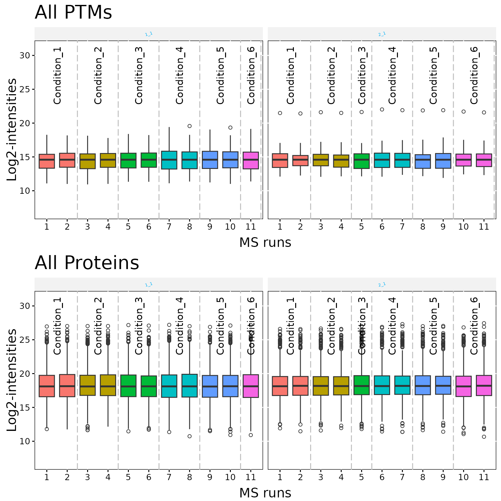
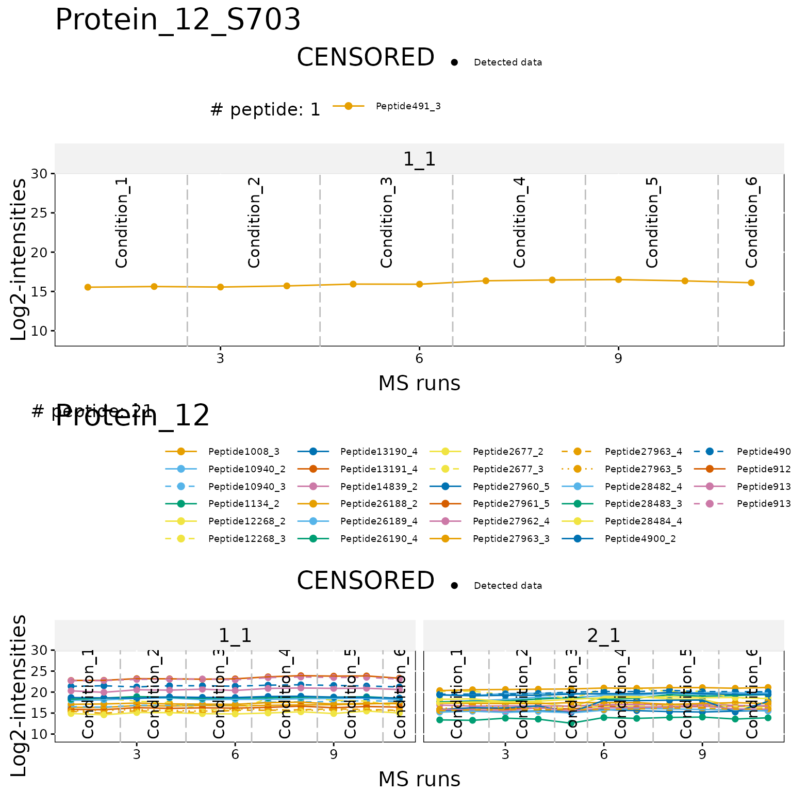
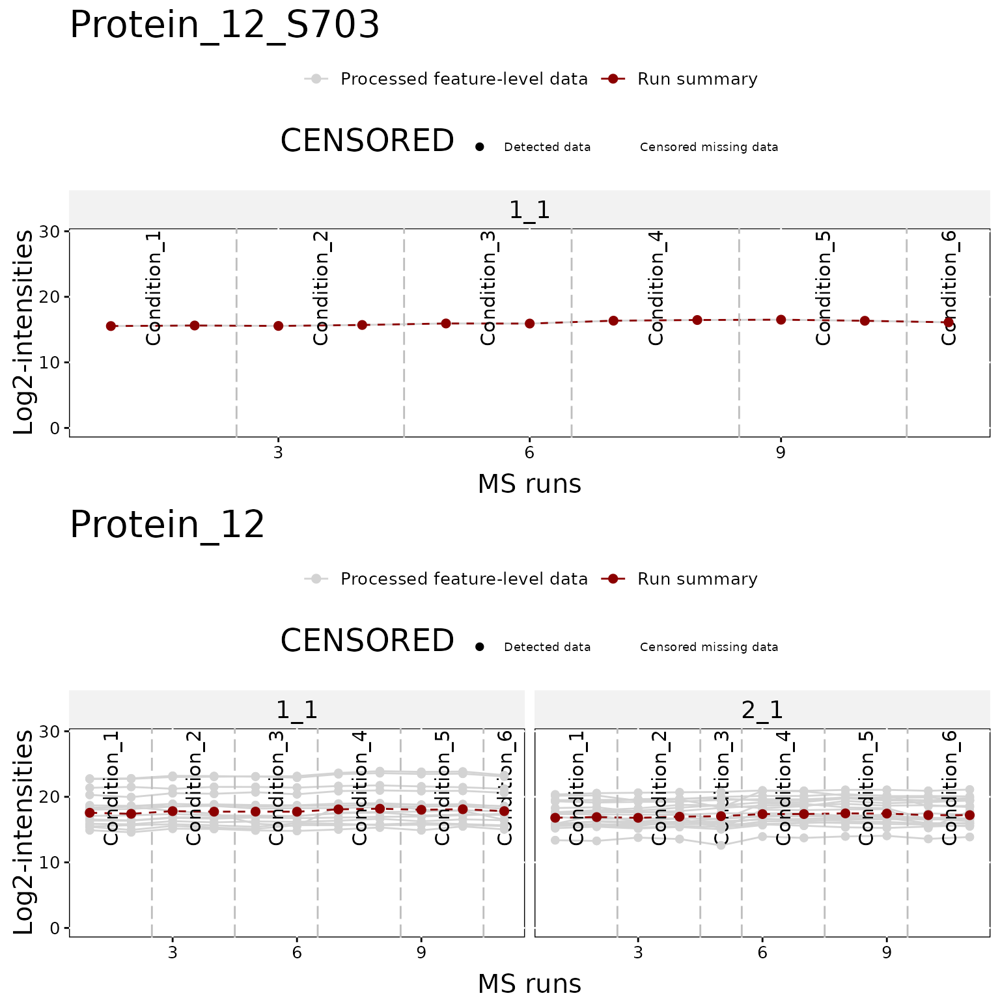
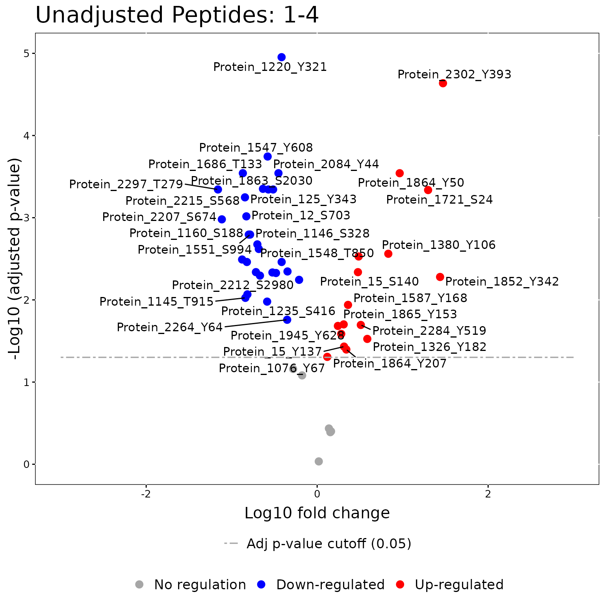
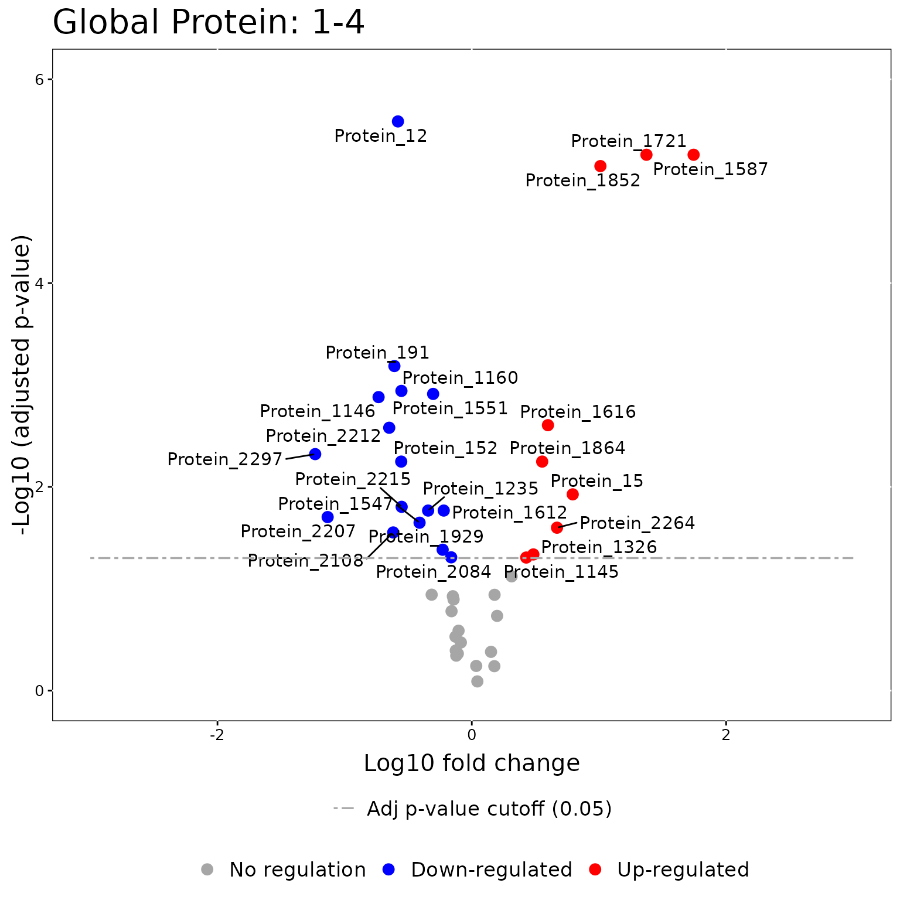
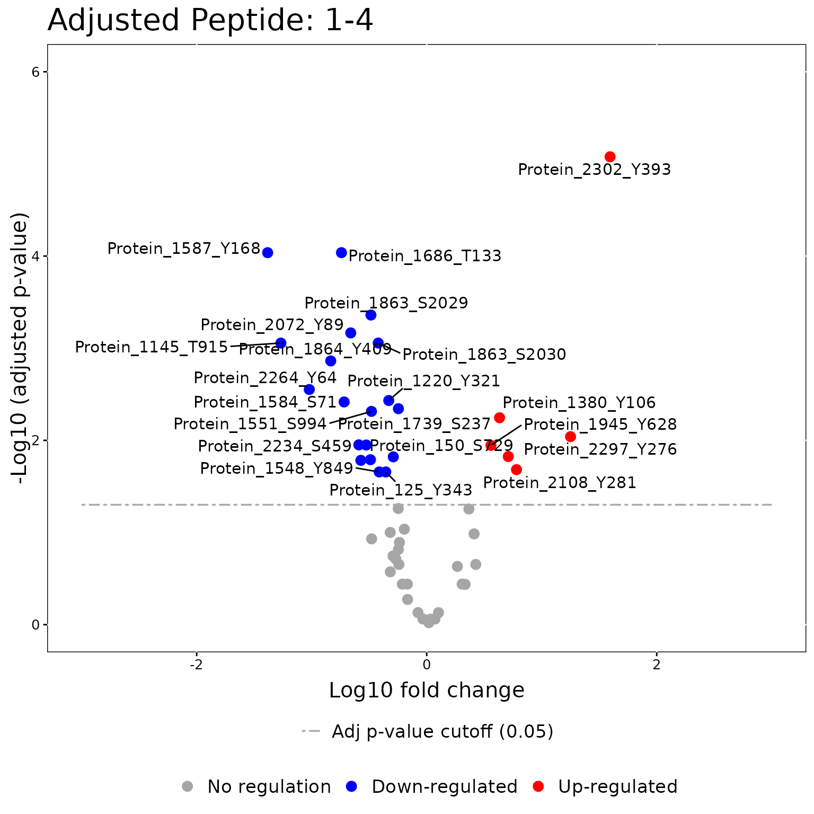
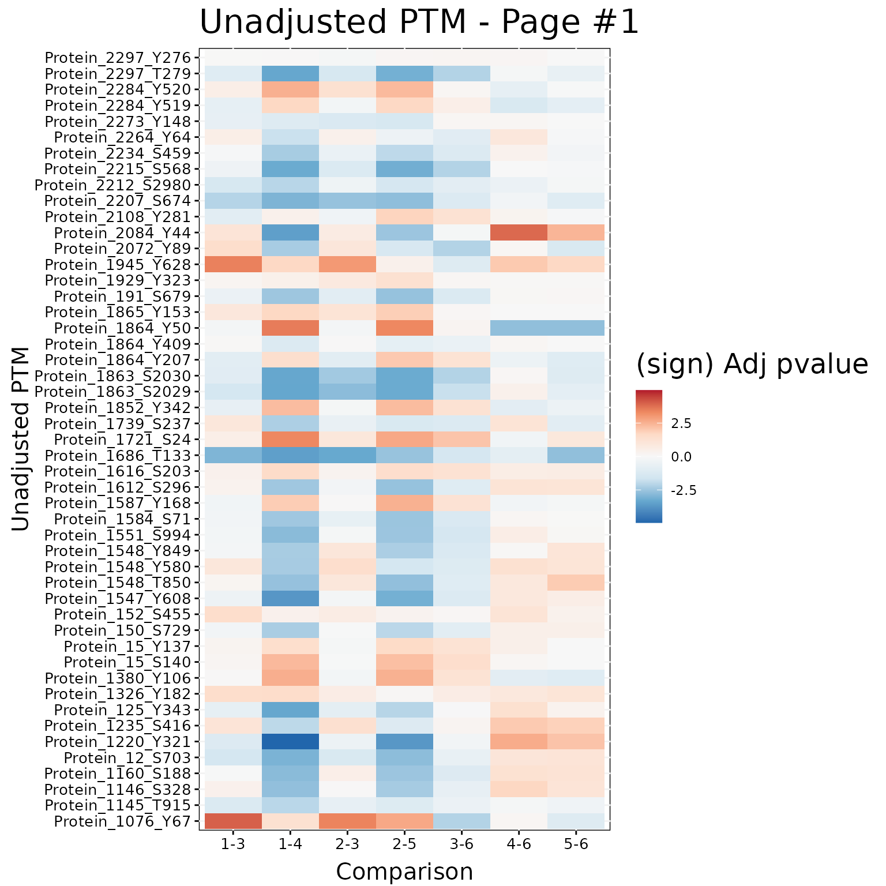
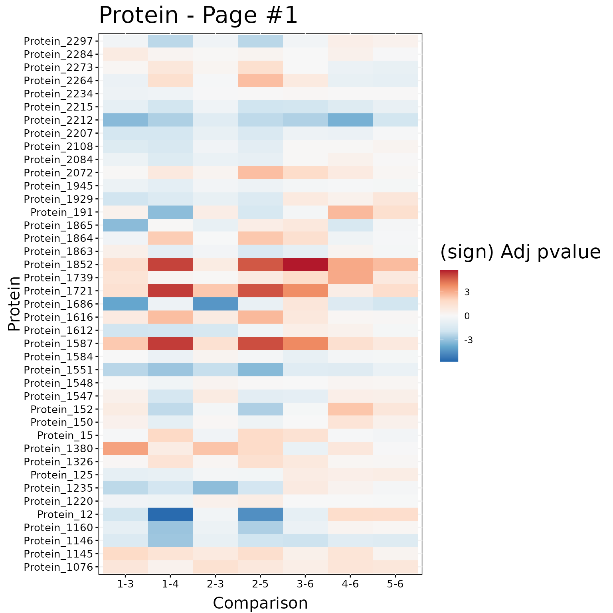
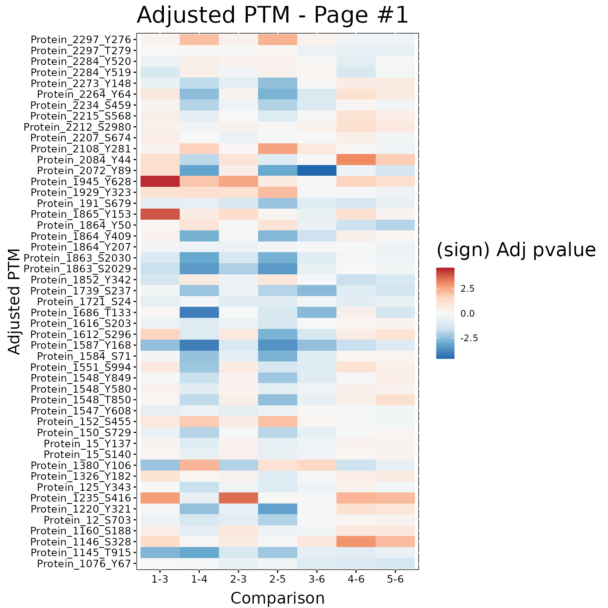

# MSstatsPTM TMT Workflow

``` r
library(MSstatsPTM)
```

This Vignette provides an example workflow for how to use the package
MSstatsPTM for a TMT dataset.

## Installation

To install this package, start R (version “4.0”) and enter:

``` r
if (!requireNamespace("BiocManager", quietly = TRUE))
    install.packages("BiocManager")

BiocManager::install("MSstatsPTM")
```

## 1. Workflow

### 1.1 Raw Data Format

**Note: We are actively developing dedicated converters for MSstatsPTM.
If you have data from a processing tool that does not have a dedicated
converter in MSstatsPTM please add a github issue
`https://github.com/Vitek-Lab/MSstatsPTM/issues` and we will add the
converter.**

We go in depth on all converters included in this package in the
`MSstatsPTM_LabelFree_Workflow`. For more information about data
conversion please review the relevant sections there.

### 1.2 Summarization - dataSummarizationPTM_TMT

After loading in the input data, the next step is to use the
dataSummarizationPTM_TMT function This provides the summarized dataset
needed to model the protein/PTM abundance. The function will summarize
the Protein dataset up to the protein level and will summarize the PTM
dataset up to the peptide level. There are multiple options for
normalization and missing value imputation. These options should be
reviewed in the package documentation.

    #>   |                                                                              |                                                                      |   0%  |                                                                              |=                                                                     |   1%  |                                                                              |==                                                                    |   2%  |                                                                              |==                                                                    |   3%  |                                                                              |===                                                                   |   5%  |                                                                              |====                                                                  |   6%  |                                                                              |=====                                                                 |   7%  |                                                                              |======                                                                |   8%  |                                                                              |=======                                                               |   9%  |                                                                              |=======                                                               |  10%  |                                                                              |========                                                              |  12%  |                                                                              |=========                                                             |  13%  |                                                                              |==========                                                            |  14%  |                                                                              |===========                                                           |  15%  |                                                                              |===========                                                           |  16%  |                                                                              |============                                                          |  17%  |                                                                              |=============                                                         |  19%  |                                                                              |==============                                                        |  20%  |                                                                              |===============                                                       |  21%  |                                                                              |===============                                                       |  22%  |                                                                              |================                                                      |  23%  |                                                                              |=================                                                     |  24%  |                                                                              |==================                                                    |  26%  |                                                                              |===================                                                   |  27%  |                                                                              |====================                                                  |  28%  |                                                                              |====================                                                  |  29%  |                                                                              |=====================                                                 |  30%  |                                                                              |======================                                                |  31%  |                                                                              |=======================                                               |  33%  |                                                                              |========================                                              |  34%  |                                                                              |========================                                              |  35%  |                                                                              |=========================                                             |  36%  |                                                                              |==========================                                            |  37%  |                                                                              |===========================                                           |  38%  |                                                                              |============================                                          |  40%  |                                                                              |============================                                          |  41%  |                                                                              |=============================                                         |  42%  |                                                                              |==============================                                        |  43%  |                                                                              |===============================                                       |  44%  |                                                                              |================================                                      |  45%  |                                                                              |=================================                                     |  47%  |                                                                              |=================================                                     |  48%  |                                                                              |==================================                                    |  49%  |                                                                              |===================================                                   |  50%  |                                                                              |====================================                                  |  51%  |                                                                              |=====================================                                 |  52%  |                                                                              |=====================================                                 |  53%  |                                                                              |======================================                                |  55%  |                                                                              |=======================================                               |  56%  |                                                                              |========================================                              |  57%  |                                                                              |=========================================                             |  58%  |                                                                              |==========================================                            |  59%  |                                                                              |==========================================                            |  60%  |                                                                              |===========================================                           |  62%  |                                                                              |============================================                          |  63%  |                                                                              |=============================================                         |  64%  |                                                                              |==============================================                        |  65%  |                                                                              |==============================================                        |  66%  |                                                                              |===============================================                       |  67%  |                                                                              |================================================                      |  69%  |                                                                              |=================================================                     |  70%  |                                                                              |==================================================                    |  71%  |                                                                              |==================================================                    |  72%  |                                                                              |===================================================                   |  73%  |                                                                              |====================================================                  |  74%  |                                                                              |=====================================================                 |  76%  |                                                                              |======================================================                |  77%  |                                                                              |=======================================================               |  78%  |                                                                              |=======================================================               |  79%  |                                                                              |========================================================              |  80%  |                                                                              |=========================================================             |  81%  |                                                                              |==========================================================            |  83%  |                                                                              |===========================================================           |  84%  |                                                                              |===========================================================           |  85%  |                                                                              |============================================================          |  86%  |                                                                              |=============================================================         |  87%  |                                                                              |==============================================================        |  88%  |                                                                              |===============================================================       |  90%  |                                                                              |===============================================================       |  91%  |                                                                              |================================================================      |  92%  |                                                                              |=================================================================     |  93%  |                                                                              |==================================================================    |  94%  |                                                                              |===================================================================   |  95%  |                                                                              |====================================================================  |  97%  |                                                                              |====================================================================  |  98%  |                                                                              |===================================================================== |  99%  |                                                                              |======================================================================| 100%
    #>   |                                                                              |                                                                      |   0%  |                                                                              |===                                                                   |   4%  |                                                                              |=====                                                                 |   7%  |                                                                              |========                                                              |  11%  |                                                                              |==========                                                            |  15%  |                                                                              |=============                                                         |  19%  |                                                                              |================                                                      |  22%  |                                                                              |==================                                                    |  26%  |                                                                              |=====================                                                 |  30%  |                                                                              |=======================                                               |  33%  |                                                                              |==========================                                            |  37%  |                                                                              |=============================                                         |  41%  |                                                                              |===============================                                       |  44%  |                                                                              |==================================                                    |  48%  |                                                                              |====================================                                  |  52%  |                                                                              |=======================================                               |  56%  |                                                                              |=========================================                             |  59%  |                                                                              |============================================                          |  63%  |                                                                              |===============================================                       |  67%  |                                                                              |=================================================                     |  70%  |                                                                              |====================================================                  |  74%  |                                                                              |======================================================                |  78%  |                                                                              |=========================================================             |  81%  |                                                                              |============================================================          |  85%  |                                                                              |==============================================================        |  89%  |                                                                              |=================================================================     |  93%  |                                                                              |===================================================================   |  96%  |                                                                              |======================================================================| 100%
    #>   |                                                                              |                                                                      |   0%  |                                                                              |=                                                                     |   1%  |                                                                              |==                                                                    |   2%  |                                                                              |==                                                                    |   4%  |                                                                              |===                                                                   |   5%  |                                                                              |====                                                                  |   6%  |                                                                              |=====                                                                 |   7%  |                                                                              |======                                                                |   8%  |                                                                              |=======                                                               |   9%  |                                                                              |=======                                                               |  11%  |                                                                              |========                                                              |  12%  |                                                                              |=========                                                             |  13%  |                                                                              |==========                                                            |  14%  |                                                                              |===========                                                           |  15%  |                                                                              |============                                                          |  16%  |                                                                              |============                                                          |  18%  |                                                                              |=============                                                         |  19%  |                                                                              |==============                                                        |  20%  |                                                                              |===============                                                       |  21%  |                                                                              |================                                                      |  22%  |                                                                              |================                                                      |  24%  |                                                                              |=================                                                     |  25%  |                                                                              |==================                                                    |  26%  |                                                                              |===================                                                   |  27%  |                                                                              |====================                                                  |  28%  |                                                                              |=====================                                                 |  29%  |                                                                              |=====================                                                 |  31%  |                                                                              |======================                                                |  32%  |                                                                              |=======================                                               |  33%  |                                                                              |========================                                              |  34%  |                                                                              |=========================                                             |  35%  |                                                                              |==========================                                            |  36%  |                                                                              |==========================                                            |  38%  |                                                                              |===========================                                           |  39%  |                                                                              |============================                                          |  40%  |                                                                              |=============================                                         |  41%  |                                                                              |==============================                                        |  42%  |                                                                              |==============================                                        |  44%  |                                                                              |===============================                                       |  45%  |                                                                              |================================                                      |  46%  |                                                                              |=================================                                     |  47%  |                                                                              |==================================                                    |  48%  |                                                                              |===================================                                   |  49%  |                                                                              |===================================                                   |  51%  |                                                                              |====================================                                  |  52%  |                                                                              |=====================================                                 |  53%  |                                                                              |======================================                                |  54%  |                                                                              |=======================================                               |  55%  |                                                                              |========================================                              |  56%  |                                                                              |========================================                              |  58%  |                                                                              |=========================================                             |  59%  |                                                                              |==========================================                            |  60%  |                                                                              |===========================================                           |  61%  |                                                                              |============================================                          |  62%  |                                                                              |============================================                          |  64%  |                                                                              |=============================================                         |  65%  |                                                                              |==============================================                        |  66%  |                                                                              |===============================================                       |  67%  |                                                                              |================================================                      |  68%  |                                                                              |=================================================                     |  69%  |                                                                              |=================================================                     |  71%  |                                                                              |==================================================                    |  72%  |                                                                              |===================================================                   |  73%  |                                                                              |====================================================                  |  74%  |                                                                              |=====================================================                 |  75%  |                                                                              |======================================================                |  76%  |                                                                              |======================================================                |  78%  |                                                                              |=======================================================               |  79%  |                                                                              |========================================================              |  80%  |                                                                              |=========================================================             |  81%  |                                                                              |==========================================================            |  82%  |                                                                              |==========================================================            |  84%  |                                                                              |===========================================================           |  85%  |                                                                              |============================================================          |  86%  |                                                                              |=============================================================         |  87%  |                                                                              |==============================================================        |  88%  |                                                                              |===============================================================       |  89%  |                                                                              |===============================================================       |  91%  |                                                                              |================================================================      |  92%  |                                                                              |=================================================================     |  93%  |                                                                              |==================================================================    |  94%  |                                                                              |===================================================================   |  95%  |                                                                              |====================================================================  |  96%  |                                                                              |====================================================================  |  98%  |                                                                              |===================================================================== |  99%  |                                                                              |======================================================================| 100%
    #>   |                                                                              |                                                                      |   0%  |                                                                              |=                                                                     |   1%  |                                                                              |==                                                                    |   2%  |                                                                              |===                                                                   |   4%  |                                                                              |===                                                                   |   5%  |                                                                              |====                                                                  |   6%  |                                                                              |=====                                                                 |   7%  |                                                                              |======                                                                |   8%  |                                                                              |=======                                                               |  10%  |                                                                              |========                                                              |  11%  |                                                                              |========                                                              |  12%  |                                                                              |=========                                                             |  13%  |                                                                              |==========                                                            |  14%  |                                                                              |===========                                                           |  16%  |                                                                              |============                                                          |  17%  |                                                                              |=============                                                         |  18%  |                                                                              |=============                                                         |  19%  |                                                                              |==============                                                        |  20%  |                                                                              |===============                                                       |  22%  |                                                                              |================                                                      |  23%  |                                                                              |=================                                                     |  24%  |                                                                              |==================                                                    |  25%  |                                                                              |===================                                                   |  27%  |                                                                              |===================                                                   |  28%  |                                                                              |====================                                                  |  29%  |                                                                              |=====================                                                 |  30%  |                                                                              |======================                                                |  31%  |                                                                              |=======================                                               |  33%  |                                                                              |========================                                              |  34%  |                                                                              |========================                                              |  35%  |                                                                              |=========================                                             |  36%  |                                                                              |==========================                                            |  37%  |                                                                              |===========================                                           |  39%  |                                                                              |============================                                          |  40%  |                                                                              |=============================                                         |  41%  |                                                                              |==============================                                        |  42%  |                                                                              |==============================                                        |  43%  |                                                                              |===============================                                       |  45%  |                                                                              |================================                                      |  46%  |                                                                              |=================================                                     |  47%  |                                                                              |==================================                                    |  48%  |                                                                              |===================================                                   |  49%  |                                                                              |===================================                                   |  51%  |                                                                              |====================================                                  |  52%  |                                                                              |=====================================                                 |  53%  |                                                                              |======================================                                |  54%  |                                                                              |=======================================                               |  55%  |                                                                              |========================================                              |  57%  |                                                                              |========================================                              |  58%  |                                                                              |=========================================                             |  59%  |                                                                              |==========================================                            |  60%  |                                                                              |===========================================                           |  61%  |                                                                              |============================================                          |  63%  |                                                                              |=============================================                         |  64%  |                                                                              |==============================================                        |  65%  |                                                                              |==============================================                        |  66%  |                                                                              |===============================================                       |  67%  |                                                                              |================================================                      |  69%  |                                                                              |=================================================                     |  70%  |                                                                              |==================================================                    |  71%  |                                                                              |===================================================                   |  72%  |                                                                              |===================================================                   |  73%  |                                                                              |====================================================                  |  75%  |                                                                              |=====================================================                 |  76%  |                                                                              |======================================================                |  77%  |                                                                              |=======================================================               |  78%  |                                                                              |========================================================              |  80%  |                                                                              |=========================================================             |  81%  |                                                                              |=========================================================             |  82%  |                                                                              |==========================================================            |  83%  |                                                                              |===========================================================           |  84%  |                                                                              |============================================================          |  86%  |                                                                              |=============================================================         |  87%  |                                                                              |==============================================================        |  88%  |                                                                              |==============================================================        |  89%  |                                                                              |===============================================================       |  90%  |                                                                              |================================================================      |  92%  |                                                                              |=================================================================     |  93%  |                                                                              |==================================================================    |  94%  |                                                                              |===================================================================   |  95%  |                                                                              |===================================================================   |  96%  |                                                                              |====================================================================  |  98%  |                                                                              |===================================================================== |  99%  |                                                                              |======================================================================| 100%

``` r
head(MSstatsPTM.summary$PTM$ProteinLevelData)
#>   Mixture TechRepMixture Run Channel           Protein Abundance  BioReplicate
#> 1       1              1 1_1    126C  Protein_1076_Y67  13.53222 Condition_4_1
#> 2       1              1 1_1    126C Protein_1145_T915  12.05299 Condition_4_1
#> 3       1              1 1_1    126C Protein_1146_S328  14.43190 Condition_4_1
#> 4       1              1 1_1    126C Protein_1160_S188  16.17976 Condition_4_1
#> 5       1              1 1_1    126C   Protein_12_S703  16.35842 Condition_4_1
#> 6       1              1 1_1    126C Protein_1220_Y321  15.69534 Condition_4_1
#>     Condition
#> 1 Condition_4
#> 2 Condition_4
#> 3 Condition_4
#> 4 Condition_4
#> 5 Condition_4
#> 6 Condition_4
head(MSstatsPTM.summary$PROTEIN$ProteinLevelData)
#>   Mixture TechRepMixture Run Channel      Protein Abundance  BioReplicate
#> 1       1              1 1_1    126C Protein_1076  18.59474 Condition_4_1
#> 2       1              1 1_1    126C Protein_1145  14.38146 Condition_4_1
#> 3       1              1 1_1    126C Protein_1146  18.74102 Condition_4_1
#> 4       1              1 1_1    126C Protein_1160  17.92639 Condition_4_1
#> 5       1              1 1_1    126C   Protein_12  18.08824 Condition_4_1
#> 6       1              1 1_1    126C Protein_1220  17.51226 Condition_4_1
#>     Condition
#> 1 Condition_4
#> 2 Condition_4
#> 3 Condition_4
#> 4 Condition_4
#> 5 Condition_4
#> 6 Condition_4
```

The summarize function returns a list with PTM and Protein summarization
information.

### 1.2.1 QCPlot

Once summarized, MSstatsPTM provides multiple plots to analyze the
experiment. Here we show the quality control boxplot. The first plot
shows the modified data and the second plot shows the global protein
dataset.

``` r

dataProcessPlotsPTM(MSstatsPTM.summary,
                    type = 'QCPLOT',
                    which.PTM = "allonly",
                    address = FALSE)
```



### 1.2.2 Profile Plot

Here we show a profile plot. Again the top plot shows the modified
peptide, and the bottom shows the overall protein.

``` r
dataProcessPlotsPTM(MSstatsPTM.summary,
                    type = 'PROFILEPLOT',
                    which.Protein = c("Protein_12"),
                    address = FALSE)
```



### 1.3 Modeling - groupComparisonPTM

After summarization, the summarized datasets can be modeled using the
groupComparisonPTM function. This function will model the PTM and
Protein summarized datasets, and then adjust the PTM model for changes
in overall protein abundance. The output of the function is a list
containing these three models named: `PTM.Model`, `PROTEIN.Model`,
`ADJUSTED.Model`.

``` r

# Specify contrast matrix
comparison <- matrix(c(1,0,0,-1,0,0,
                       0,1,0,0,-1,0,
                       0,0,1,0,0,-1,
                       1,0,-1,0,0,0,
                       0,1,-1,0,0,0,
                       0,0,0,1,0,-1,
                       0,0,0,0,1,-1),nrow=7, ncol=6, byrow=TRUE)

# Set the names of each row
row.names(comparison)<-c('1-4', '2-5', '3-6', '1-3', 
                         '2-3', '4-6', '5-6')
colnames(comparison) <- c('Condition_1','Condition_2','Condition_3',
                          'Condition_4','Condition_5','Condition_6')
MSstatsPTM.model <- groupComparisonPTM(MSstatsPTM.summary,
                                       ptm_label_type = "TMT",
                                       protein_label_type = "TMT",
                                       contrast.matrix = comparison,
                                       use_log_file = FALSE, append = FALSE)
#> INFO  [2026-04-25 15:41:20] Design: 2 mixtures.
#> INFO  [2026-04-25 15:41:20] Design: 1 MS run per mixture.
#> INFO  [2026-04-25 15:41:20] Design: group comparison design (Different conditions contains different biological subjects).
#> INFO  [2026-04-25 15:41:20] Model fitting for 90 proteins.
#>   |                                                                              |                                                                      |   0%  |                                                                              |=                                                                     |   1%  |                                                                              |==                                                                    |   2%  |                                                                              |==                                                                    |   3%  |                                                                              |===                                                                   |   4%  |                                                                              |====                                                                  |   6%  |                                                                              |=====                                                                 |   7%  |                                                                              |=====                                                                 |   8%  |                                                                              |======                                                                |   9%  |                                                                              |=======                                                               |  10%  |                                                                              |========                                                              |  11%  |                                                                              |=========                                                             |  12%  |                                                                              |=========                                                             |  13%  |                                                                              |==========                                                            |  14%  |                                                                              |===========                                                           |  16%  |                                                                              |============                                                          |  17%  |                                                                              |============                                                          |  18%  |                                                                              |=============                                                         |  19%  |                                                                              |==============                                                        |  20%  |                                                                              |===============                                                       |  21%  |                                                                              |================                                                      |  22%  |                                                                              |================                                                      |  23%  |                                                                              |=================                                                     |  24%  |                                                                              |==================                                                    |  26%  |                                                                              |===================                                                   |  27%  |                                                                              |===================                                                   |  28%  |                                                                              |====================                                                  |  29%  |                                                                              |=====================                                                 |  30%  |                                                                              |======================                                                |  31%  |                                                                              |=======================                                               |  32%  |                                                                              |=======================                                               |  33%  |                                                                              |========================                                              |  34%  |                                                                              |=========================                                             |  36%  |                                                                              |==========================                                            |  37%  |                                                                              |==========================                                            |  38%  |                                                                              |===========================                                           |  39%  |                                                                              |============================                                          |  40%  |                                                                              |=============================                                         |  41%  |                                                                              |==============================                                        |  42%  |                                                                              |==============================                                        |  43%  |                                                                              |===============================                                       |  44%  |                                                                              |================================                                      |  46%  |                                                                              |=================================                                     |  47%  |                                                                              |=================================                                     |  48%  |                                                                              |==================================                                    |  49%  |                                                                              |===================================                                   |  50%  |                                                                              |====================================                                  |  51%  |                                                                              |=====================================                                 |  52%  |                                                                              |=====================================                                 |  53%  |                                                                              |======================================                                |  54%  |                                                                              |=======================================                               |  56%  |                                                                              |========================================                              |  57%  |                                                                              |========================================                              |  58%  |                                                                              |=========================================                             |  59%  |                                                                              |==========================================                            |  60%  |                                                                              |===========================================                           |  61%  |                                                                              |============================================                          |  62%  |                                                                              |============================================                          |  63%  |                                                                              |=============================================                         |  64%  |                                                                              |==============================================                        |  66%  |                                                                              |===============================================                       |  67%  |                                                                              |===============================================                       |  68%  |                                                                              |================================================                      |  69%  |                                                                              |=================================================                     |  70%  |                                                                              |==================================================                    |  71%  |                                                                              |===================================================                   |  72%  |                                                                              |===================================================                   |  73%  |                                                                              |====================================================                  |  74%  |                                                                              |=====================================================                 |  76%  |                                                                              |======================================================                |  77%  |                                                                              |======================================================                |  78%  |                                                                              |=======================================================               |  79%  |                                                                              |========================================================              |  80%  |                                                                              |=========================================================             |  81%  |                                                                              |==========================================================            |  82%  |                                                                              |==========================================================            |  83%  |                                                                              |===========================================================           |  84%  |                                                                              |============================================================          |  86%  |                                                                              |=============================================================         |  87%  |                                                                              |=============================================================         |  88%  |                                                                              |==============================================================        |  89%  |                                                                              |===============================================================       |  90%  |                                                                              |================================================================      |  91%  |                                                                              |=================================================================     |  92%  |                                                                              |=================================================================     |  93%  |                                                                              |==================================================================    |  94%  |                                                                              |===================================================================   |  96%  |                                                                              |====================================================================  |  97%  |                                                                              |====================================================================  |  98%  |                                                                              |===================================================================== |  99%  |                                                                              |======================================================================| 100%
#> INFO  [2026-04-25 15:41:22] Testing for 90 proteins:
#>   |                                                                              |                                                                      |   0%  |                                                                              |=                                                                     |   1%  |                                                                              |==                                                                    |   2%  |                                                                              |==                                                                    |   3%  |                                                                              |===                                                                   |   4%  |                                                                              |====                                                                  |   6%  |                                                                              |=====                                                                 |   7%  |                                                                              |=====                                                                 |   8%  |                                                                              |======                                                                |   9%  |                                                                              |=======                                                               |  10%  |                                                                              |========                                                              |  11%  |                                                                              |=========                                                             |  12%  |                                                                              |=========                                                             |  13%  |                                                                              |==========                                                            |  14%  |                                                                              |===========                                                           |  16%  |                                                                              |============                                                          |  17%  |                                                                              |============                                                          |  18%  |                                                                              |=============                                                         |  19%  |                                                                              |==============                                                        |  20%  |                                                                              |===============                                                       |  21%  |                                                                              |================                                                      |  22%  |                                                                              |================                                                      |  23%  |                                                                              |=================                                                     |  24%  |                                                                              |==================                                                    |  26%  |                                                                              |===================                                                   |  27%  |                                                                              |===================                                                   |  28%  |                                                                              |====================                                                  |  29%  |                                                                              |=====================                                                 |  30%  |                                                                              |======================                                                |  31%  |                                                                              |=======================                                               |  32%  |                                                                              |=======================                                               |  33%  |                                                                              |========================                                              |  34%  |                                                                              |=========================                                             |  36%  |                                                                              |==========================                                            |  37%  |                                                                              |==========================                                            |  38%  |                                                                              |===========================                                           |  39%  |                                                                              |============================                                          |  40%  |                                                                              |=============================                                         |  41%  |                                                                              |==============================                                        |  42%  |                                                                              |==============================                                        |  43%  |                                                                              |===============================                                       |  44%  |                                                                              |================================                                      |  46%  |                                                                              |=================================                                     |  47%  |                                                                              |=================================                                     |  48%  |                                                                              |==================================                                    |  49%  |                                                                              |===================================                                   |  50%  |                                                                              |====================================                                  |  51%  |                                                                              |=====================================                                 |  52%  |                                                                              |=====================================                                 |  53%  |                                                                              |======================================                                |  54%  |                                                                              |=======================================                               |  56%  |                                                                              |========================================                              |  57%  |                                                                              |========================================                              |  58%  |                                                                              |=========================================                             |  59%  |                                                                              |==========================================                            |  60%  |                                                                              |===========================================                           |  61%  |                                                                              |============================================                          |  62%  |                                                                              |============================================                          |  63%  |                                                                              |=============================================                         |  64%  |                                                                              |==============================================                        |  66%  |                                                                              |===============================================                       |  67%  |                                                                              |===============================================                       |  68%  |                                                                              |================================================                      |  69%  |                                                                              |=================================================                     |  70%  |                                                                              |==================================================                    |  71%  |                                                                              |===================================================                   |  72%  |                                                                              |===================================================                   |  73%  |                                                                              |====================================================                  |  74%  |                                                                              |=====================================================                 |  76%  |                                                                              |======================================================                |  77%  |                                                                              |======================================================                |  78%  |                                                                              |=======================================================               |  79%  |                                                                              |========================================================              |  80%  |                                                                              |=========================================================             |  81%  |                                                                              |==========================================================            |  82%  |                                                                              |==========================================================            |  83%  |                                                                              |===========================================================           |  84%  |                                                                              |============================================================          |  86%  |                                                                              |=============================================================         |  87%  |                                                                              |=============================================================         |  88%  |                                                                              |==============================================================        |  89%  |                                                                              |===============================================================       |  90%  |                                                                              |================================================================      |  91%  |                                                                              |=================================================================     |  92%  |                                                                              |=================================================================     |  93%  |                                                                              |==================================================================    |  94%  |                                                                              |===================================================================   |  96%  |                                                                              |====================================================================  |  97%  |                                                                              |====================================================================  |  98%  |                                                                              |===================================================================== |  99%  |                                                                              |======================================================================| 100%
#> INFO  [2026-04-25 15:41:22] Design: 2 mixtures.
#> INFO  [2026-04-25 15:41:22] Design: 1 MS run per mixture.
#> INFO  [2026-04-25 15:41:22] Design: group comparison design (Different conditions contains different biological subjects).
#> INFO  [2026-04-25 15:41:22] Model fitting for 85 proteins.
#>   |                                                                              |                                                                      |   0%  |                                                                              |=                                                                     |   1%  |                                                                              |==                                                                    |   2%  |                                                                              |==                                                                    |   4%  |                                                                              |===                                                                   |   5%  |                                                                              |====                                                                  |   6%  |                                                                              |=====                                                                 |   7%  |                                                                              |======                                                                |   8%  |                                                                              |=======                                                               |   9%  |                                                                              |=======                                                               |  11%  |                                                                              |========                                                              |  12%  |                                                                              |=========                                                             |  13%  |                                                                              |==========                                                            |  14%  |                                                                              |===========                                                           |  15%  |                                                                              |============                                                          |  16%  |                                                                              |============                                                          |  18%  |                                                                              |=============                                                         |  19%  |                                                                              |==============                                                        |  20%  |                                                                              |===============                                                       |  21%  |                                                                              |================                                                      |  22%  |                                                                              |================                                                      |  24%  |                                                                              |=================                                                     |  25%  |                                                                              |==================                                                    |  26%  |                                                                              |===================                                                   |  27%  |                                                                              |====================                                                  |  28%  |                                                                              |=====================                                                 |  29%  |                                                                              |=====================                                                 |  31%  |                                                                              |======================                                                |  32%  |                                                                              |=======================                                               |  33%  |                                                                              |========================                                              |  34%  |                                                                              |=========================                                             |  35%  |                                                                              |==========================                                            |  36%  |                                                                              |==========================                                            |  38%  |                                                                              |===========================                                           |  39%  |                                                                              |============================                                          |  40%  |                                                                              |=============================                                         |  41%  |                                                                              |==============================                                        |  42%  |                                                                              |==============================                                        |  44%  |                                                                              |===============================                                       |  45%  |                                                                              |================================                                      |  46%  |                                                                              |=================================                                     |  47%  |                                                                              |==================================                                    |  48%  |                                                                              |===================================                                   |  49%  |                                                                              |===================================                                   |  51%  |                                                                              |====================================                                  |  52%  |                                                                              |=====================================                                 |  53%  |                                                                              |======================================                                |  54%  |                                                                              |=======================================                               |  55%  |                                                                              |========================================                              |  56%  |                                                                              |========================================                              |  58%  |                                                                              |=========================================                             |  59%  |                                                                              |==========================================                            |  60%  |                                                                              |===========================================                           |  61%  |                                                                              |============================================                          |  62%  |                                                                              |============================================                          |  64%  |                                                                              |=============================================                         |  65%  |                                                                              |==============================================                        |  66%  |                                                                              |===============================================                       |  67%  |                                                                              |================================================                      |  68%  |                                                                              |=================================================                     |  69%  |                                                                              |=================================================                     |  71%  |                                                                              |==================================================                    |  72%  |                                                                              |===================================================                   |  73%  |                                                                              |====================================================                  |  74%  |                                                                              |=====================================================                 |  75%  |                                                                              |======================================================                |  76%  |                                                                              |======================================================                |  78%  |                                                                              |=======================================================               |  79%  |                                                                              |========================================================              |  80%  |                                                                              |=========================================================             |  81%  |                                                                              |==========================================================            |  82%  |                                                                              |==========================================================            |  84%  |                                                                              |===========================================================           |  85%  |                                                                              |============================================================          |  86%  |                                                                              |=============================================================         |  87%  |                                                                              |==============================================================        |  88%  |                                                                              |===============================================================       |  89%  |                                                                              |===============================================================       |  91%  |                                                                              |================================================================      |  92%  |                                                                              |=================================================================     |  93%  |                                                                              |==================================================================    |  94%  |                                                                              |===================================================================   |  95%  |                                                                              |====================================================================  |  96%  |                                                                              |====================================================================  |  98%  |                                                                              |===================================================================== |  99%  |                                                                              |======================================================================| 100%
#> INFO  [2026-04-25 15:41:25] Testing for 85 proteins:
#>   |                                                                              |                                                                      |   0%  |                                                                              |=                                                                     |   1%  |                                                                              |==                                                                    |   2%  |                                                                              |==                                                                    |   4%  |                                                                              |===                                                                   |   5%  |                                                                              |====                                                                  |   6%  |                                                                              |=====                                                                 |   7%  |                                                                              |======                                                                |   8%  |                                                                              |=======                                                               |   9%  |                                                                              |=======                                                               |  11%  |                                                                              |========                                                              |  12%  |                                                                              |=========                                                             |  13%  |                                                                              |==========                                                            |  14%  |                                                                              |===========                                                           |  15%  |                                                                              |============                                                          |  16%  |                                                                              |============                                                          |  18%  |                                                                              |=============                                                         |  19%  |                                                                              |==============                                                        |  20%  |                                                                              |===============                                                       |  21%  |                                                                              |================                                                      |  22%  |                                                                              |================                                                      |  24%  |                                                                              |=================                                                     |  25%  |                                                                              |==================                                                    |  26%  |                                                                              |===================                                                   |  27%  |                                                                              |====================                                                  |  28%  |                                                                              |=====================                                                 |  29%  |                                                                              |=====================                                                 |  31%  |                                                                              |======================                                                |  32%  |                                                                              |=======================                                               |  33%  |                                                                              |========================                                              |  34%  |                                                                              |=========================                                             |  35%  |                                                                              |==========================                                            |  36%  |                                                                              |==========================                                            |  38%  |                                                                              |===========================                                           |  39%  |                                                                              |============================                                          |  40%  |                                                                              |=============================                                         |  41%  |                                                                              |==============================                                        |  42%  |                                                                              |==============================                                        |  44%  |                                                                              |===============================                                       |  45%  |                                                                              |================================                                      |  46%  |                                                                              |=================================                                     |  47%  |                                                                              |==================================                                    |  48%  |                                                                              |===================================                                   |  49%  |                                                                              |===================================                                   |  51%  |                                                                              |====================================                                  |  52%  |                                                                              |=====================================                                 |  53%  |                                                                              |======================================                                |  54%  |                                                                              |=======================================                               |  55%  |                                                                              |========================================                              |  56%  |                                                                              |========================================                              |  58%  |                                                                              |=========================================                             |  59%  |                                                                              |==========================================                            |  60%  |                                                                              |===========================================                           |  61%  |                                                                              |============================================                          |  62%  |                                                                              |============================================                          |  64%  |                                                                              |=============================================                         |  65%  |                                                                              |==============================================                        |  66%  |                                                                              |===============================================                       |  67%  |                                                                              |================================================                      |  68%  |                                                                              |=================================================                     |  69%  |                                                                              |=================================================                     |  71%  |                                                                              |==================================================                    |  72%  |                                                                              |===================================================                   |  73%  |                                                                              |====================================================                  |  74%  |                                                                              |=====================================================                 |  75%  |                                                                              |======================================================                |  76%  |                                                                              |======================================================                |  78%  |                                                                              |=======================================================               |  79%  |                                                                              |========================================================              |  80%  |                                                                              |=========================================================             |  81%  |                                                                              |==========================================================            |  82%  |                                                                              |==========================================================            |  84%  |                                                                              |===========================================================           |  85%  |                                                                              |============================================================          |  86%  |                                                                              |=============================================================         |  87%  |                                                                              |==============================================================        |  88%  |                                                                              |===============================================================       |  89%  |                                                                              |===============================================================       |  91%  |                                                                              |================================================================      |  92%  |                                                                              |=================================================================     |  93%  |                                                                              |==================================================================    |  94%  |                                                                              |===================================================================   |  95%  |                                                                              |====================================================================  |  96%  |                                                                              |====================================================================  |  98%  |                                                                              |===================================================================== |  99%  |                                                                              |======================================================================| 100%
head(MSstatsPTM.model$PTM.Model)
#>             Protein  Label      log2FC         SE       DF       pvalue
#>              <fctr> <char>       <num>      <num>    <num>        <num>
#> 1: Protein_1076_Y67    1-4  0.11835636 0.05264970 15.00000 4.004178e-02
#> 2: Protein_1076_Y67    2-5  0.24162457 0.05264970 15.00000 3.544345e-04
#> 3: Protein_1076_Y67    3-6 -0.27968805 0.06173696 15.00028 3.984772e-04
#> 4: Protein_1076_Y67    1-3  0.42262536 0.05712141 15.00008 2.223242e-06
#> 5: Protein_1076_Y67    2-3  0.37549462 0.05712141 15.00008 8.829044e-06
#> 6: Protein_1076_Y67    4-6  0.02458095 0.05712141 15.00008 6.730757e-01
#>      adj.pvalue  issue
#>           <num> <lgcl>
#> 1: 0.0493665762     NA
#> 2: 0.0020224378     NA
#> 3: 0.0071725899     NA
#> 4: 0.0001000459     NA
#> 5: 0.0003973070     NA
#> 6: 0.7530134974     NA
head(MSstatsPTM.model$PROTEIN.Model)
#>         Protein  Label    log2FC        SE    DF      pvalue adj.pvalue  issue
#>          <fctr> <char>     <num>     <num> <num>       <num>      <num> <lgcl>
#> 1: Protein_1076    1-4 0.1511817 0.1459011     5 0.347602256 0.41614355     NA
#> 2: Protein_1076    2-5 0.3559027 0.1459011     5 0.058701203 0.09494067     NA
#> 3: Protein_1076    3-6 0.3195065 0.1786916     5 0.133803423 0.24198491     NA
#> 4: Protein_1076    1-3 0.4304476 0.1459011     5 0.031875419 0.07322731     NA
#> 5: Protein_1076    2-3 0.6261724 0.1459011     5 0.007776053 0.03478761     NA
#> 6: Protein_1076    4-6 0.5987725 0.1786916     5 0.020309479 0.05754353     NA
head(MSstatsPTM.model$ADJUSTED.Model)
#>              Protein  Label      log2FC         SE     Tvalue        DF
#>               <fctr> <char>       <num>      <num>      <num>     <num>
#> 1:  Protein_1076_Y67    1-4 -0.03282532 0.15511001 -0.2116261  6.351078
#> 2: Protein_1145_T915    1-4 -1.26808260 0.24799278 -5.1133852 14.829339
#> 3: Protein_1146_S328    1-4  0.03359191 0.17861660  0.1880671 19.996632
#> 4: Protein_1160_S188    1-4 -0.24643910 0.14565603 -1.6919252 17.822868
#> 5:   Protein_12_S703    1-4 -0.24745688 0.10078246 -2.4553567 10.599996
#> 6: Protein_1220_Y321    1-4 -0.33005855 0.08668981 -3.8073512 24.562266
#>          pvalue  adj.pvalue GlobalProtein Adjusted
#>           <num>       <num>        <char>   <lgcl>
#> 1: 0.8390276607 0.868296067  Protein_1076     TRUE
#> 2: 0.0001318386 0.000879508  Protein_1145     TRUE
#> 3: 0.8527193854 0.872322130  Protein_1146     TRUE
#> 4: 0.1080693549 0.152669406  Protein_1160     TRUE
#> 5: 0.0326935599 0.054900506    Protein_12     TRUE
#> 6: 0.0008302273 0.003694511  Protein_1220     TRUE
```

### 1.3.1 Volcano Plot

The models from the `groupComparisonPTM` function can be used in the
model visualization function, `groupComparisonPlotsPTM`. Here we show
Volcano Plots for the models.

``` r
groupComparisonPlotsPTM(data = MSstatsPTM.model,
                        type = "VolcanoPlot",
                        which.Comparison = c('1-4'),
                        which.PTM = 1:50,
                        address=FALSE)
```



### 1.3.2 Heatmap Plot

Here we show a Heatmap for the models.

``` r
groupComparisonPlotsPTM(data = MSstatsPTM.model,
                        type = "Heatmap",
                        which.PTM = 1:49,
                        address=FALSE)
```


